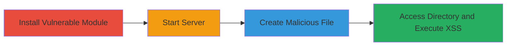

---
tags:
  - xss
  - stored-xss
  - node-js
  - web-vulnerability
type: attack_chain
tools:
  - '[[tools/npm]]'
  - '[[tools/public-module]]'
  - '[[tools/touch]]'
  - '[[tools/Chrome]]'
tactics:
  - '[[Execution]]'
verified: false
platforms:
  - Web
  - Node.js
  - macOS
submitted: true
complexity: medium
created_at: '2024-01-01T12:00:00Z'
procedures:
  - '[[procedures/Install-and-Run-Vulnerable-Public-Module]]'
  - '[[procedures/Create-Malicious-Filename-for-XSS]]'
  - '[[procedures/Trigger-XSS-via-Directory-Listing]]'
step_count: 4
techniques:
  - '[[JavaScript]]'
updated_at: '2025-12-14T03:16:02.766Z'
description: >-
  A multi-stage attack demonstrating stored XSS in the 'public' Node.js module
  by injecting malicious JavaScript into a filename, leading to arbitrary code
  execution in the victim's browser upon directory listing.
skill_level: intermediate
impact_level: high
id: 3f0a650b-1549-428e-b470-e525f1022657
validated: true
mitre_tactics:
  - '[[Execution]]'
mitre_techniques:
  - '[[JavaScript]]'
---
# Stored XSS Exploitation in Public Node.js Module via Malicious Filename

Multi-stage attack chain demonstrating a complete attack workflow for exploiting a stored XSS vulnerability in the 'public' Node.js module (version 0.1.3), a static file hosting server with directory indexing. The attack involves installing and running the vulnerable module, creating a file with a malicious filename that injects JavaScript, and accessing the directory listing to execute the payload in the browser, potentially leading to session hijacking or data theft.

## Chain Metrics Dashboard

| Metric | Value |
|--------|-------|
| Chain Status | Unverified |
| Total Steps | 4 |
| Execution Time | ~5 minutes |
| Skill Level | Intermediate |
| Complexity | Medium |
| Impact Level | High |

## Attack Flow Visualization



## Prerequisites & Requirements

### Required Tools

- [[tools/npm]]
- [[tools/public-module]]
- [[tools/touch]]
- [[tools/Chrome]]

### Target Environment

- Node.js runtime
- macOS or Unix-like OS for command execution
- Port 6060 available
- Local network access to http://127.0.0.1:6060

### Initial Access Requirements

- Local machine with npm installed
- No remote credentials needed; local exploitation
- Administrative privileges not required

## Detailed Attack Procedures

### Step 1: Install Vulnerable Module
procedure: [[procedures/Install-and-Run-Vulnerable-Public-Module]]

**Objective**: Install the 'public' module from npm to set up the vulnerable static file server.

**Instructions**: Use [[commands/npm-i-public]] to install the module:

```bash
npm i public
```

**Expected Output**: Installation logs confirming the module is added to node_modules.

**Success Indicators**:
- 'public' directory appears in node_modules
- No errors in npm output

### Step 2: Start the Server
procedure: [[procedures/Install-and-Run-Vulnerable-Public-Module]]

**Objective**: Launch the static file server with directory indexing enabled on port 6060.

**Instructions**: Execute [[commands/public-bin-start-server]] to run the server serving the current directory:

```bash
./node_modules/public/bin/public ./ 6060
```

**Expected Output**: Server startup message indicating it's listening on port 6060.

**Success Indicators**:
- Server process running without errors
- Localhost:6060 accessible

### Step 3: Create Malicious File
procedure: [[procedures/Create-Malicious-Filename-for-XSS]]

**Objective**: Create an empty file with a filename containing an XSS payload to inject JavaScript into the directory listing.

**Instructions**: Use [[commands/touch-malicious-filename]] to create the file:

```bash
touch '"><svg onload=alert(3);'
```

**Expected Output**: No output; file created successfully in the current directory.

**Success Indicators**:
- File named '"><svg onload=alert(3);' exists (verify with ls)
- File is empty

### Step 4: Trigger XSS Payload
procedure: [[procedures/Trigger-XSS-via-Directory-Listing]]

**Objective**: Access the directory listing in a browser to execute the injected JavaScript.

**Instructions**: Open [[tools/Chrome]] and navigate to http://127.0.0.1:6060/. The unsanitized filename will render the payload, executing the alert.

**Expected Output**: Browser alert box with '3' pops up.

**Success Indicators**:
- JavaScript alert executes
- Directory listing displays with broken HTML from the payload

## Attack Chain Summary

### Key Achievements

1. Successful installation and execution of the vulnerable 'public' module server.
2. Injection of stored XSS payload via malicious filename.
3. Arbitrary JavaScript execution in the victim's browser, demonstrating potential for data theft or session hijacking.

## Technique & Tactic Coverage

### MITRE ATT&CK Techniques

- [[JavaScript]]

### MITRE ATT&CK Tactics

- [[Execution]]

---
*Last updated: 2024-01-01T12:00:00Z*
