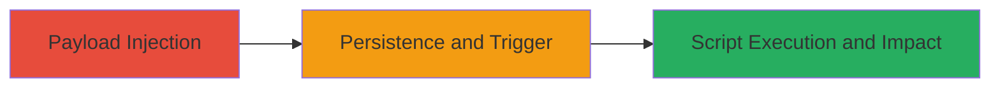

# Stored XSS Exploitation in Pushwoosh Send Push Filters

Multi-stage attack chain demonstrating the exploitation of a stored XSS vulnerability in the Pushwoosh platform's send push form filters, enabling attackers to inject and persist malicious JavaScript that executes in the context of other users' browsers.

## Chain Metrics Dashboard

| Metric | Value |
|--------|-------|
| Chain Status | Unverified |
| Total Steps | 2 |
| Execution Time | ~5 minutes |
| Skill Level | Novice |
| Complexity | Low |
| Impact Level | High |

## Attack Flow Visualization

## Prerequisites & Requirements

### Required Tools

- Browser developer tools for payload crafting and verification
- Access to a Pushwoosh account for form submission

### Target Environment

- Pushwoosh web platform
- Web browser (e.g., Chrome, Firefox)
- No specific ports or services beyond standard HTTPS access

### Initial Access Requirements

- Valid user credentials for the Pushwoosh dashboard
- Network access to the Pushwoosh application (https://cp.pushwoosh.com)
- No prior elevated access needed; standard user privileges suffice

## Detailed Attack Procedures

### Step 1: Payload Injection
procedure: [[procedures/Inject-Stored-XSS-Payload-in-Pushwoosh-Filters]]

**Objective**: Inject a malicious JavaScript payload into the filters section of the send push form to store it persistently on the server.

**Instructions**: Navigate to the Pushwoosh dashboard, access the "Send Push" form, and locate the filters input field. Craft a simple alert payload such as `` and submit it via the form without sanitization.

**Expected Output**: The form accepts the input without error, storing the payload for later retrieval.

**Success Indicators**:
- Form submission succeeds without validation errors
- Payload is saved and visible in the filters configuration upon review

### Step 2: Trigger and Verify Execution
procedure: [[procedures/Trigger-and-Verify-XSS-Execution-in-Viewer-Browsers]]

**Objective**: Trigger the stored payload by having another user (or yourself in a different session) access the send push form, leading to JavaScript execution in their browser context.

**Instructions**: Log out and log in with another account or share the dashboard link. Access the send push form to load the filters, which renders the injected script. Observe the alert dialog or any payload effects like cookie theft simulation.

**Expected Output**: JavaScript executes, displaying an alert or performing actions like document.cookie access.

**Success Indicators**:
- Alert box or console log appears in the viewer's browser
- Potential for further exploitation, such as session token exfiltration to an attacker-controlled server

## Attack Chain Summary

### Key Achievements

1. Successful injection of persistent XSS payload into the filters feature
2. Execution of arbitrary JavaScript in victim browsers viewing the form
3. Demonstration of risks including session hijacking and data theft

## Technique & Tactic Coverage

### MITRE ATT&CK Techniques

- [[JavaScript]]

### MITRE ATT&CK Tactics

- [[Execution]]

---
*Last updated: 2023-10-01T12:00:00Z*
