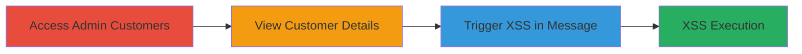

---
tags:
  - stored-xss
  - shopify
  - admin
  - iframe
  - email-preview
type: attack_chain
tools: []
tactics:
  - '[[Execution]]'
verified: false
platforms:
  - Web
submitted: true
complexity: medium
created_at: '2024-01-01T00:00:00Z'
procedures:
  - '[[procedures/Access-Shopify-Admin-Customers-Page]]'
  - '[[procedures/View-Customer-Email-Details]]'
  - '[[procedures/Trigger-Stored-XSS-in-Customer-Message]]'
step_count: 3
techniques:
  - '[[JavaScript]]'
updated_at: '2025-12-13T23:56:03.544Z'
description: >-
  A multi-step attack chain exploiting a stored XSS vulnerability in Shopify's
  admin panel by injecting malicious JavaScript into customer messages and
  triggering execution through an unsandboxed iframe in the email preview
  feature.
skill_level: intermediate
impact_level: high
id: df5ee95d-56a4-448b-9330-759b49c68e80
validated: true
mitre_tactics:
  - '[[Execution]]'
mitre_techniques:
  - '[[JavaScript]]'
---
# Stored XSS Exploitation in Shopify Admin via Unsandboxed Email Preview Iframe

Multi-stage attack chain demonstrating a complete attack workflow for exploiting stored XSS in Shopify's private messaging and Timeline features.

## Chain Metrics Dashboard

| Metric | Value |
|--------|-------|
| Chain Status | Unverified |
| Total Steps | 3 |
| Execution Time | ~2 minutes |
| Skill Level | Intermediate |
| Complexity | Medium |
| Impact Level | High |

## Attack Flow Visualization

## Prerequisites & Requirements

### Required Tools

- None (browser-based exploitation)

### Target Environment

- Shopify Admin Panel (Web platform)
- Required services: Shopify Admin, Customers feature, Timeline feature
- Network access requirements: Valid staff login to target store admin

### Initial Access Requirements

- Credential requirements: Staff account with 'Customers' permission
- Network position: Direct access to admin panel (e.g., https://store.myshopify.com/admin)
- Prior access needed: Malicious JavaScript payload pre-injected into a customer message via private messaging feature

## Detailed Attack Procedures

### Step 1: Access Customers Page

procedure: [[procedures/Access-Shopify-Admin-Customers-Page]]

**Objective**: Navigate to the customers management section to begin targeting a specific customer.

**Instructions**: Log in to the Shopify admin panel using staff credentials, then directly access the customers page by entering the URL or using the navigation menu.

**Expected Output**: The customers list page loads, displaying available customer records.

**Success Indicators**:
- Customers page is accessible without errors
- List of customers is visible

### Step 2: View Customer Email Details

procedure: [[procedures/View-Customer-Email-Details]]

**Objective**: Select and open the details of a customer who has sent a message containing the stored malicious payload.

**Instructions**: From the customers list, click on the email address of the target customer to load their profile, including communication history.

**Expected Output**: Customer profile page opens, showing details such as orders, messages, and Timeline events.

**Success Indicators**:
- Customer profile loads successfully
- Email and message sections are visible

### Step 3: Trigger Stored XSS in Message

procedure: [[procedures/Trigger-Stored-XSS-in-Customer-Message]]

**Objective**: View the malicious message to load it in the unsandboxed iframe, executing the injected JavaScript in the admin context.

**Instructions**: On the customer profile page, locate and click on the sent message in the Timeline or messages section to preview its contents.

**Expected Output**: The message preview iframe loads without the sandbox attribute, executing the stored XSS payload (e.g., alert or data exfiltration script).

**Success Indicators**:
- JavaScript executes (e.g., alert pops up or console logs)
- No sandbox restrictions block the payload

## Attack Chain Summary

### Key Achievements

1. Successful navigation to admin customers without detection
2. Access to customer communications revealing stored payload
3. Arbitrary JavaScript execution in the high-privilege admin panel context, enabling potential account compromise or data theft

## Technique & Tactic Coverage

### MITRE ATT&CK Techniques

- [[JavaScript]]

### MITRE ATT&CK Tactics

- [[Execution]]

---

*Last updated: 2024-01-01T00:00:00Z*
