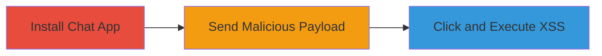

---
tags:
  - xss
  - stored-xss
  - shopify
  - javascript-uri
type: attack_chain
tools: []
tactics:
  - '[[Execution]]'
  - '[[Collection]]'
verified: false
platforms:
  - Web
submitted: true
complexity: medium
created_at: '2023-10-01T00:00:00Z'
procedures:
  - '[[procedures/Install-Shopify-Chat-App]]'
  - '[[procedures/Send-Stored-XSS-Payload-in-Shopify-Chat]]'
  - '[[procedures/Trigger-XSS-Execution-via-Malicious-Link]]'
step_count: 3
techniques:
  - '[[JavaScript]]'
updated_at: '2025-12-13T23:55:38.356Z'
description: >-
  A multi-step attack exploiting a stored XSS vulnerability in the Shopify Chat
  application by injecting a malicious javascript: URI payload, leading to
  arbitrary JavaScript execution when clicked by victims including
  administrators.
skill_level: intermediate
impact_level: high
id: b8cb0aca-23fd-420e-8f07-00275ede6ae8
validated: true
mitre_tactics:
  - '[[Execution]]'
  - '[[Collection]]'
mitre_techniques:
  - '[[JavaScript]]'
---
# Stored XSS Exploitation in Shopify Chat via JavaScript URI

Multi-stage attack chain demonstrating a complete attack workflow exploiting stored XSS in Shopify's chat functionality.

## Chain Metrics Dashboard

| Metric | Value |
|--------|-------|
| Chain Status | Unverified |
| Total Steps | 3 |
| Execution Time | ~5 minutes |
| Skill Level | Intermediate |
| Complexity | Medium |
| Impact Level | High |

## Attack Flow Visualization

## Prerequisites & Requirements

### Required Tools

- None (web browser sufficient)

### Target Environment

- Shopify store with admin access
- Web platform
- Services: Shopify Chat, Shopify Ping

### Initial Access Requirements

- Access to a Shopify store as a user or admin
- Ability to install apps
- No special credentials beyond standard Shopify login

## Detailed Attack Procedures

### Step 1: Install Shopify Chat App
procedure: [[procedures/Install-Shopify-Chat-App]]

**Objective**: Enable the vulnerable chat functionality on the target Shopify store.

**Instructions**: Navigate to the Shopify app store, search for the Chat app, and install it on the target store to activate chat features on the homepage or via Shopify Ping.

**Expected Output**: Chat interface appears on the store homepage, ready for message input.

**Success Indicators**:
- Chat widget visible on the store page
- Ability to send and receive messages confirmed

### Step 2: Send Stored XSS Payload in Shopify Chat
procedure: [[procedures/Send-Stored-XSS-Payload-in-Shopify-Chat]]

**Objective**: Inject a malicious javascript: URI payload into the chat, which is stored and rendered as a clickable link.

**Instructions**: In the chat interface on the shop homepage or Shopify Ping, enter the payload `javascript:alert(1)//https://dqdqdqdqdq.myshopify.com` as a message. The system stores and displays it without proper sanitization, making it appear as a legitimate URL.

**Expected Output**: The payload is sent and visible in the chat history as a clickable link.

**Success Indicators**:
- Message appears in chat without errors
- Link is rendered and clickable for recipients

### Step 3: Trigger XSS Execution via Malicious Link
procedure: [[procedures/Trigger-XSS-Execution-via-Malicious-Link]]

**Objective**: Execute arbitrary JavaScript in the victim's browser by clicking the disguised URI, achieving self-XSS or targeting admins.

**Instructions**: Have the victim (user or admin) click the malicious link in the chat message. The javascript: scheme bypasses URL validation, executing the embedded script.

**Expected Output**: JavaScript alert (or custom payload) executes in the browser context.

**Success Indicators**:
- Alert box or script output appears
- Browser console shows JavaScript execution
- Potential for session hijacking or data theft if payload is escalated

## Attack Chain Summary

### Key Achievements

1. Successful installation and activation of vulnerable chat feature
2. Storage and rendering of unsanitized javascript: URI as a clickable link
3. Arbitrary JavaScript execution in victim browsers, enabling further attacks like session theft

## Technique & Tactic Coverage

### MITRE ATT&CK Techniques

- [[JavaScript]]

### MITRE ATT&CK Tactics

- [[Execution]]
- [[Collection]]

---
*Last updated: 2023-10-01T00:00:00Z*
