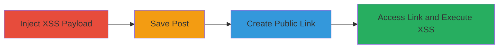

---
tags:
  - xss
  - stored-xss
  - slack
  - web-vulnerability
type: attack_chain
tools: []
tactics:
  - '[[Initial Access]]'
  - '[[Execution]]'
verified: false
platforms:
  - Web
submitted: true
complexity: low
procedures:
  - '[[procedures/Inject-XSS-Payload-into-Slack-File-Post]]'
  - '[[procedures/Save-Malicious-Slack-File-Post]]'
  - '[[procedures/Create-Public-Link-for-Slack-File-Post]]'
  - '[[procedures/Trigger-Stored-XSS-via-Public-Link-Access]]'
step_count: 4
techniques:
  - '[[JavaScript]]'
  - '[[Drive-by Compromise]]'
description: >-
  A multi-step attack demonstrating stored XSS in Slack's file posting feature,
  allowing arbitrary JavaScript execution when public links are accessed.
skill_level: beginner
impact_level: medium
id: 8ac5215c-0c9e-48b7-a89e-7fcf45d85f9e
created_at: '2025-12-14T03:16:31.151Z'
updated_at: '2025-12-14T03:16:31.151Z'
validated: true
mitre_tactics:
  - '[[Initial Access]]'
  - '[[Execution]]'
mitre_techniques:
  - '[[JavaScript]]'
  - '[[Drive-by Compromise]]'
---
# Stored XSS Exploitation in Slack File Posts via Public Links

Multi-stage attack chain demonstrating a complete attack workflow for exploiting stored XSS in Slack's file posting system.

## Chain Metrics Dashboard

| Metric | Value |
|--------|-------|
| Chain Status | Unverified |
| Total Steps | 4 |
| Execution Time | ~5 minutes |
| Skill Level | Beginner |
| Complexity | Low |
| Impact Level | Medium |

## Attack Flow Visualization

## Prerequisites & Requirements

### Required Tools

- Web browser (e.g., Chrome or Firefox)

### Target Environment

- Slack workspace with file posting enabled
- Access to a Slack subdomain (e.g., subdomain.slack.com)
- No special ports required; operates over HTTPS

### Initial Access Requirements

- Authenticated Slack account with permission to create file posts
- Network access to Slack's web interface
- No prior compromise needed

## Detailed Attack Procedures

### Step 1: Inject XSS Payload
procedure: [[procedures/Inject-XSS-Payload-into-Slack-File-Post]]

**Objective**: Introduce a malicious JavaScript payload into the file post's title and body to store XSS content.

**Instructions**: Open your web browser and navigate to the Slack file post creation endpoint, such as `https://subdomain.slack.com/files/create/post`. In the title and body fields, enter the payload `'>'`. This payload uses an image tag with an onerror event to execute JavaScript.

**Expected Output**: The form fields accept the payload without sanitization errors.

**Success Indicators**:
- Payload entered successfully in title and body
- No immediate validation errors from the form

### Step 2: Save the Post
procedure: [[procedures/Save-Malicious-Slack-File-Post]]

**Objective**: Persist the malicious payload in Slack's storage by submitting the post.

**Instructions**: With the payload in place, submit the form to save the file post. Slack will process and store the content, including the unsanitized JavaScript.

**Expected Output**: Confirmation that the post has been saved, with a reference to the new post in your Slack workspace.

**Success Indicators**:
- Post saved without rejection
- Malicious content stored for later retrieval

### Step 3: Create Public Link
procedure: [[procedures/Create-Public-Link-for-Slack-File-Post]]

**Objective**: Generate a shareable public URL that exposes the stored XSS payload on slack-files.com.

**Instructions**: In the Slack interface, locate the saved post and click the 'Create public link' option. This generates a URL like `https://slack-files.com/T025LLJ2X-F025N8W7W-3a5691`.

**Expected Output**: A public link is provided, hosted on www.slack-files.com.

**Success Indicators**:
- Public link generated successfully
- Link points to slack-files.com domain

### Step 4: Trigger XSS Execution
procedure: [[procedures/Trigger-Stored-XSS-via-Public-Link-Access]]

**Objective**: Access the public link to render the stored payload and execute the JavaScript in the victim's browser.

**Instructions**: Share the public link with a target (e.g., via email or chat) and have them open it in their browser. Upon loading, the page will render the post, triggering the onerror event and displaying an alert with '10'.

**Expected Output**: JavaScript alert box pops up in the browser, confirming execution.

**Success Indicators**:
- Alert executes on page load
- No cookies or session data accessible due to sandbox domain

## Attack Chain Summary

### Key Achievements

1. Successful injection and storage of XSS payload in Slack file posts
2. Generation of public links that bypass authentication to deliver the payload
3. Arbitrary JavaScript execution in victim browsers, demonstrating potential for phishing or defacement

## Technique & Tactic Coverage

### MITRE ATT&CK Techniques

- [[JavaScript]]
- [[Drive-by Compromise]]

### MITRE ATT&CK Tactics

- [[Initial Access]]
- [[Execution]]

---
*Last updated: 2024-01-01*
