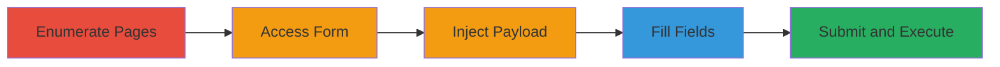

---
tags:
  - stored-xss
  - xss
  - web-vulnerability
  - javascript-injection
  - redirect-attack
type: attack_chain
tools: []
tactics:
  - '[[Initial Access]]'
  - '[[Execution]]'
verified: false
platforms:
  - Web
submitted: true
complexity: low
created_at: '2023-10-01T00:00:00Z'
procedures:
  - '[[procedures/Enumerate-Starbucks-Career-Landing-Pages]]'
  - '[[procedures/Access-Comment-Form-on-Career-Page]]'
  - '[[procedures/Inject-Malicious-XSS-Payload-into-Comment]]'
  - '[[procedures/Fill-Name-and-Email-Fields-in-Comment-Form]]'
  - '[[procedures/Submit-Comment-and-Verify-Stored-XSS-Execution]]'
step_count: 5
techniques:
  - '[[Exploit Public-Facing Application]]'
  - '[[JavaScript]]'
updated_at: '2025-12-13T23:52:33.770Z'
description: >-
  A multi-step attack exploiting a stored XSS vulnerability in the comment
  sections of Starbucks Singapore career landing pages, allowing injection of
  malicious JavaScript that executes on page load for all visitors, enabling
  redirects, phishing, or session hijacking.
skill_level: intermediate
impact_level: high
id: 2c2905fc-1f66-4b07-8e58-107810a59513
validated: true
mitre_tactics:
  - '[[Initial Access]]'
  - '[[Execution]]'
mitre_techniques:
  - '[[Exploit Public-Facing Application]]'
  - '[[JavaScript]]'
---
# Stored XSS Exploitation in Starbucks Career Page Comments Leading to Arbitrary Redirects

Multi-stage attack chain demonstrating a complete attack workflow exploiting a stored XSS vulnerability in the comment sections of Starbucks Singapore's career landing pages. The attack begins with enumeration to identify vulnerable pages, proceeds through form interaction to inject a malicious payload, and culminates in submission and verification of execution, resulting in arbitrary JavaScript execution for all subsequent visitors.

## Chain Metrics Dashboard

| Metric | Value |
|--------|-------|
| Chain Status | Unverified |
| Total Steps | 5 |
| Execution Time | ~5 minutes |
| Skill Level | Intermediate |
| Complexity | Low |
| Impact Level | High |

## Attack Flow Visualization

## Prerequisites & Requirements

### Required Tools

- Web browser (e.g., Chrome or Firefox with developer tools)

### Target Environment

- Web platform
- Starbucks Singapore career pages (e.g., https://www.starbucks.com.sg/careers/career-center/career-landing-*)
- No specific services or ports required beyond standard HTTP/HTTPS access

### Initial Access Requirements

- Public internet access to the target website
- No credentials needed
- Ability to submit comments without authentication

## Detailed Attack Procedures

### Step 1: Enumerate and Browse to Affected Career Landing Pages
procedure: [[procedures/Enumerate-Starbucks-Career-Landing-Pages]]

**Objective**: Identify vulnerable career landing pages by browsing and noting existing signs of compromise, such as spam comments.

**Instructions**: Manually navigate to the career section and visit pages like https://www.starbucks.com.sg/careers/career-center/career-landing-1 through career-landing-6. Observe any existing spam comments that redirect to external sites, indicating poor input validation.

**Expected Output**: List of accessible pages with comment sections; identification of pre-existing spam redirects.

**Success Indicators**:
- Pages load successfully
- Comment sections are visible and interactive
- Existing spam comments confirm lack of sanitization

### Step 2: Access the Comment Form
procedure: [[procedures/Access-Comment-Form-on-Career-Page]]

**Objective**: Interact with the 'Leave a Comment' feature to open the submission form.

**Instructions**: On a targeted page (e.g., career-landing-1), locate and click the 'Leave a Comment' button to reveal the form fields for Name, Email, and Comment.

**Expected Output**: Comment form appears with input fields.

**Success Indicators**:
- Form fields are editable
- No immediate validation errors on access

### Step 3: Inject Malicious Payload into the Comment Field
procedure: [[procedures/Inject-Malicious-XSS-Payload-into-Comment]]

**Objective**: Enter a crafted HTML/JavaScript payload into the comment area to exploit the stored XSS vulnerability.

**Instructions**: In the comment textarea, paste the payload: `
<h2><strong><a href="https://www.hackerone.com">hackerone</a></strong></h2>
`. This includes a fixed div for visibility, CSS to hide other paragraphs, and JavaScript for redirection.

**Expected Output**: Payload entered without form rejection.

**Success Indicators**:
- Payload text appears in the field
- No client-side escaping observed

### Step 4: Enter Dummy Values for Name and Email Fields
procedure: [[procedures/Fill-Name-and-Email-Fields-in-Comment-Form]]

**Objective**: Complete the required form fields with placeholder data to enable submission.

**Instructions**: Input 'Test' in the Name field and 'test@live.com' in the Email field.

**Expected Output**: All form fields populated.

**Success Indicators**:
- Fields accept input without validation errors
- Form is ready for submission

### Step 5: Submit the Comment and Reload the Page
procedure: [[procedures/Submit-Comment-and-Verify-Stored-XSS-Execution]]

**Objective**: Store the payload server-side and verify execution by reloading the page, triggering the XSS for any visitor.

**Instructions**: Click the submit button to post the comment. Once submitted, refresh the page (press F5) to simulate a new visitor load.

**Expected Output**: Page reloads with the injected div visible and automatic redirect to https://hackerone.com; original paragraphs hidden.

**Success Indicators**:
- Comment appears on the page without encoding
- JavaScript executes, causing redirect
- Potential for broader impacts like phishing if payload modified

## Attack Chain Summary

### Key Achievements

1. Identified vulnerable comment sections on multiple career pages
2. Successfully injected and stored malicious JavaScript payload
3. Demonstrated arbitrary code execution leading to redirects and potential data theft for all page visitors

## Technique & Tactic Coverage

### MITRE ATT&CK Techniques

- [[Exploit Public-Facing Application]]
- [[JavaScript]]

### MITRE ATT&CK Tactics

- [[Initial Access]]
- [[Execution]]

---
*Last updated: 2023-10-01T00:00:00Z*
