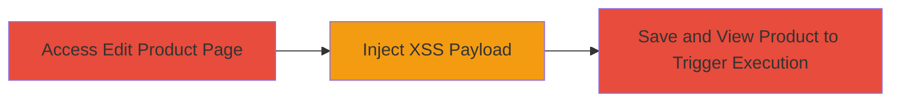

---
tags:
  - xss
  - stored-xss
  - javascript
  - tiktok
  - web-vulnerability
type: attack_chain
tools: []
tactics:
  - '[[Execution]]'
  - '[[Collection]]'
commands: []
platforms:
  - Web
complexity: low
procedures:
  - '[[procedures/Access-TikTok-Seller-Center-Edit-Product-Page]]'
  - '[[procedures/Inject-Malicious-XSS-Payload-into-Product-Name]]'
  - '[[procedures/Save-Changes-and-Trigger-Stored-XSS]]'
step_count: 3
techniques:
  - '[[JavaScript]]'
description: >-
  A multi-step attack exploiting a stored XSS vulnerability in the TikTok Seller
  Center's Edit Product page by injecting malicious JavaScript into the Product
  Name field, leading to arbitrary code execution when the product is viewed.
skill_level: intermediate
impact_level: high
id: 45864cd8-f70f-4482-8b28-2ea1a5817e61
created_at: '2025-12-13T23:55:20.463Z'
updated_at: '2025-12-13T23:55:20.463Z'
verified: false
validated: true
submitted: true
mitre_tactics:
  - '[[Execution]]'
  - '[[Collection]]'
mitre_techniques:
  - '[[JavaScript]]'
---
# Stored XSS Exploitation in TikTok Seller Center Product Name Field

Multi-stage attack chain demonstrating the exploitation of a stored Cross-Site Scripting (XSS) vulnerability in the TikTok Seller Center's 'Edit Product' page. The attack involves injecting a malicious JavaScript payload into the 'Product Name' field, which is stored without proper sanitization and executed in the browser of any user viewing the product details. This can lead to session hijacking, data exfiltration, or further malicious actions in the victim's context.

## Chain Metrics Dashboard

| Metric | Value |
|--------|-------|
| Chain Status | Unverified |
| Total Steps | 3 |
| Execution Time | ~2 minutes |
| Skill Level | Intermediate |
| Complexity | Low |
| Impact Level | High |

## Attack Flow Visualization

## Prerequisites & Requirements

### Required Tools

- Web browser (e.g., Chrome with developer tools for payload testing)

### Target Environment

- Web platform
- TikTok Seller Center service
- Valid user account with edit permissions on products

### Initial Access Requirements

- Authenticated session in TikTok Seller Center
- No special network access beyond standard internet connectivity
- Prior product creation or edit access

## Detailed Attack Procedures

### Step 1: Access Edit Product Page
procedure: [[procedures/Access-TikTok-Seller-Center-Edit-Product-Page]]

**Objective**: Gain access to the product editing interface to prepare for payload injection.

**Instructions**: Log in to your TikTok Seller Center account using a web browser. Navigate to the products section and select an existing product to edit, or create a new one if necessary. This positions you at the 'Edit Product' endpoint where the vulnerable 'Product Name' field is available.

**Expected Output**: The Edit Product page loads, displaying input fields including 'Product Name'.

**Success Indicators**:
- Page loads without errors
- 'Product Name' field is editable

### Step 2: Inject Malicious XSS Payload into Product Name
procedure: [[procedures/Inject-Malicious-XSS-Payload-into-Product-Name]]

**Objective**: Insert unsanitized JavaScript code into the 'Product Name' field to store the payload on the server.

**Instructions**: In the 'Product Name' field, enter a malicious script such as ``. Avoid using more complex payloads initially to test for basic execution. The field does not sanitize HTML or script tags, allowing the input to be stored as-is.

**Expected Output**: The payload is accepted in the field without validation errors.

**Success Indicators**:
- Payload input is not escaped or rejected
- Field accepts the script tag

### Step 3: Save Changes and Trigger Stored XSS
procedure: [[procedures/Save-Changes-and-Trigger-Stored-XSS]]

**Objective**: Persist the payload and execute it by viewing the affected product page.

**Instructions**: Submit the edit form to save the changes. Then, navigate to the product details or listing page where the 'Product Name' is rendered. The stored payload will execute as JavaScript in the browser context, popping an alert or performing other actions.

**Expected Output**: Upon viewing the product, the JavaScript executes, e.g., an alert box appears confirming the XSS.

**Success Indicators**:
- Form saves successfully
- JavaScript alert or equivalent action triggers on product view
- No sanitization occurs during rendering

## Attack Chain Summary

### Key Achievements

1. Successful injection and storage of malicious JavaScript in a persistent field
2. Arbitrary code execution in the browser of any viewer, including admins or other sellers
3. Potential for session theft or data exfiltration via advanced payloads

## Technique & Tactic Coverage

### MITRE ATT&CK Techniques

- [[JavaScript]]

### MITRE ATT&CK Tactics

- [[Execution]]
- [[Collection]]

---
*Last updated: 2023-10-01T00:00:00Z*
