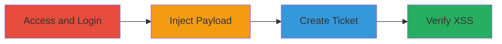

# Stored XSS Exploitation in WordPress Trac Workflow Keywords

Multi-stage attack chain demonstrating a complete workflow to exploit a stored cross-site scripting (XSS) vulnerability in the WordPress Trac instance's workflow keywords feature. The attack involves injecting a malicious payload into the workflow keyword field during ticket creation, which is not properly escaped, leading to arbitrary JavaScript execution when the ticket is viewed. This can result in cookie theft or other client-side attacks.

## Chain Metrics Dashboard

| Metric | Value |
|--------|-------|
| Chain Status | Unverified |
| Total Steps | 4 |
| Execution Time | ~5 minutes |
| Skill Level | Beginner |
| Complexity | Low |
| Impact Level | Medium |

## Attack Flow Visualization



## Prerequisites & Requirements

### Required Tools

- [[tools/Web-Browser]]
- [[tools/Git]] (optional for local testing setup)

### Target Environment

- Target Platform: Web
- Required Services: Trac
- Tech Stack: JavaScript, jQuery, Trac (Python)
- Network Access: Public access to https://core.trac.wordpress.org/

### Initial Access Requirements

- Valid account credentials for WordPress Trac
- Secondary account for verification
- No prior access beyond public website needed

## Detailed Attack Procedures

### Step 1: Access and Prepare for Ticket Creation

**Procedure**: [[procedures/Access-and-Prepare-for-Ticket-Creation-in-WordPress-Trac]]

**Objective**: Gain access to the Trac site and navigate to the ticket creation page to set up for payload injection.

**Expected Output**: Successful login and arrival at the new ticket form.

**Success Indicators**:
- Logged in successfully
- New ticket page loaded with form fields

For local testing, optionally set up a Trac environment using [[commands/git-clone-trac-repo]]:

```bash
git clone git://meta.git.wordpress.org/
```

Navigate to https://core.trac.wordpress.org/ using [[tools/Web-Browser]] and log in with an account. Use a new private window to log in with another account for testing. Then go to https://core.trac.wordpress.org/newticket and set a summary and description for the ticket.

### Step 2: Inject Malicious XSS Payload

**Procedure**: [[procedures/Inject-Malicious-XSS-Payload-in-Workflow-Keyword]]

**Objective**: Insert the malicious payload into the workflow keyword field to exploit the unescaped input vulnerability.

**Expected Output**: Payload successfully entered into the form without immediate errors.

**Success Indicators**:
- Workflow keyword field accepts the payload
- No client-side validation blocks the input

Using [[tools/Web-Browser]], select a Workflow Keyword, click manual, and paste the payload: "><svg/onload=alert(document.domain)>

### Step 3: Create Ticket and Trigger Stored XSS

**Procedure**: [[procedures/Create-Ticket-and-Trigger-Stored-XSS]]

**Objective**: Submit the ticket to store the XSS payload and trigger it upon creation.

**Expected Output**: Ticket created and XSS alert triggered in the current session.

**Success Indicators**:
- Ticket creation successful
- Alert box appears with document.domain

Click the enter button and then the Create Ticket button using [[tools/Web-Browser]], resulting in an XSS alert being triggered.

### Step 4: Verify Stored XSS in Separate Session

**Procedure**: [[procedures/Verify-Stored-XSS-in-Separate-Session]]

**Objective**: Confirm the stored nature of the XSS by viewing the ticket in another logged-in session.

**Expected Output**: XSS alert triggered in the secondary session.

**Success Indicators**:
- Alert appears in the private window
- Payload executes across sessions

Copy the ticket URL, open in a private window with another logged-in account using [[tools/Web-Browser]], and observe the XSS alert.

## Attack Chain Summary

### Key Achievements

1. Successful injection of stored XSS payload
2. Execution of arbitrary JavaScript in victim browsers
3. Potential for cookie theft and further client-side attacks

## Technique & Tactic Coverage

### MITRE ATT&CK Techniques

- [[Exploit Public-Facing Application]]
- [[JavaScript]]

### MITRE ATT&CK Tactics

- [[Initial Access]]
- [[Execution]]
- [[Collection]]

---

*Last updated: 2023-10-01*
