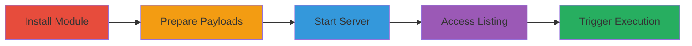

---
tags:
  - xss
  - stored-xss
  - node-js
  - http-server
  - directory-listing
type: attack_chain
tools:
  - '[[tools/npm]]'
  - '[[tools/Firefox-ESR]]'
tactics:
  - '[[Initial Access]]'
  - '[[Execution]]'
verified: false
platforms:
  - Web
  - Node.js
submitted: true
complexity: medium
created_at: '2023-10-01T00:00:00Z'
procedures:
  - '[[procedures/Install-http-server-Module]]'
  - '[[procedures/Create-Malicious-Filenames]]'
  - '[[procedures/Start-http-server]]'
  - '[[procedures/Access-Directory-Listing]]'
  - '[[procedures/Trigger-Stored-XSS]]'
step_count: 5
techniques:
  - '[[Exploit Public-Facing Application]]'
  - '[[JavaScript]]'
updated_at: '2025-12-13T23:52:49.818Z'
description: >-
  Demonstrates a stored XSS attack by injecting malicious JavaScript into
  filenames served by the vulnerable http_server Node.js module, leading to
  script execution in the victim's browser upon directory listing interaction.
skill_level: intermediate
impact_level: high
id: e95ae71e-1bfb-44ab-a50c-4b7485218665
validated: true
mitre_tactics:
  - '[[Initial Access]]'
  - '[[Execution]]'
mitre_techniques:
  - '[[Exploit Public-Facing Application]]'
  - '[[JavaScript]]'
---
# Stored XSS Exploitation in http_server Node.js Module via Malicious Filenames

Multi-stage attack chain demonstrating a complete stored XSS workflow in the http_server Node.js module, where unsanitized filenames allow injection of malicious JavaScript that executes when victims interact with the directory listing.

## Chain Metrics Dashboard

| Metric | Value |
|--------|-------|
| Chain Status | Unverified |
| Total Steps | 5 |
| Execution Time | ~5 minutes |
| Skill Level | Intermediate |
| Complexity | Medium |
| Impact Level | High |

## Attack Flow Visualization



## Prerequisites & Requirements

### Required Tools

- [[tools/npm]]
- [[tools/Firefox-ESR]]

### Target Environment

- Node.js runtime installed
- npm package manager available
- Local directory for serving files (e.g., ~/Desktop/)
- Port 8888 available

### Initial Access Requirements

- Local machine with Node.js and npm
- No remote access needed; attack is local setup simulating server exposure
- Browser for verification

## Detailed Attack Procedures

### Step 1: Install the http_server Module
procedure: [[procedures/Install-http-server-Module]]

**Objective**: Set up the vulnerable http_server module to enable serving directories with unsanitized filenames.

**Instructions**: Install the module globally using [[commands/npm-install-global-http-server]] to make the http_server command available system-wide.

```bash
npm install -g http_server
```

**Expected Output**: Installation completion message from npm, confirming the package is installed.

**Success Indicators**:
- http_server command is executable from the terminal
- No errors during npm installation

### Step 2: Create Malicious Filenames
procedure: [[procedures/Create-Malicious-Filenames]]

**Objective**: Inject XSS payloads into filenames to store malicious scripts on the server-side directory.

**Instructions**: In the target directory (e.g., ~/Desktop/), create files with names containing JavaScript payloads like onmouseover events. Use touch or manual creation for filenames such as '" onmouseover=alert(1) "' or 'image'.

```bash
touch "\" onmouseover=alert(1) \""
touch 'image'
```

**Expected Output**: Files created successfully in the directory, verifiable with ls.

**Success Indicators**:
- Maliciously named files exist in the directory
- Filenames include unescaped HTML/JavaScript attributes

### Step 3: Start the http_server
procedure: [[procedures/Start-http-server]]

**Objective**: Launch the server to expose the directory listing, rendering unsanitized filenames in HTML.

**Instructions**: Navigate to the directory containing malicious files and execute [[commands/http-server-start]] to begin serving on localhost:8888.

```bash
http_server
```

**Expected Output**: Server output indicating "server running is :http://localhost:8888".

**Success Indicators**:
- Server starts without errors
- Localhost:8888 is accessible

### Step 4: Access the Directory Listing
procedure: [[procedures/Access-Directory-Listing]]

**Objective**: View the vulnerable directory listing in a browser to render the malicious filenames.

**Instructions**: Open the served URL in a browser like Firefox ESR to load the HTML directory listing.

No command needed; manually navigate to http://localhost:8888/.

**Expected Output**: Browser displays the directory listing with filenames, including the malicious ones.

**Success Indicators**:
- Page loads without errors
- Filenames appear in the listing

### Step 5: Trigger the Stored XSS
procedure: [[procedures/Trigger-Stored-XSS]]

**Objective**: Execute the injected JavaScript by interacting with the listing, demonstrating client-side script execution.

**Instructions**: Hover the mouse over the malicious filename in the browser's directory listing to trigger the onmouseover event.

No command needed; perform mouseover action on the payload filename.

**Expected Output**: Alert box pops up with "1" or equivalent payload execution.

**Success Indicators**:
- JavaScript alert executes
- Confirms arbitrary code execution in the browser context

## Attack Chain Summary

### Key Achievements

1. Successful installation and setup of the vulnerable http_server module
2. Injection of stored XSS payloads via filenames without sanitization
3. Execution of malicious JavaScript in a victim's browser upon directory interaction

## Technique & Tactic Coverage

### MITRE ATT&CK Techniques

- [[Exploit Public-Facing Application]]
- [[JavaScript]]

### MITRE ATT&CK Tactics

- [[Initial Access]]
- [[Execution]]

---
*Last updated: 2023-10-01T00:00:00Z*
