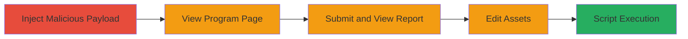

# Stored XSS Exploitation via Program Asset Identifier in HackerOne Platform

Multi-stage attack chain demonstrating a stored XSS vulnerability in the HackerOne platform, where malicious HTML is injected into a program's asset identifier and rendered unsafely due to jQuery's truncate function parsing HTML instead of treating it as plaintext. This allows script execution in vulnerable browsers like Internet Explorer without CSP, or others with CSP disabled, affecting viewers of program pages, reports, and edit interfaces.

## Chain Metrics Dashboard

| Metric | Value |
|--------|-------|
| Chain Status | Unverified |
| Total Steps | 4 |
| Execution Time | ~5 minutes |
| Skill Level | Intermediate |
| Complexity | Medium |
| Impact Level | High |

## Attack Flow Visualization

## Prerequisites & Requirements

### Required Tools

- Web browser (preferably Internet Explorer for full exploitability without CSP)
- Access to a HackerOne program where you can add assets (e.g., as a hacker or admin)

### Target Environment

- HackerOne platform (web application)
- Services: Program management interface
- Tech stack: React, jQuery, JavaScript
- No specific ports; standard HTTPS web access

### Initial Access Requirements

- Valid HackerOne account with permission to manage program scope/assets
- Network access to hackerone.com
- No prior elevated access needed, but authenticated session required

## Detailed Attack Procedures

### Step 1: Inject Malicious Asset
procedure: [[procedures/Inject-Malicious-Asset-Identifier]]

**Objective**: Add a program asset with a malicious payload in the identifier field to store the XSS script.

**Instructions**: Navigate to the program's scope section and add a new asset using the payload `">` in the 'Others' category. This injects HTML that will be parsed later.

**Expected Output**: Asset successfully added to the program scope without immediate errors.

**Success Indicators**:
- Asset appears in the program scope list
- No validation errors on input

### Step 2: Trigger XSS on Program Page
procedure: [[procedures/Trigger-XSS-on-Program-Page]]

**Objective**: Render the asset identifier on the program page to execute the injected script.

**Instructions**: Visit the program page URL, such as `https://hackerone.com/script_src_x_img_src_x_onerror`, and click on the created asset. The jQuery truncate function will parse the HTML, firing the onerror event.

**Expected Output**: Alert box (prompt) pops up in the browser, indicating script execution.

**Success Indicators**:
- JavaScript alert triggers on asset click
- Payload executes in the page context

### Step 3: Trigger XSS via Report Submission
procedure: [[procedures/Trigger-XSS-via-Report-Submission]]

**Objective**: Associate the asset with a report and view it to execute the XSS in a different context.

**Instructions**: Submit a test report linked to the program, then open the submitted report. The asset identifier renders in the report view, triggering the payload.

**Expected Output**: Script execution (e.g., prompt alert) when viewing the report.

**Success Indicators**:
- XSS fires upon report viewing
- Affects any user viewing the report

### Step 4: Trigger XSS in Asset Edit Interface
procedure: [[procedures/Trigger-XSS-in-Asset-Edit-Interface]]

**Objective**: Exploit the vulnerability in the asset editing flow for additional execution points.

**Instructions**: Go to the assets section, click 'edit' on the malicious asset, and observe the rendering of the identifier field.

**Expected Output**: Payload executes during the edit preview or load.

**Success Indicators**:
- Alert triggers in edit mode
- Confirms multi-context exploitability

## Attack Chain Summary

### Key Achievements

1. Successful injection of stored XSS payload into asset identifier
2. Script execution across program pages, reports, and edit interfaces
3. Potential for session hijacking or data theft in vulnerable browsers

## Technique & Tactic Coverage

### MITRE ATT&CK Techniques

- [[JavaScript]]

### MITRE ATT&CK Tactics

- [[Execution]]

---
*Last updated: 2023-10-01T00:00:00Z*
