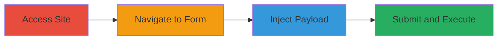

# Stored XSS Exploitation via Question Submission Form on Question.com

Multi-stage attack chain demonstrating a complete stored XSS workflow on a web application.

## Chain Metrics Dashboard

| Metric | Value |
|--------|-------|
| Chain Status | Unverified |
| Total Steps | 4 |
| Execution Time | ~2 minutes |
| Skill Level | Beginner |
| Complexity | Low |
| Impact Level | High |

## Attack Flow Visualization

## Prerequisites & Requirements

### Required Tools

- [[tools/Firefox]]
- [[tools/Chrome]]

### Target Environment

- Web platform
- Access to public-facing website https://www.question.com/
- No authentication required

### Initial Access Requirements

- Internet connectivity
- Standard web browser
- No prior access or credentials needed

## Detailed Attack Procedures

### Step 1: Access Main Site
procedure: [[procedures/Exploit-Stored-XSS-via-Question-Submission]]

**Objective**: Gain initial access to the target website to begin the exploitation process.

**Instructions**: Open a web browser and navigate to the main site URL.

**Expected Output**: The homepage of https://www.question.com/ loads successfully.

**Success Indicators**:
- Site homepage is accessible without errors
- No blocking mechanisms like CAPTCHAs encountered

### Step 2: Navigate to Question Form
procedure: [[procedures/Exploit-Stored-XSS-via-Question-Submission]]

**Objective**: Locate and access the vulnerable question submission form.

**Instructions**: From the homepage, click or directly enter the URL to reach the ask question page.

**Expected Output**: The question submission form at https://www.question.com/ask/ is displayed.

**Success Indicators**:
- Form fields for question input are visible
- Submission button is present and functional

### Step 3: Inject XSS Payload
procedure: [[procedures/Exploit-Stored-XSS-via-Question-Submission]]

**Objective**: Enter a malicious JavaScript payload into the form to test for stored XSS.

**Instructions**: In the question field, input the payload `<iframe onload=alert(document.domain)>` and leave other fields as default if applicable.

**Expected Output**: The payload is accepted without sanitization errors.

**Success Indicators**:
- Payload input is not rejected or escaped
- Form allows progression to submission

### Step 4: Submit and Verify Execution
procedure: [[procedures/Exploit-Stored-XSS-via-Question-Submission]]

**Objective**: Submit the form to store the payload and confirm execution on the generated page.

**Instructions**: Click the submit button to post the question. The site redirects to a new page (e.g., https://www.question.com/iframe-onload-alert-9-1631390.html) where the script should execute.

**Expected Output**: An alert popup displays "document.domain" value, confirming XSS execution.

**Success Indicators**:
- Redirect to a unique question page
- JavaScript alert triggers on page load
- Potential for data theft from viewing users

## Attack Chain Summary

### Key Achievements

1. Successful injection and storage of malicious JavaScript via user input form
2. Persistent execution of script on generated pages viewed by other users
3. Demonstration of data theft potential through browser context execution

## Technique & Tactic Coverage

### MITRE ATT&CK Techniques

- [[JavaScript]]

### MITRE ATT&CK Tactics

- [[Execution]]
- [[Collection]]

---
*Last updated: 2023-10-01T00:00:00Z*
