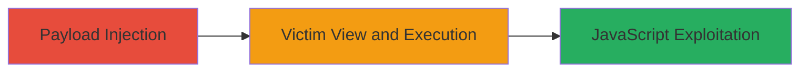

---
tags:
  - xss
  - stored-xss
  - filter-bypass
  - expressionengine
type: attack_chain
tools: []
tactics:
  - '[[Execution]]'
commands: []
platforms:
  - Web
complexity: medium
procedures:
  - '[[procedures/Inject-Malicious-Payload-via-URL-Tag]]'
  - '[[procedures/Trigger-JavaScript-Execution-on-View]]'
step_count: 2
techniques:
  - '[[JavaScript]]'
description: >-
  A multi-stage attack exploiting a stored XSS vulnerability in
  ExpressionEngine's discussion forum by bypassing the XSS filter with the 'URL'
  tag, leading to arbitrary JavaScript execution in victims' browsers.
skill_level: intermediate
impact_level: high
id: d230f66e-c43c-46f8-b8e9-c96f9726f9b1
created_at: '2025-12-13T23:52:20.995Z'
updated_at: '2025-12-13T23:52:20.995Z'
verified: false
validated: true
submitted: true
mitre_tactics:
  - '[[Execution]]'
mitre_techniques:
  - '[[JavaScript]]'
---
# Stored XSS Filter Bypass in ExpressionEngine Discussion Forum Using URL Tag

## Overview

This attack chain demonstrates a stored cross-site scripting (XSS) vulnerability in ExpressionEngine's discussion forum, where attackers can bypass the built-in XSS filter using the 'URL' tag. Discovered by researcher d0bby and reported on HackerOne (Report #1096061) on February 5, 2021, the vulnerability allows injection of malicious JavaScript payloads that persist in forum posts. When victims view the affected thread, the payload executes in their browser, enabling attacks like session hijacking, data theft, or phishing. The chain involves crafting and injecting the payload, followed by execution upon viewing, with high impact on user sessions and client-side security.

## Chain Metrics Dashboard

| Metric | Value |
|--------|-------|
| Chain Status | Unverified |
| Total Steps | 2 |
| Execution Time | ~5 minutes |
| Skill Level | Intermediate |
| Complexity | Medium |
| Impact Level | High |

## Attack Flow Visualization

## Prerequisites & Requirements

### Required Tools

- Web browser with developer tools (e.g., Chrome DevTools for payload testing)
- Access to the ExpressionEngine forum (user account may be required for posting)

### Target Environment

- ExpressionEngine CMS (vulnerable versions prior to patch)
- Web platform with discussion forum enabled
- No specific ports required beyond standard HTTP/HTTPS (80/443)

### Initial Access Requirements

- Valid forum account or anonymous posting capability
- Network access to the target forum URL
- No prior privileged access needed; attacker operates as a regular user

## Detailed Attack Procedures

### Step 1: Payload Injection
procedure: [[procedures/Inject-Malicious-Payload-via-URL-Tag]]

**Objective**: Craft and inject a malicious payload into the discussion forum using the 'URL' tag to bypass the XSS filter, storing the script for later execution.

**Instructions**: Register or log in to the ExpressionEngine forum if required. Navigate to a discussion thread and prepare a post containing the bypass payload. Use the 'URL' tag to encode JavaScript that evades filtering, such as wrapping script in a URL attribute. Submit the post to store the payload persistently.

**Expected Output**: The post appears in the forum without visible errors, but inspection reveals the injected script in the HTML source.

**Success Indicators**:
- Payload successfully posted and visible in the thread
- No filtering errors or post rejection

### Step 2: Trigger Execution
procedure: [[procedures/Trigger-JavaScript-Execution-on-View]]

**Objective**: Lure or wait for a victim to view the infected forum post, triggering arbitrary JavaScript execution in their browser for client-side attacks.

**Instructions**: Share the link to the vulnerable thread via email, social media, or direct messaging to entice victims. Upon viewing, the stored payload executes automatically. Monitor for execution via callback to an attacker-controlled server (e.g., alert or beacon).

**Expected Output**: JavaScript runs in the victim's browser, potentially displaying an alert, stealing cookies, or hijacking sessions.

**Success Indicators**:
- Victim's browser executes the payload (verifiable via network callbacks)
- Evidence of session hijacking or data exfiltration

## Attack Chain Summary

### Key Achievements

1. Successful bypass of ExpressionEngine's XSS filter using the 'URL' tag
2. Persistent storage of malicious JavaScript in forum posts
3. Arbitrary code execution in victims' browsers, enabling session theft or further attacks

## Technique & Tactic Coverage

### MITRE ATT&CK Techniques

- [[JavaScript]]

### MITRE ATT&CK Tactics

- [[Execution]]

---
*Last updated: 2023-10-01*
