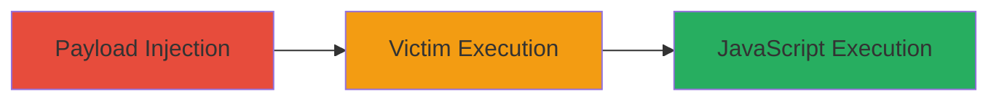

# Stored XSS Filter Bypass in ExpressionEngine Discussion Forum

Multi-stage attack chain demonstrating a complete attack workflow.

## Chain Metrics Dashboard

| Metric | Value |
|--------|-------|
| Chain Status | Unverified |
| Total Steps | 1 |
| Execution Time | ~5 minutes |
| Skill Level | Intermediate |
| Complexity | Medium |
| Impact Level | High |

## Attack Flow Visualization

## Prerequisites & Requirements

### Required Tools

- None (manual browser-based injection)

### Target Environment

- Web platform with ExpressionEngine CMS
- Discussion forum enabled
- No specific ports required (standard HTTP/HTTPS)

### Initial Access Requirements

- Ability to register an account and post in the forum
- No special credentials needed beyond user registration
- Direct network access to the forum URL

## Detailed Attack Procedures

### Step 1: Inject Malicious Payload
procedure: [[procedures/Exploit-Stored-XSS-Filter-Bypass-in-Forum]]

**Objective**: Bypass the XSS filter to store a malicious JavaScript payload in a forum post, which executes when viewed by victims.

**Instructions**: Register a forum account if needed, then craft and post a comment containing a bypass payload, such as using encoded or alternative script tags that evade the filter (e.g., ``). Submit the post to store the payload persistently.

**Expected Output**: The post appears in the forum without visible errors, and the payload is stored server-side.

**Success Indicators**:
- Post successfully submitted and visible in forum threads
- No immediate sanitization errors during posting
- Payload executes when previewed in your own browser (test indicator)

## Attack Chain Summary

### Key Achievements

1. Successful bypass of XSS filter to inject persistent script
2. Arbitrary JavaScript execution in victim browsers viewing the forum
3. Potential for session hijacking, phishing, or data exfiltration

## Technique & Tactic Coverage

### MITRE ATT&CK Techniques

- [[JavaScript]]

### MITRE ATT&CK Tactics

- [[Execution]]

---
*Last updated: 2023-10-01T12:00:00Z*
