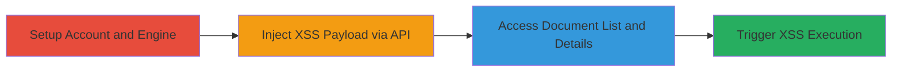

---
tags:
  - xss
  - stored-xss
  - swiftype
  - api-injection
  - javascript-execution
type: attack_chain
tools:
  - '[[tools/curl]]'
tactics:
  - '[[Execution]]'
verified: false
platforms:
  - Web
submitted: true
complexity: medium
created_at: '2023-10-01T00:00:00Z'
procedures:
  - '[[procedures/Setup-Swiftype-Trial-Account-and-API-Engine]]'
  - '[[procedures/Inject-XSS-Payload-into-Swiftype-Document-via-API]]'
  - '[[procedures/Access-Swiftype-Document-Details-to-Trigger-XSS]]'
step_count: 4
techniques:
  - '[[JavaScript]]'
updated_at: '2025-12-14T03:16:20.036Z'
description: >-
  Multi-stage attack exploiting a stored XSS vulnerability in Swiftype's
  API-based engines by injecting malicious JavaScript payloads into document
  fields, leading to execution when admins or viewers access the document
  details page.
skill_level: intermediate
impact_level: high
id: ac75632b-2f6a-4580-9058-d3ad3f12988a
validated: true
mitre_tactics:
  - '[[Execution]]'
mitre_techniques:
  - '[[JavaScript]]'
---
# Stored XSS Injection in Swiftype Document URL Field via API

Multi-stage attack chain demonstrating exploitation of a stored XSS vulnerability in Swiftype's API-based document engines. An attacker creates a trial account, sets up an engine, injects a JavaScript payload into the 'url' and 'thumbnail_url' fields via the API, and triggers execution when an authorized user (admin or viewer) views the document details and clicks the 'View on your site' link. This can lead to session theft, phishing, or further client-side attacks.

## Chain Metrics Dashboard

| Metric | Value |
|--------|-------|
| Chain Status | Unverified |
| Total Steps | 4 |
| Execution Time | ~10 minutes |
| Skill Level | Intermediate |
| Complexity | Medium |
| Impact Level | High |

## Attack Flow Visualization



## Prerequisites & Requirements

### Required Tools

- [[tools/curl]]

### Target Environment

- Web platform with access to Swiftype app (https://app.swiftype.com)
- Required services: Swiftype API (api.swiftype.com)
- Network access: Internet connectivity for API calls and web navigation

### Initial Access Requirements

- No prior credentials needed; uses free trial signup
- Email address for account creation
- Basic knowledge of HTTP APIs and JavaScript payloads

## Detailed Attack Procedures

### Step 1: Setup Trial Account and API Engine
procedure: [[procedures/Setup-Swiftype-Trial-Account-and-API-Engine]]

**Objective**: Establish a Swiftype trial account and create an API-based engine to prepare for document injection.

**Instructions**: Sign up for a trial account using an email address, then create an API-based engine with a document type. This provides the necessary environment for API interactions.

**Expected Output**: Confirmation of account creation and engine setup, including engine name and document type.

**Success Indicators**:
- Trial account dashboard accessible at https://app.swiftype.com
- New engine listed under API engines

### Step 2: Obtain API Key and Inject XSS Payload
procedure: [[procedures/Inject-XSS-Payload-into-Swiftype-Document-via-API]]

**Objective**: Retrieve the API key and use it to create a document with a malicious JavaScript payload in the 'url' field via curl.

**Instructions**: Navigate to account settings to copy the API key, then execute the injection using [[commands/inject-xss-payload-swiftype-api]]:

```bash
curl -X POST 'https://api.swiftype.com/api/v1/engines/123/document_types/test/documents.json' -H 'Content-Type: application/json' -d '{ "auth_token": "gB7BT3iA3GhqoU_SWoRq", "document": { "external_id": "v1uyQZNg2vE", "fields": [ {"name": "url", "value": "javascript:alert(1)", "type": "enum"}, {"name": "thumbnail_url", "value": "javascript:alert(1)", "type": "enum"}, {"name": "channel_id", "value": "UCK8sQmJBp8GCxrOtXWBpyEA", "type": "enum"}, {"name": "title", "value": "How It Feels [through Glass]", "type": "string"}, {"name": "caption", "value": "Want to see how Glass actually feels?...", "type": "text"}, {"name": "tags", "value": ["glass", "wearable computing", "google"], "type": "string"}, {"name": "category_name", "value": "Science & Technology", "type": "string"}, {"name": "category_id", "value": 28, "type": "enum"}, {"name": "published_at", "value": "2013-02-20T10:47:18", "type": "date"}, {"name": "duration", "value": 136, "type": "integer"}, {"name": "view_count", "value": 14599202, "type": "integer"}, {"name": "like_count", "value": 75952, "type": "integer"} ] } }'
```

Replace placeholders like engine name (123), document type (test), auth_token, and external_id with your values.

**Expected Output**: HTTP 200/201 response with document creation confirmation.

**Success Indicators**:
- Document created successfully via API
- Payload stored without validation errors

### Step 3: Access Document List
procedure: [[procedures/Access-Swiftype-Document-Details-to-Trigger-XSS]]

**Objective**: Navigate to the document list page to locate the injected document.

**Instructions**: Visit the documents list URL for your engine and document type, e.g., https://app.swiftype.com/engines/123/document_types/test/documents#q=&page=1. Scan for the document with external_id v1uyQZNg2vE.

**Expected Output**: List of documents including the newly created one.

**Success Indicators**:
- Injected document appears in the list
- No immediate errors on page load

### Step 4: View Details and Trigger XSS
procedure: [[procedures/Access-Swiftype-Document-Details-to-Trigger-XSS]]

**Objective**: Access the document details page and click the vulnerable link to execute the XSS payload.

**Instructions**: Click on the document ID to open the details page at https://app.swiftype.com/engines/123/document_types/test/documents/v1uyQZNg2vE. Locate and click the 'View on your site' link, which renders the malicious 'url' as http://javascript:alert(1).

**Expected Output**: Alert box pops up executing alert(1), confirming XSS.

**Success Indicators**:
- JavaScript alert triggers on link click
- Potential for session cookie access or further payload execution

## Attack Chain Summary

### Key Achievements

1. Successful injection of stored XSS payload via Swiftype API without validation.
2. Persistence of the payload in document fields accessible to admins/viewers.
3. Execution of arbitrary JavaScript in the victim's browser, enabling session theft or phishing.

## Technique & Tactic Coverage

### MITRE ATT&CK Techniques

- [[JavaScript]]

### MITRE ATT&CK Tactics

- [[Execution]]

---
*Last updated: 2023-10-01T00:00:00Z*
