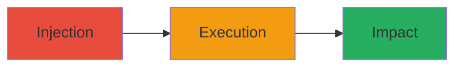

---
tags:
  - xss
  - stored-xss
  - web-vulnerability
  - script-injection
type: attack_chain
tools: []
tactics:
  - '[[Execution]]'
verified: false
platforms:
  - Web
submitted: true
complexity: medium
created_at: '2023-10-01T00:00:00Z'
procedures:
  - '[[procedures/Exploiting-Stored-XSS-Vulnerability]]'
step_count: 1
techniques:
  - '[[JavaScript]]'
updated_at: '2025-12-14T03:16:14.012Z'
description: >-
  A stored Cross-Site Scripting (XSS) vulnerability in Y Combinator's web
  application allowing injection of malicious scripts that persist and execute
  in users' browsers.
skill_level: intermediate
impact_level: high
id: bf2eba1c-8766-4b40-a805-a3d6dc90bb92
validated: true
mitre_tactics:
  - '[[Execution]]'
mitre_techniques:
  - '[[JavaScript]]'
---
# Stored XSS Injection in Y Combinator Web Application

Multi-stage attack chain demonstrating a complete attack workflow.

## Chain Metrics Dashboard

| Metric | Value |
|--------|-------|
| Chain Status | Unverified |
| Total Steps | 1 |
| Execution Time | ~5 minutes |
| Skill Level | Intermediate |
| Complexity | Medium |
| Impact Level | High |

## Attack Flow Visualization

## Prerequisites & Requirements

### Required Tools

- Browser developer tools

### Target Environment

- Web application (Y Combinator platform)
- Required services/ports: HTTP/HTTPS on standard ports (80/443)
- Network access requirements: Public internet access to the web app

### Initial Access Requirements

- No credentials required for public-facing injection points
- Network position: External attacker
- Prior access needed: None

## Detailed Attack Procedures

### Step 1: Inject and Execute Malicious Script
procedure: [[procedures/Exploiting-Stored-XSS-Vulnerability]]

**Objective**: Identify an input field lacking sanitization, inject a malicious script, and trigger its execution in other users' browsers to potentially hijack sessions or steal data.

**Instructions**: Use browser tools to submit a payload like `` into a form that stores user input (e.g., comments or profiles). Refresh or have another user view the stored content to execute the script.

**Expected Output**: Alert box or console log confirming script execution; in a real exploit, could include data exfiltration to an attacker-controlled server.

**Success Indicators**:
- Script executes without errors
- No data exposure in this case, but potential for session theft confirmed via payload

## Attack Chain Summary

### Key Achievements

1. Successful identification of stored XSS in web app input handling
2. Injection of persistent malicious script
3. Disclosure and rapid fix by the vendor with no actual data loss

## Technique & Tactic Coverage

### MITRE ATT&CK Techniques

- [[JavaScript]]

### MITRE ATT&CK Tactics

- [[Execution]]

---
*Last updated: 2023-10-01T00:00:00Z*
