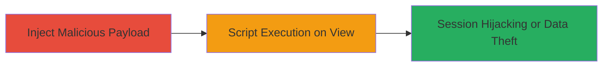

# Stored XSS Injection via Link Thumbnail Addition in Linktr.ee

Multi-stage attack chain demonstrating a complete attack workflow exploiting a stored XSS vulnerability in Linktr.ee's link thumbnail feature.

## Chain Metrics Dashboard

| Metric | Value |
|--------|-------|
| Chain Status | Unverified |
| Total Steps | 1 |
| Execution Time | ~5 minutes |
| Skill Level | Intermediate |
| Complexity | Medium |
| Impact Level | Medium |

## Attack Flow Visualization



## Prerequisites & Requirements

### Required Tools

- Browser with developer tools (e.g., Chrome DevTools)
- Optional: Proxy tool like [[tools/Burp-Suite]] for intercepting requests

### Target Environment

- Web platform
- Access to Linktr.ee account creation and link management
- No specific ports or services required beyond standard HTTPS (443)

### Initial Access Requirements

- Valid Linktr.ee user account (free to create)
- Ability to add custom links and thumbnails
- Victim interaction (other users viewing the injected link thumbnails)

## Detailed Attack Procedures

### Step 1: Inject and Trigger Stored XSS
procedure: [[procedures/Exploit-Stored-XSS-in-Link-Thumbnail-Addition]]

**Objective**: Inject a malicious JavaScript payload into the link thumbnail addition feature, store it on the server, and execute it when other users view the affected link previews.

**Instructions**: Create a Linktr.ee account if needed, then navigate to the link addition section. When adding a thumbnail URL, craft a payload that bypasses sanitization, such as embedding a script tag in a data URI or URL parameter. Submit the form to store the payload. Once stored, share the link profile; when victims view it, the thumbnail renders the script in their browser context.

For testing, use browser developer tools to inspect the thumbnail rendering:

```javascript
// In console, simulate payload execution
debugger; alert('XSS Executed');
```

Intercept the thumbnail submission request using a proxy if needed:

```http
POST /api/thumbnail HTTP/1.1
Host: linktr.ee
Content-Type: application/json

{"url": "javascript:alert('XSS')"}
```

**Expected Output**: The malicious script executes in the viewer's browser, e.g., an alert box or cookie theft via network request.

**Success Indicators**:
- Payload stored without error in thumbnail addition
- Script executes on page load for viewers (confirm via alert or logged network activity)
- Potential session cookie exfiltration to attacker-controlled server

## Attack Chain Summary

### Key Achievements

1. Successful injection of stored XSS payload via thumbnail URL field
2. Execution of arbitrary JavaScript in victim browsers viewing link previews
3. Potential for session hijacking, data theft, or phishing attacks on unsuspecting users

## Technique & Tactic Coverage

### MITRE ATT&CK Techniques

- [[JavaScript]]

### MITRE ATT&CK Tactics

- [[Execution]]
- [[Collection]]

---
*Last updated: 2023-10-01T00:00:00Z*
