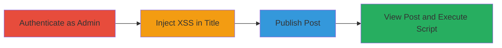

---
tags:
  - xss
  - stored-xss
  - wordpress
type: attack_chain
tools: []
tactics:
  - '[[Initial Access]]'
  - '[[Execution]]'
  - '[[Collection]]'
verified: false
platforms:
  - Web
submitted: true
complexity: low
created_at: '2023-10-05T12:00:00Z'
procedures:
  - '[[procedures/Authenticate-to-WordPress-Admin-Panel]]'
  - '[[procedures/Inject-XSS-Payload-into-Post-Title]]'
  - '[[procedures/Publish-Post-Containing-XSS]]'
  - '[[procedures/Trigger-Stored-XSS-by-Viewing-Post]]'
step_count: 4
techniques:
  - '[[JavaScript]]'
updated_at: '2025-12-14T03:16:37.101Z'
description: >-
  Demonstrates how an authenticated WordPress admin or editor can inject a
  stored XSS payload into a post title, leading to script execution when the
  post is viewed on the frontend.
skill_level: beginner
impact_level: medium
id: 8613eaa7-ac7e-476a-90df-eb9fd14caa26
validated: true
mitre_tactics:
  - '[[Initial Access]]'
  - '[[Execution]]'
  - '[[Collection]]'
mitre_techniques:
  - '[[JavaScript]]'
---
# Stored XSS Injection via WordPress Post Title

Multi-stage attack chain demonstrating how authenticated users with admin or editor privileges in WordPress 5.3 can inject and trigger stored XSS via the post title field. Although WordPress considers this intended behavior for privileged users who can post unfiltered HTML, it can lead to arbitrary JavaScript execution, such as cookie theft, when the post is viewed by other users on the frontend.

## Chain Metrics Dashboard

| Metric | Value |
|--------|-------|
| Chain Status | Unverified |
| Total Steps | 4 |
| Execution Time | ~5 minutes |
| Skill Level | Beginner |
| Complexity | Low |
| Impact Level | Medium |

## Attack Flow Visualization

## Prerequisites & Requirements

### Required Tools

- Web browser (e.g., Chrome, Firefox)

### Target Environment

- WordPress 5.3 or similar version
- PHP-based web server
- MySQL database
- Admin or editor user privileges

### Initial Access Requirements

- Valid admin or editor credentials for the WordPress site
- Direct access to the WordPress admin dashboard (typically /wp-admin/)
- No prior network access beyond standard HTTP/HTTPS

## Detailed Attack Procedures

### Step 1: Authenticate to WordPress Admin Panel
procedure: [[procedures/Authenticate-to-WordPress-Admin-Panel]]

**Objective**: Gain access to the WordPress admin interface to create posts with unfiltered HTML.

**Instructions**: Open a web browser and navigate to the WordPress login page, typically at `https://target.com/wp-admin/`. Enter admin credentials to log in.

**Expected Output**: Successful login redirects to the dashboard, granting access to post creation tools.

**Success Indicators**:
- Dashboard loads with admin menu options visible
- User role confirmed as admin or editor

### Step 2: Inject XSS Payload into Post Title
procedure: [[procedures/Inject-XSS-Payload-into-Post-Title]]

**Objective**: Insert a malicious JavaScript payload into the post title field, which is not sanitized for privileged users.

**Instructions**: From the dashboard, go to Posts > Add New. In the title field, enter a payload like ``. Add any body content if needed, but the title is key.

**Expected Output**: The payload appears in the title field without escaping or warnings.

**Success Indicators**:
- Payload is accepted in the title without sanitization
- Preview shows the script tag intact

### Step 3: Publish Post Containing XSS
procedure: [[procedures/Publish-Post-Containing-XSS]]

**Objective**: Store the payload in the database by publishing the post, making it available on the frontend.

**Instructions**: Click the 'Publish' button in the post editor. Confirm publication if prompted.

**Expected Output**: Post status changes to 'Published', and a permalink is generated.

**Success Indicators**:
- Post appears in the Posts list as published
- No errors during save or publish

### Step 4: Trigger Stored XSS by Viewing Post
procedure: [[procedures/Trigger-Stored-XSS-by-Viewing-Post]]

**Objective**: Render the post on the frontend to execute the stored script in viewers' browsers.

**Instructions**: Copy the post's permalink and open it in a browser (can be incognito to simulate another user). The title renders, executing the script.

**Expected Output**: Alert box or other script effects trigger, such as `alert(document.domain)` popping up.

**Success Indicators**:
- Script executes (e.g., alert fires)
- Browser console shows JavaScript errors or network requests if payload is more advanced (e.g., cookie exfiltration)

## Attack Chain Summary

### Key Achievements

1. Authenticated access to inject unfiltered HTML
2. Storage of XSS payload in post title without sanitization
3. Frontend execution of arbitrary JavaScript on post view
4. Potential for client-side attacks like session hijacking

## Technique & Tactic Coverage

### MITRE ATT&CK Techniques

- [[JavaScript]]

### MITRE ATT&CK Tactics

- [[Initial Access]]
- [[Execution]]
- [[Collection]]

---
*Last updated: 2023-10-05T12:00:00Z*
