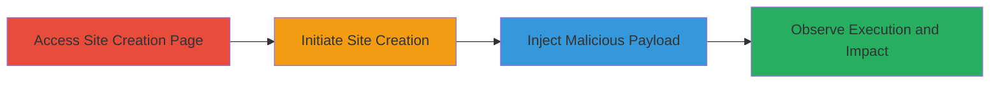

---
tags:
  - xss
  - stored-xss
  - html-injection
  - web-vulnerability
  - credential-theft
  - phishing
type: attack_chain
tools: []
tactics:
  - '[[Execution]]'
  - '[[Collection]]'
verified: false
platforms:
  - Web
submitted: true
complexity: low
created_at: '2023-10-01T00:00:00Z'
procedures:
  - '[[procedures/Access-Pressable-Site-Creation-Page]]'
  - '[[procedures/Initiate-New-Site-Creation-on-Pressable]]'
  - '[[procedures/Inject-Malicious-Payload-in-Display-Name]]'
  - '[[procedures/Observe-XSS-or-HTML-Injection-Execution]]'
step_count: 4
techniques:
  - '[[JavaScript]]'
  - '[[Exploit Public-Facing Application]]'
updated_at: '2025-12-14T03:46:32.042Z'
description: >-
  A multi-stage attack exploiting insufficient input sanitization in the Display
  Name field during site creation on try.pressable.com, enabling stored XSS for
  credential theft and HTML injection for phishing.
skill_level: beginner
impact_level: high
id: c7c6f646-46e1-4355-94a6-94524f0fcc8a
validated: true
mitre_tactics:
  - '[[Execution]]'
  - '[[Collection]]'
mitre_techniques:
  - '[[JavaScript]]'
  - '[[Exploit Public-Facing Application]]'
---
# Stored XSS and HTML Injection in Pressable Site Creation Display Name

Multi-stage attack chain demonstrating exploitation of a stored XSS and HTML injection vulnerability in the Display Name section of the site creation process on try.pressable.com. An attacker creates a new site, injects malicious payloads into the Display Name field, and observes execution when the site information is displayed, allowing script execution for cookie theft or HTML rendering for phishing forms.

## Chain Metrics Dashboard

| Metric | Value |
|--------|-------|
| Chain Status | Unverified |
| Total Steps | 4 |
| Execution Time | ~5 minutes |
| Skill Level | Beginner |
| Complexity | Low |
| Impact Level | High |

## Attack Flow Visualization

## Prerequisites & Requirements

### Required Tools

- Web browser (e.g., Chrome, Firefox)

### Target Environment

- Web platform: https://try.pressable.com/
- No specific services or ports required beyond standard HTTPS (443)
- Public internet access

### Initial Access Requirements

- No credentials needed
- Direct public access to the site creation page
- No prior access required

## Detailed Attack Procedures

### Step 1: Access Site Creation Page
procedure: [[procedures/Access-Pressable-Site-Creation-Page]]

**Objective**: Navigate to the vulnerable site creation interface to begin the attack workflow.

**Instructions**: Open a web browser and directly visit the site creation page at https://try.pressable.com/. Ensure you are on the page where site details, including the Display Name field, can be entered.

**Expected Output**: The site creation form loads, displaying fields for site configuration.

**Success Indicators**:
- Page loads without errors
- Display Name input field is visible

### Step 2: Initiate New Site Creation
procedure: [[procedures/Initiate-New-Site-Creation-on-Pressable]]

**Objective**: Start the process of creating a new site to access the vulnerable Display Name input.

**Instructions**: Follow the on-screen prompts to begin creating a new site, such as selecting a plan or entering basic details, leading to the Display Name section.

**Expected Output**: Progress to the Display Name input stage in the workflow.

**Success Indicators**:
- Workflow advances without validation errors
- Display Name field becomes editable

### Step 3: Inject Malicious Payload in Display Name
procedure: [[procedures/Inject-Malicious-Payload-in-Display-Name]]

**Objective**: Insert XSS or HTML payloads into the Display Name field to exploit the lack of sanitization, enabling stored execution.

**Instructions**: In the Display Name field, enter a stored XSS payload such as `">` to test script execution and cookie theft. Alternatively, for HTML injection, use `<form action="/action_page.php"><label for="fname">First name:</label><input type="text" id="fname" name="fname">  <label for="lname">Last name:</label><input type="text" id="lname" name="lname">  <input type="submit" value="Submit"></form>` to render a phishing form. Complete the site creation by submitting the form.

**Expected Output**: Site creation succeeds, and the payload is stored in the site's metadata.

**Success Indicators**:
- No input rejection or sanitization errors
- Site is created successfully

### Step 4: Observe XSS or HTML Injection Execution
procedure: [[procedures/Observe-XSS-or-HTML-Injection-Execution]]

**Objective**: View the site information page to trigger the stored payload, confirming execution and potential impact like alerts or form rendering.

**Instructions**: After creation, navigate to the site's information or dashboard page where the Display Name is displayed. Refresh or reload the page to reflect the stored content.

**Expected Output**: The XSS payload triggers an alert showing document cookies, or the HTML form renders interactively on the page.

**Success Indicators**:
- JavaScript executes (e.g., alert pops up with cookies)
- HTML elements render as intended (e.g., form appears and functions)

## Attack Chain Summary

### Key Achievements

1. Successful injection of unsanitized payloads into a persistent field
2. Execution of arbitrary JavaScript for credential exfiltration
3. Rendering of malicious HTML for phishing or content manipulation

## Technique & Tactic Coverage

### MITRE ATT&CK Techniques

- [[JavaScript]]
- [[Exploit Public-Facing Application]]

### MITRE ATT&CK Tactics

- [[Execution]]
- [[Collection]]

---
*Last updated: 2023-10-01T00:00:00Z*
