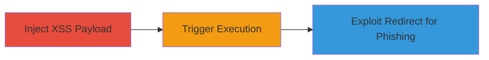

# Stored XSS and Open Redirect Exploitation in ExpressionEngine for JavaScript Execution and Phishing

Multi-stage attack chain demonstrating exploitation of stored cross-site scripting (XSS) and open HTTP redirection vulnerabilities in ExpressionEngine, a PHP-based content management system. The chain allows attackers to inject malicious JavaScript that executes in the browsers of other users, potentially leading to session hijacking or data theft, and uses open redirects to lure victims to phishing sites.

## Chain Metrics Dashboard

| Metric | Value |
|--------|-------|
| Chain Status | Unverified |
| Total Steps | 3 |
| Execution Time | ~5 minutes |
| Skill Level | Intermediate |
| Complexity | Medium |
| Impact Level | High |

## Attack Flow Visualization

## Prerequisites & Requirements

### Required Tools

- Browser developer tools for payload testing
- Proxy tool like Burp Suite for intercepting requests

### Target Environment

- ExpressionEngine CMS (PHP-based web application)
- Web server with HTTP endpoints
- No specific ports required beyond standard 80/443

### Initial Access Requirements

- Ability to submit user input (e.g., comments, forms) without authentication or with low-privilege account
- Network access to the target web application
- No prior access needed beyond public-facing interface

## Detailed Attack Procedures

### Step 1: Inject Stored XSS Payload
procedure: [[procedures/Inject-Stored-XSS-Payload-in-ExpressionEngine]]

**Objective**: Submit malicious JavaScript payload to a vulnerable input field in ExpressionEngine that gets stored and rendered for other users.

**Instructions**: Identify a stored input point such as a comment or entry form. Use a browser or proxy to submit a payload like ``, ensuring it bypasses any basic filtering due to insufficient sanitization.

**Expected Output**: Payload stored in the database and visible when the affected page is loaded by other users.

**Success Indicators**:
- Payload appears unescaped in the page source when viewed by another user
- Alert or console log triggers on page load

### Step 2: Trigger XSS Execution in User Browsers
procedure: [[procedures/Trigger-XSS-Execution-in-User-Browsers]]

**Objective**: Lure or wait for targeted users to visit the page containing the stored payload, executing arbitrary JavaScript in their browser context.

**Instructions**: Share the URL of the vulnerable page via social engineering or wait for natural traffic. The payload executes automatically upon rendering, allowing actions like stealing cookies or keylogging.

**Expected Output**: JavaScript runs in the victim's browser, e.g., sending session data to attacker-controlled server.

**Success Indicators**:
- Victim's session cookie exfiltrated to attacker's endpoint
- Malicious actions (e.g., form submissions) performed in victim's context

### Step 3: Exploit Open Redirect for Phishing
procedure: [[procedures/Exploit-Open-Redirect-for-Phishing]]

**Objective**: Manipulate a redirect endpoint to send users to a malicious phishing site, combining with XSS for enhanced deception.

**Instructions**: Append a malicious URL to the vulnerable redirect parameter, e.g., `?redirect=http://evil.com/phish`. Trigger the redirect from a page affected by XSS to seamlessly direct victims.

**Expected Output**: User browser redirects to the attacker-specified URL without validation.

**Success Indicators**:
- Successful navigation to phishing site
- No error or block on external domain redirect

## Attack Chain Summary

### Key Achievements

1. Injected and stored malicious JavaScript for persistent execution across users
2. Achieved arbitrary code execution in victim browsers leading to potential data theft
3. Enabled phishing campaigns via unvalidated redirects to external malicious domains

## Technique & Tactic Coverage

### MITRE ATT&CK Techniques

- [[JavaScript]]
- [[T1566.002]]

### MITRE ATT&CK Tactics

- [[Execution]]
- [[Initial Access]]

---
*Last updated: 2023-10-01T12:00:00Z*
