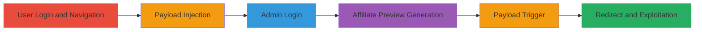

---
tags:
  - xss
  - stored-xss
  - open-redirect
  - revive-adserver
type: attack_chain
tools: []
tactics:
  - '[[Initial Access]]'
  - '[[Execution]]'
verified: false
platforms:
  - Web
submitted: true
complexity: medium
created_at: '2023-10-01T00:00:00Z'
procedures:
  - '[[procedures/Inject-XSS-Payload-into-Website-Properties]]'
  - '[[procedures/Trigger-XSS-via-Affiliate-Preview]]'
step_count: 6
techniques:
  - '[[JavaScript]]'
  - '[[Drive-by Compromise]]'
updated_at: '2025-12-14T17:24:26.160Z'
description: >-
  A multi-stage attack exploiting stored XSS and open redirect vulnerabilities
  in Revive Adserver's website properties feature to inject malicious payloads
  and redirect administrators to arbitrary sites.
skill_level: intermediate
impact_level: high
id: e54b16ae-8e3e-48d0-96c2-e0761fbc3b5c
validated: true
mitre_tactics:
  - '[[Initial Access]]'
  - '[[Execution]]'
mitre_techniques:
  - '[[JavaScript]]'
  - '[[Drive-by Compromise]]'
---
# Stored XSS and Open Redirect in Revive Adserver Website Properties

Multi-stage attack chain demonstrating a complete attack workflow exploiting stored XSS and open redirect in Revive Adserver to execute JavaScript and redirect users to malicious sites.

## Chain Metrics Dashboard

| Metric | Value |
|--------|-------|
| Chain Status | Unverified |
| Total Steps | 6 |
| Execution Time | ~5 minutes |
| Skill Level | Intermediate |
| Complexity | Medium |
| Impact Level | High |

## Attack Flow Visualization

## Prerequisites & Requirements

### Required Tools

- Web browser (e.g., Firefox or Chrome with developer tools)

### Target Environment

- Revive Adserver instance (PHP-based web application)
- Accessible admin panel
- Valid user and administrator credentials

### Initial Access Requirements

- Network access to the Revive Adserver web interface
- User account with inventory management permissions
- Administrator account for previewing

## Detailed Attack Procedures

### Step 1: Login with Valid User Credentials
procedure: [[procedures/Inject-XSS-Payload-into-Website-Properties]]

**Objective**: Gain access to the inventory management interface to prepare for payload injection.

**Instructions**: Open a web browser and navigate to the Revive Adserver login page. Enter valid user credentials with access to the inventory section.

**Expected Output**: Successful login redirecting to the admin dashboard.

**Success Indicators**:
- Dashboard loads without errors
- Navigation to inventory menu is available

### Step 2: Navigate to Inventory > Website > Website Properties
procedure: [[procedures/Inject-XSS-Payload-into-Website-Properties]]

**Objective**: Access the form where the vulnerable Website URL field is located.

**Instructions**: From the admin dashboard, click on "Inventory" in the main menu, then select "Websites", and choose "Website Properties" to open the edit form.

**Expected Output**: The website properties form loads, displaying fields including the Website URL.

**Success Indicators**:
- Form fields are editable
- Save button is visible

### Step 3: Fill the Form and Enter Malicious Website URL, then Save Changes
procedure: [[procedures/Inject-XSS-Payload-into-Website-Properties]]

**Objective**: Inject a stored XSS payload into the Website URL field to enable later execution.

**Instructions**: In the Website URL field, enter the payload `http://Test">`. Fill other required fields as needed, then click "Save Changes".

**Expected Output**: Form submission succeeds, and the changes are stored without validation errors.

**Success Indicators**:
- Confirmation message for saved changes
- Payload is persisted in the backend

### Step 4: Login with an Administrator Account
procedure: [[procedures/Trigger-XSS-via-Affiliate-Preview]]

**Objective**: Switch to an admin context to access preview functionality that renders the injected payload.

**Instructions**: Log out of the user account if necessary, then log in using administrator credentials.

**Expected Output**: Admin dashboard loads with elevated permissions.

**Success Indicators**:
- Admin-specific menus are visible
- Access to affiliate tools is granted

### Step 5: Open the Affiliate-Preview.php Endpoint with Specific Parameters
procedure: [[procedures/Trigger-XSS-via-Affiliate-Preview]]

**Objective**: Generate invocation tags that include the vulnerable website properties, rendering the stored payload.

**Instructions**: Navigate directly to the URL `http://localhost/hackerone/www/admin/affiliate-preview.php?codetype=invocationTags%3AoxInvocationTags%3Aspc&block=0&blockcampaign=0&target=&source=&withtext=0&charset=&noscript=1&ssl=0&comments=0&affiliateid=1&submitbutton=Generate` (adjust base URL to match the target instance). This simulates generating tags for affiliate ID 1.

**Expected Output**: The preview page loads, displaying generated invocation tags including a Header Script Banner.

**Success Indicators**:
- Invocation code is rendered
- Banner image from the injected website URL appears

### Step 6: Click on the Header Script Banner Image to Trigger the Payload
procedure: [[procedures/Trigger-XSS-via-Affiliate-Preview]]

**Objective**: Execute the stored XSS payload to perform the open redirect.

**Instructions**: Locate the rendered Header Script Banner image on the preview page and click on it to trigger the onclick event.

**Expected Output**: Browser redirects to `http://google.com` (or the attacker's specified site), confirming the open redirect.

**Success Indicators**:
- JavaScript executes without errors
- Redirect occurs to the external site

## Attack Chain Summary

### Key Achievements

1. Successful injection of a stored XSS payload into the Website URL field without sanitization.
2. Rendering of the payload in the admin preview interface, leading to JavaScript execution.
3. Achievement of an open redirect to an arbitrary external site, enabling phishing or further attacks.

## Technique & Tactic Coverage

### MITRE ATT&CK Techniques

- [[JavaScript]]
- [[Drive-by Compromise]]

### MITRE ATT&CK Tactics

- [[Initial Access]]
- [[Execution]]

---

*Last updated: 2023-10-01T00:00:00Z*
