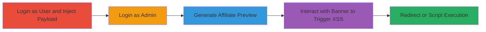

---
tags:
  - xss
  - open-redirect
  - stored-xss
  - revive-adserver
  - php
  - web-vulnerability
type: attack_chain
tools: []
tactics:
  - '[[Initial Access]]'
  - '[[Execution]]'
verified: false
platforms:
  - Web
submitted: true
complexity: medium
created_at: '2023-10-01T12:00:00Z'
procedures:
  - '[[procedures/Login-and-Inject-Malicious-URL-in-Revive-Adserver]]'
  - '[[procedures/Login-as-Admin-and-Generate-Affiliate-Preview]]'
  - '[[procedures/Trigger-XSS-via-Banner-Interaction-in-Revive-Adserver]]'
step_count: 6
techniques:
  - '[[Exploit Public-Facing Application]]'
  - '[[JavaScript]]'
updated_at: '2025-12-14T03:15:41.652Z'
description: >-
  A multi-stage attack exploiting stored XSS and open redirect vulnerabilities
  in Revive Adserver's inventory management to inject malicious payloads and
  redirect administrators to arbitrary sites.
skill_level: intermediate
impact_level: high
id: e3bed2a2-5a0a-4163-be6a-bc063092d156
validated: true
mitre_tactics:
  - '[[Initial Access]]'
  - '[[Execution]]'
mitre_techniques:
  - '[[Exploit Public-Facing Application]]'
  - '[[JavaScript]]'
---
# Stored XSS and Open Redirect in Revive Adserver Website URL Field

Multi-stage attack chain demonstrating a complete attack workflow exploiting stored XSS and open redirect in Revive Adserver's website URL field to execute JavaScript and redirect users.

## Chain Metrics Dashboard

| Metric | Value |
|--------|-------|
| Chain Status | Unverified |
| Total Steps | 6 |
| Execution Time | ~5 minutes |
| Skill Level | Intermediate |
| Complexity | Medium |
| Impact Level | High |

## Attack Flow Visualization

## Prerequisites & Requirements

### Required Tools

- Web browser (e.g., Chrome or Firefox with developer tools)

### Target Environment

- Revive Adserver application running on PHP
- Access to inventory management section
- Valid user and admin credentials

### Initial Access Requirements

- Standard user account for injection
- Administrator account for triggering
- Network access to the Revive Adserver instance

## Detailed Attack Procedures

### Step 1: Login as User
procedure: [[procedures/Login-and-Inject-Malicious-URL-in-Revive-Adserver]]

**Objective**: Gain access as a standard user to reach the inventory management interface.

**Instructions**: Open a web browser and navigate to the Revive Adserver login page. Enter valid user credentials to authenticate.

**Expected Output**: Successful login redirect to the dashboard.

**Success Indicators**:
- User dashboard accessible
- No authentication errors

### Step 2: Navigate to Website Properties and Inject Payload
procedure: [[procedures/Login-and-Inject-Malicious-URL-in-Revive-Adserver]]

**Objective**: Inject a malicious payload into the Website URL field without sanitization.

**Instructions**: From the dashboard, go to Inventory > Website > Website Properties. In the URL field, enter the payload `http://Test">` and click Save Changes.

**Expected Output**: Form saves successfully without errors, storing the payload.

**Success Indicators**:
- Payload saved in the database
- No validation errors on save

### Step 3: Login as Administrator
procedure: [[procedures/Login-as-Admin-and-Generate-Affiliate-Preview]]

**Objective**: Switch to admin privileges to access preview functionality.

**Instructions**: Log out of the user account and log in using administrator credentials.

**Expected Output**: Admin dashboard loads with elevated permissions.

**Success Indicators**:
- Admin-specific menus visible
- Access to affiliate preview granted

### Step 4: Generate Affiliate Preview
procedure: [[procedures/Login-as-Admin-and-Generate-Affiliate-Preview]]

**Objective**: Load the affiliate preview page that renders the stored payload.

**Instructions**: Navigate to the affiliate preview URL: `http://localhost/hackerone/www/admin/affiliate-preview.php?codetype=invocationTags%3AoxInvocationTags%3Aspc&block=0&blockcampaign=0&target=&source=&withtext=0&charset=&noscript=1&ssl=0&comments=0&affiliateid=1&submitbutton=Generate`.

**Expected Output**: Preview page generates with banner content including the injected URL.

**Success Indicators**:
- Page loads without errors
- Banner image or script elements visible in HTML

### Step 5: Interact with Banner
procedure: [[procedures/Trigger-XSS-via-Banner-Interaction-in-Revive-Adserver]]

**Objective**: Trigger the stored XSS payload through user interaction.

**Instructions**: On the preview page, locate and click the Header Script Banner image.

**Expected Output**: Onclick event fires, executing the JavaScript to redirect.

**Success Indicators**:
- Browser redirects to the malicious site (e.g., google.com)
- JavaScript console shows execution if dev tools open

### Step 6: Verify Exploitation
procedure: [[procedures/Trigger-XSS-via-Banner-Interaction-in-Revive-Adserver]]

**Objective**: Confirm impact such as redirect or potential credential theft.

**Instructions**: After clicking, observe the redirect. In a real attack, replace the redirect with a phishing site or data exfiltration script.

**Expected Output**: User redirected to arbitrary site; potential for further exploitation.

**Success Indicators**:
- Successful redirect
- Admin session compromised if payload escalates

## Attack Chain Summary

### Key Achievements

1. Persistent storage of malicious JavaScript in the URL field
2. Execution of XSS when admin previews affiliate content
3. Open redirect to arbitrary malicious websites for phishing or theft

## Technique & Tactic Coverage

### MITRE ATT&CK Techniques

- [[Exploit Public-Facing Application]]
- [[JavaScript]]

### MITRE ATT&CK Tactics

- [[Initial Access]]
- [[Execution]]

---

*Last updated: 2023-10-01T12:00:00Z*
