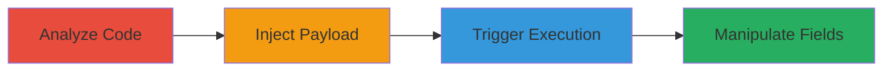

# Stored XSS in 8x8 Payment API Leading to JavaScript Execution and Access Control Bypass

Multi-stage attack chain demonstrating exploitation of a stored XSS vulnerability in the 8x8 API, allowing injection of malicious JavaScript via the ipAddress field, execution upon viewing payment details, and unauthorized manipulation of payment method attributes due to improper access controls.

## Chain Metrics Dashboard

| Metric | Value |
|--------|-------|
| Chain Status | Unverified |
| Total Steps | 4 |
| Execution Time | ~5 minutes |
| Skill Level | Intermediate |
| Complexity | Medium |
| Impact Level | High |

## Attack Flow Visualization



## Prerequisites & Requirements

### Required Tools

- [[tools/Firefox-Browser]]

### Target Environment

- Web platform with 8x8 API access
- Authenticated session to the API
- Network access to https://*.8x8.com endpoints

### Initial Access Requirements

- Valid user credentials for API authentication
- Browser-based access to the application
- No prior elevated privileges needed, but authenticated session required

## Detailed Attack Procedures

### Step 1: Analyze Client-Side Code
procedure: [[procedures/Analyze-Client-Side-Code-for-Vulnerable-Fields]]

**Objective**: Identify modifiable fields and endpoints vulnerable to XSS by inspecting JavaScript code.

**Instructions**: Use browser developer tools to examine the JavaScript handling API requests and responses. Look for the /api/patchPaymentMethod/ID endpoint and confirm that ipAddress can be modified, and /api/paymentMethodInfoById/ID renders content as HTML.

**Expected Output**: Confirmation that ipAddress accepts arbitrary input and output is rendered without escaping.

**Success Indicators**:
- Modifiable ipAddress field identified
- HTML rendering on payment info endpoint confirmed

### Step 2: Inject XSS Payload
procedure: [[procedures/Inject-XSS-Payload-via-PATCH-Request]]

**Objective**: Send a malicious payload to store XSS in the ipAddress field using a PATCH request.

**Instructions**: Use the browser or a tool to send a POST (acting as PATCH) request to /api/patchPaymentMethod/ID with the XSS payload in ipAddress. Execute [[commands/patch-payment-method-xss-injection]]:

```bash
# Simulated via curl or browser dev tools
curl -X POST https://example.8x8.com/api/patchPaymentMethod/ID \
  -H "Content-Type: application/json" \
  -H "Cookie: [your-session-cookie]" \
  -d '{"ipAddress": "<svg on onload=(alert)(document.domain)>", "callBackURL":"dssdsd"}'
```

**Expected Output**: HTTP 400 or success response, but payload stored in the backend.

**Success Indicators**:
- Request accepted without validation error on payload
- Payload confirmed stored via subsequent API calls

### Step 3: Trigger Stored XSS
procedure: [[procedures/Trigger-Stored-XSS-by-Accessing-Payment-Info]]

**Objective**: Access the payment info endpoint to execute the injected JavaScript in the victim's browser.

**Instructions**: Navigate to the payment info endpoint in the browser, such as https://example.8x8.com/api/paymentMethodInfoById/ID, where the ipAddress is rendered as HTML.

**Expected Output**: Alert box or JavaScript execution, e.g., alert(document.domain).

**Success Indicators**:
- Malicious script executes
- Potential for cookie theft or further actions

### Step 4: Bypass Access Controls
procedure: [[procedures/Bypass-Access-Controls-to-Modify-Payment-Fields]]

**Objective**: Exploit improper authorization to alter sensitive fields like isPrimary and savePaymentMethod.

**Instructions**: Using the same /api/patchPaymentMethod/ID endpoint, send additional requests to modify unauthorized fields without proper checks.

**Expected Output**: Fields updated successfully, e.g., isPrimary set to true for non-owned methods.

**Success Indicators**:
- Unauthorized field modifications succeed
- Payment method details altered

## Attack Chain Summary

### Key Achievements

1. Injected and executed arbitrary JavaScript via stored XSS
2. Demonstrated potential for session hijacking through cookie theft
3. Bypassed access controls to manipulate payment configurations

## Technique & Tactic Coverage

### MITRE ATT&CK Techniques

- [[JavaScript]]
- [[Exploit Public-Facing Application]]

### MITRE ATT&CK Tactics

- [[Execution]]
- [[Collection]]

---

*Last updated: 2023-10-01T00:00:00Z*
