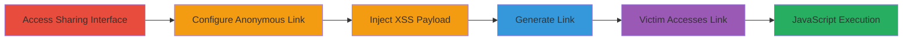

# Stored XSS in Adobe Acrobat File Sharing Description Field

Multi-stage attack chain demonstrating a complete attack workflow exploiting insufficient input sanitization in the description field of Adobe's file sharing feature on files.acrobat.com.

## Chain Metrics Dashboard

| Metric | Value |
|--------|-------|
| Chain Status | Unverified |
| Total Steps | 6 |
| Execution Time | ~5 minutes |
| Skill Level | Beginner |
| Complexity | Low |
| Impact Level | High |

## Attack Flow Visualization

## Prerequisites & Requirements

### Required Tools

- Web browser (e.g., Chrome, Firefox)

### Target Environment

- Web platform
- Access to https://cloud.acrobat.com/send
- Adobe Acrobat account (free tier sufficient)

### Initial Access Requirements

- Valid Adobe account credentials
- Internet access
- No special network position required

## Detailed Attack Procedures

### Step 1: Navigate to File Sharing and Select File
procedure: [[procedures/Navigate-to-Adobe-File-Sharing-and-Select-File]]

**Objective**: Access the file sending interface and prepare a file for sharing to set up the attack vector.

**Instructions**: Open a web browser and navigate to the Adobe file sharing page. Select a file from your local system to upload or share.

**Expected Output**: File selected on the send page, ready for link configuration.

**Success Indicators**:
- Send page loaded successfully
- File upload or selection confirmed

### Step 2: Enable Anonymous Link Creation
procedure: [[procedures/Enable-Anonymous-Link-Creation]]

**Objective**: Configure the sharing to allow anonymous access, enabling the XSS payload to affect unauthenticated victims.

**Instructions**: On the send page, locate and check the 'Create Anonymous Link' option to ensure the link can be accessed without authentication.

**Expected Output**: Anonymous link option enabled, visible in the sharing settings.

**Success Indicators**:
- Checkbox for anonymous link is selected
- No authentication requirement previewed for the link

### Step 3: Enter Sharing Subject
procedure: [[procedures/Enter-Sharing-Subject]]

**Objective**: Provide a legitimate-looking subject to make the shared link appear benign and increase victim click-through.

**Instructions**: In the subject field, input neutral text such as 'Shared Document for Review' to disguise the malicious intent.

**Expected Output**: Subject field populated with the entered text.

**Success Indicators**:
- Subject text saved and displayed in the form
- No validation errors on the field

### Step 4: Inject XSS Payload into Description
procedure: [[procedures/Inject-XSS-Payload-into-Description]]

**Objective**: Insert a malicious JavaScript payload into the description field, which will be stored and rendered unsanitized on the preview page.

**Instructions**: In the description field, enter the payload `` to trigger an alert box upon rendering.

**Expected Output**: Payload entered without immediate errors, stored for link generation.

**Success Indicators**:
- Description field accepts the HTML/JS input
- No client-side sanitization blocks the payload

### Step 5: Create Malicious Sharing Link
procedure: [[procedures/Create-Malicious-Sharing-Link]]

**Objective**: Generate the anonymous sharing link that embeds the stored XSS payload for distribution to victims.

**Instructions**: Click the 'Create Link' button to finalize the sharing setup and obtain the URL.

**Expected Output**: A generated link, e.g., https://files.acrobat.com/a/preview/[unique-id], ready for sharing.

**Success Indicators**:
- Link created successfully
- URL copied or displayed for distribution

### Step 6: Trigger Stored XSS via Accessed Link
procedure: [[procedures/Trigger-Stored-XSS-via-Accessed-Link]]

**Objective**: Have a victim (or self-test) access the link to execute the injected JavaScript, demonstrating arbitrary code execution.

**Instructions**: Share the link with a victim or open it in a new browser session. Upon accessing the preview, the description renders the payload, executing the onerror handler.

**Expected Output**: Alert box pops up with '1' or custom payload effect, confirming XSS execution.

**Success Indicators**:
- JavaScript alert or payload effect observed
- DOM inspection shows unsanitized HTML in description

## Attack Chain Summary

### Key Achievements

1. Successful injection of stored XSS payload without detection
2. Generation of a benign-appearing anonymous link
3. Arbitrary JavaScript execution on victims, enabling session hijacking or data theft

## Technique & Tactic Coverage

### MITRE ATT&CK Techniques

- [[JavaScript]]

### MITRE ATT&CK Tactics

- [[Execution]]

---
*Last updated: 2023-10-01T12:00:00Z*
