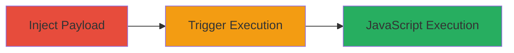

---

# Stored XSS in Algolia Account Name Field for JavaScript Execution

Multi-stage attack chain demonstrating a complete attack workflow exploiting a stored XSS vulnerability in Algolia's platform.

## Chain Metrics Dashboard

| Metric | Value |
|--------|-------|
| Chain Status | Unverified |
| Total Steps | 2 |
| Execution Time | ~5 minutes |
| Skill Level | Intermediate |
| Complexity | Medium |
| Impact Level | High |

## Attack Flow Visualization

## Prerequisites & Requirements

### Required Tools

- None (manual browser-based exploitation)

### Target Environment

- Algolia web platform
- Authenticated user account
- Web browser for navigation

### Initial Access Requirements

- Valid Algolia account credentials
- Direct access to account settings page
- No prior network compromise needed

## Detailed Attack Procedures

### Step 1: Inject Malicious Payload
procedure: [[procedures/Inject-Malicious-Payload-into-Account-Name]]

**Objective**: Update the account name with a payload that bypasses sanitization and stores executable JavaScript.

**Instructions**: Log in to the Algolia dashboard, navigate to account settings, and enter the payload `</script>` in the name field. Submit the update form.

**Expected Output**: Account name updated successfully without errors; payload stored in the backend.

**Success Indicators**:
- No validation errors on submission
- Name change reflected in the UI (though payload may not visibly execute yet)

### Step 2: Trigger XSS Execution on Account Pages
procedure: [[procedures/Trigger-XSS-Execution-on-Account-Pages]]

**Objective**: Navigate to pages displaying the account name to trigger the stored payload execution.

**Instructions**: After injection, visit various account dashboard pages such as the profile overview or settings where the name is rendered. The payload should execute automatically upon page load.

**Expected Output**: Alert box pops up displaying 'xss' on affected pages.

**Success Indicators**:
- JavaScript alert triggered
- Potential for further payload expansion to steal session data

## Attack Chain Summary

### Key Achievements

1. Successful injection of unsanitized JavaScript into the account name field
2. Execution of arbitrary code in the authenticated user's browser context
3. Demonstration of potential for session hijacking or phishing via expanded payloads

## Technique & Tactic Coverage

### MITRE ATT&CK Techniques

- [[JavaScript]]

### MITRE ATT&CK Tactics

- [[Execution]]

---

*Last updated: 2023-10-01T00:00:00Z*
