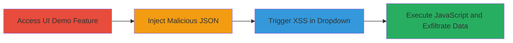

---
tags:
  - xss
  - stored-xss
  - algolia
  - json
  - dashboard
type: attack_chain
tools: []
tactics:
  - '[[Execution]]'
verified: false
platforms:
  - Web
submitted: true
complexity: medium
created_at: '2023-10-01T00:00:00Z'
procedures:
  - '[[procedures/Access-Algolia-Generate-UI-Demo]]'
  - '[[procedures/Input-Malicious-JSON-Payload]]'
  - '[[procedures/Trigger-XSS-in-Attribute-Dropdown]]'
step_count: 3
techniques:
  - '[[JavaScript]]'
updated_at: '2025-12-14T03:16:25.305Z'
description: >-
  A multi-step attack exploiting a Stored XSS vulnerability in Algolia's
  Generate a UI Demo feature by injecting malicious JavaScript into JSON keys,
  leading to arbitrary code execution in the victim's browser.
skill_level: intermediate
impact_level: high
id: a3f02545-3c04-4c27-b484-70e36a5a2c35
validated: true
mitre_tactics:
  - '[[Execution]]'
mitre_techniques:
  - '[[JavaScript]]'
---
# Stored-XSS-in-Algolia-Dashboard-via-Unsanitized-JSON-Keys

Multi-stage attack chain demonstrating a complete Stored XSS workflow in Algolia's dashboard.

## Chain Metrics Dashboard

| Metric | Value |
|--------|-------|
| Chain Status | Unverified |
| Total Steps | 3 |
| Execution Time | ~5 minutes |
| Skill Level | Intermediate |
| Complexity | Medium |
| Impact Level | High |

## Attack Flow Visualization



## Prerequisites & Requirements

### Required Tools

- None (manual browser-based exploitation)

### Target Environment

- Algolia dashboard (web application)
- Authenticated access to Indices section
- Browser supporting JavaScript (e.g., Chrome, Firefox)

### Initial Access Requirements

- Valid Algolia account credentials
- No special network position required (direct web access)
- Ability to upload or input JSON data

## Detailed Attack Procedures

### Step 1: Access the Generate a UI Demo Feature
procedure: [[procedures/Access-Algolia-Generate-UI-Demo]]

**Objective**: Navigate to the vulnerable UI generation interface to prepare for payload injection.

**Instructions**: Log in to the Algolia dashboard and locate the Indices section. Select an index and click on the "Generate a UI Demo" option to open the demo configuration panel.

**Expected Output**: The UI Demo generation interface loads, displaying fields for attribute selection (Primary, Secondary, Tertiary, Image, URL).

**Success Indicators**:
- Dashboard loads without errors
- UI Demo feature is accessible

### Step 2: Input Malicious JSON with XSS Payload
procedure: [[procedures/Input-Malicious-JSON-Payload]]

**Objective**: Introduce a Stored XSS payload into the JSON data via an unsanitized key name, storing the malicious content for later rendering.

**Instructions**: In the JSON input field or file upload area, provide a JSON object where a key contains the XSS payload. For example, use the following JSON structure:

```json
{
  "": "hello"
}
```
Submit the JSON to process the demo configuration.

**Expected Output**: The JSON is accepted without validation errors, and the demo proceeds to the attribute selection phase.

**Success Indicators**:
- JSON upload succeeds
- No immediate errors or sanitization alerts

### Step 3: Trigger XSS by Interacting with Attribute Dropdowns
procedure: [[procedures/Trigger-XSS-in-Attribute-Dropdown]]

**Objective**: Render the malicious JSON key in the UI dropdown, executing the injected JavaScript in the browser context.

**Instructions**: In the attribute selection text boxes (Primary, Secondary, Tertiary, Image, or URL), begin typing to trigger the autocomplete dropdown. The dropdown will list JSON keys, rendering the malicious key as HTML and firing the onerror event to execute the alert (or more advanced payload for exfiltration).

**Expected Output**: JavaScript executes, displaying an alert with the document domain or performing further actions like session cookie theft.

**Success Indicators**:
- Alert box pops up or network requests for exfiltration occur
- Browser console shows JavaScript execution errors or logs

## Attack Chain Summary

### Key Achievements

1. Successful injection of XSS payload via JSON keys without detection
2. Triggering of Stored XSS in an authenticated dashboard context
3. Potential for session hijacking or data theft through arbitrary JS execution

## Technique & Tactic Coverage

### MITRE ATT&CK Techniques

- [[JavaScript]]

### MITRE ATT&CK Tactics

- [[Execution]]

---
*Last updated: 2023-10-01T00:00:00Z*
