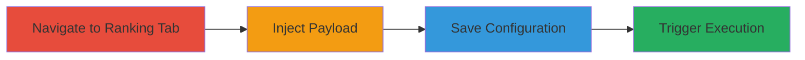

---
tags:
  - xss
  - stored-xss
  - algolia
  - javascript
  - client-side-attack
type: attack_chain
tools: []
tactics:
  - '[[Execution]]'
  - '[[Collection]]'
verified: false
platforms:
  - Web
submitted: true
complexity: low
created_at: '2023-10-01T00:00:00Z'
procedures:
  - '[[procedures/Navigate-to-Algolia-Explorer-Ranking-Tab]]'
  - '[[procedures/Inject-Malicious-Payload-into-Attributes-to-Index-Field]]'
  - '[[procedures/Save-Configuration-to-Store-XSS-Payload]]'
  - '[[procedures/Trigger-and-Observe-Stored-XSS-Execution]]'
step_count: 4
techniques:
  - '[[JavaScript]]'
updated_at: '2025-12-13T23:52:39.115Z'
description: >-
  A multi-step attack exploiting a Stored XSS vulnerability in Algolia's
  explorer tool to inject and persist malicious JavaScript, leading to arbitrary
  code execution for any user accessing the affected page.
skill_level: beginner
impact_level: high
id: b121a2eb-fae9-47a9-8ce5-c0e00332a719
validated: true
mitre_tactics:
  - '[[Execution]]'
  - '[[Collection]]'
mitre_techniques:
  - '[[JavaScript]]'
---
# Stored XSS in Algolia Explorer Attributes to Index Field for Persistent JavaScript Execution

Multi-stage attack chain demonstrating a complete Stored XSS exploitation in Algolia's explorer tool, allowing persistent injection of malicious JavaScript that executes for any user revisiting the affected page.

## Chain Metrics Dashboard

| Metric | Value |
|--------|-------|
| Chain Status | Unverified |
| Total Steps | 4 |
| Execution Time | ~2 minutes |
| Skill Level | Beginner |
| Complexity | Low |
| Impact Level | High |

## Attack Flow Visualization

## Prerequisites & Requirements

### Required Tools

- Web browser (e.g., Chrome, Firefox)

### Target Environment

- Web platform
- Access to Algolia's public explorer tool at https://www.algolia.com/explorer
- No authentication required for the test index

### Initial Access Requirements

- Internet access
- No prior credentials or network position needed; the explorer is publicly accessible

## Detailed Attack Procedures

### Step 1: Navigate to Explorer Ranking Tab
procedure: [[procedures/Navigate-to-Algolia-Explorer-Ranking-Tab]]

**Objective**: Access the vulnerable ranking tab in Algolia's explorer to prepare for payload injection.

**Instructions**: Open a web browser and directly navigate to the specified URL to load the ranking configuration interface.

**Expected Output**: The explorer page loads with the ranking tab active, displaying fields like 'Attributes to index'.

**Success Indicators**:
- Ranking tab is visible and editable
- URL matches https://www.algolia.com/explorer#?index=test&tab=ranking

### Step 2: Inject Malicious Payload
procedure: [[procedures/Inject-Malicious-Payload-into-Attributes-to-Index-Field]]

**Objective**: Insert a JavaScript payload into the vulnerable input field to test for XSS.

**Instructions**: Locate the 'Attributes to index' field and enter the malicious payload, then submit it to attempt injection.

**Expected Output**: The payload is accepted into the field without immediate error or sanitization.

**Success Indicators**:
- Payload text appears in the field
- No validation errors block input

### Step 3: Save Configuration
procedure: [[procedures/Save-Configuration-to-Store-XSS-Payload]]

**Objective**: Persist the injected payload by saving the configuration, storing it server-side for future loads.

**Instructions**: Click the save button to commit the changes, which stores the unsanitized input.

**Expected Output**: Configuration saves successfully, and the page may reload or update.

**Success Indicators**:
- Save confirmation or no error message
- Payload remains in the field post-save

### Step 4: Trigger and Observe Execution
procedure: [[procedures/Trigger-and-Observe-Stored-XSS-Execution]]

**Objective**: Reload or revisit the page to trigger the stored payload, confirming arbitrary JavaScript execution.

**Instructions**: Refresh the page or access the URL again to load the stored configuration and execute the script.

**Expected Output**: An alert dialog prompts 'XSS' due to the onerror event in the injected img tag.

**Success Indicators**:
- Alert box appears on page load
- Script executes persistently on revisits

## Attack Chain Summary

### Key Achievements

1. Successful injection and storage of malicious JavaScript in a public web interface
2. Persistent execution affecting any user accessing the page
3. Demonstration of potential for session hijacking or data theft via client-side attacks

## Technique & Tactic Coverage

### MITRE ATT&CK Techniques

- [[JavaScript]]

### MITRE ATT&CK Tactics

- [[Execution]]
- [[Collection]]

---
*Last updated: 2023-10-01T00:00:00Z*
