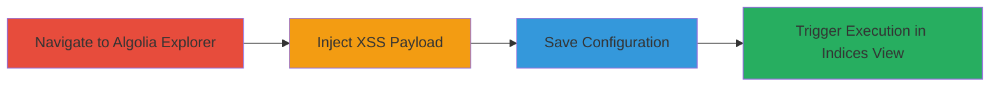

# Stored XSS in Algolia Explorer Ranking Formula for Arbitrary JavaScript Execution

Multi-stage attack chain demonstrating a complete attack workflow exploiting a stored Cross-Site Scripting (XSS) vulnerability in the Algolia Explorer tool. The attack involves injecting a malicious JavaScript payload into the 'Ranking formula' field, saving it to persist the unsanitized input, and triggering execution when viewing the Indices tab, which can lead to session hijacking, data theft, or other client-side attacks in the victim's browser.

## Chain Metrics Dashboard

| Metric | Value |
|--------|-------|
| Chain Status | Unverified |
| Total Steps | 4 |
| Execution Time | ~2 minutes |
| Skill Level | Beginner |
| Complexity | Low |
| Impact Level | High |

## Attack Flow Visualization

## Prerequisites & Requirements

### Required Tools

- Web browser (e.g., Chrome, Firefox)

### Target Environment

- Web platform
- Access to Algolia Explorer at https://www.algolia.com/explorer
- Authenticated session with permissions to modify index settings

### Initial Access Requirements

- Valid Algolia account credentials
- Network access to Algolia's web application
- No prior access needed beyond login

## Detailed Attack Procedures

### Step 1: Navigate to Algolia Explorer
procedure: [[procedures/Exploit-Stored-XSS-in-Algolia-Ranking-Formula]]

**Objective**: Access the Ranking formula configuration page to prepare for payload injection.

**Instructions**: Open a web browser and navigate to the Algolia Explorer page for the target index.

**Expected Output**: The Explorer interface loads with the Ranking tab visible.

**Success Indicators**:
- Page loads successfully at https://www.algolia.com/explorer#?index=test&tab=ranking
- Ranking formula input field is accessible

### Step 2: Inject XSS Payload
procedure: [[procedures/Exploit-Stored-XSS-in-Algolia-Ranking-Formula]]

**Objective**: Insert a malicious JavaScript payload into the unsanitized Ranking formula field to store the XSS.

**Instructions**: In the Ranking formula input field under index > ranking, enter the payload: `'>`. This payload breaks out of the expected input context and executes JavaScript on render.

**Expected Output**: Payload is entered without immediate errors or sanitization.

**Success Indicators**:
- Payload text appears in the input field
- No validation errors prevent entry

### Step 3: Save Configuration
procedure: [[procedures/Exploit-Stored-XSS-in-Algolia-Ranking-Formula]]

**Objective**: Persist the injected payload in the index settings to enable stored XSS.

**Instructions**: Click the save button to store the modified ranking formula containing the payload.

**Expected Output**: Configuration saves successfully, with a confirmation message.

**Success Indicators**:
- Save operation completes without errors
- Index settings are updated with the payload

### Step 4: Trigger Execution in Indices View
procedure: [[procedures/Exploit-Stored-XSS-in-Algolia-Ranking-Formula]]

**Objective**: Render the affected index to execute the stored JavaScript payload in the browser.

**Instructions**: Switch to or refresh the Indices tab/view where the ranking formula is displayed. The payload will execute automatically upon rendering.

**Expected Output**: An alert box pops up displaying '0' (or custom payload effects like session theft).

**Success Indicators**:
- JavaScript alert or other payload effects trigger
- Browser console shows execution errors or logs from the payload

## Attack Chain Summary

### Key Achievements

1. Successful injection and storage of unsanitized JavaScript in Algolia's Ranking formula.
2. Triggered client-side execution leading to arbitrary code running in the victim's browser.
3. Demonstrated potential for session hijacking or data exfiltration via XSS.

## Technique & Tactic Coverage

### MITRE ATT&CK Techniques

- [[JavaScript]]

### MITRE ATT&CK Tactics

- [[Execution]]

---
*Last updated: 2023-10-01T00:00:00Z*
