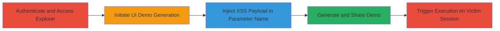

# Stored XSS in Algolia UI Demo Generation via Parameter Name Injection

Multi-stage attack chain demonstrating a complete stored XSS exploitation workflow in Algolia's explorer tool, allowing arbitrary JavaScript execution across user sessions via shared demo links.

## Chain Metrics Dashboard

| Metric | Value |
|--------|-------|
| Chain Status | Unverified |
| Total Steps | 12 |
| Execution Time | ~5 minutes |
| Skill Level | Intermediate |
| Complexity | Medium |
| Impact Level | High |

## Attack Flow Visualization

## Prerequisites & Requirements

### Required Tools

- Browser with developer tools (e.g., Chrome DevTools)

### Target Environment

- Web platform
- Algolia account with access to https://www.algolia.com/explorer
- No specific services/ports beyond standard HTTPS (443)

### Initial Access Requirements

- Valid Algolia user credentials
- Direct network access to Algolia's web application
- No prior access needed beyond authentication

## Detailed Attack Procedures

### Step 1: Authenticate and Navigate to Explorer

procedure: [[procedures/Inject-Stored-XSS-Payload-in-Algolia-Explorer]]

**Objective**: Gain authenticated access to the Algolia explorer page to initiate the demo generation process.

**Instructions**: Log in to your Algolia account and navigate to the explorer page.

**Expected Output**: Successful login and access to https://www.algolia.com/explorer.

**Success Indicators**:
- Explorer page loads with UI elements visible
- Authentication token active in session

### Step 2: Initiate UI Demo Generation

procedure: [[procedures/Inject-Stored-XSS-Payload-in-Algolia-Explorer]]

**Objective**: Start the process of generating a UI demo to access the vulnerable form fields.

**Instructions**: Click on the "GENERATE A UI DEMO" button located at the bottom right of the page.

**Expected Output**: Modal or form opens for demo configuration.

**Success Indicators**:
- Demo generation interface appears
- Form fields for title and attributes are present

### Step 3: Enter Demo Title

procedure: [[procedures/Inject-Stored-XSS-Payload-in-Algolia-Explorer]]

**Objective**: Provide a basic title to proceed without triggering validation errors.

**Instructions**: Input any non-malicious title in the designated title field.

**Expected Output**: Title field populated.

**Success Indicators**:
- Title accepted without errors

### Step 4: Proceed to Attribute Configuration

procedure: [[procedures/Inject-Stored-XSS-Payload-in-Algolia-Explorer]]

**Objective**: Advance to the step where attribute fields can be manipulated.

**Instructions**: Click the "NEXT" button to move to the attribute selection screen.

**Expected Output**: Attribute configuration form loads, including the Primary attribute input.

**Success Indicators**:
- Primary attribute field is visible and editable

### Step 5: Inspect Primary Attribute Input

procedure: [[procedures/Inject-Stored-XSS-Payload-in-Algolia-Explorer]]

**Objective**: Use browser tools to access and modify the underlying HTML of the vulnerable input element.

**Instructions**: Right-click on the Primary attribute field and select "Inspect Element" to open developer tools.

**Expected Output**: HTML source of the <input> element is displayed in the inspector.

**Success Indicators**:
- <input> element highlighted in dev tools
- Name attribute visible (e.g., name="engine[primary_attribute]")

### Step 6: Inject Malicious Payload in Name Attribute

procedure: [[procedures/Inject-Stored-XSS-Payload-in-Algolia-Explorer]]

**Objective**: Modify the input's name attribute to embed a JavaScript payload that bypasses CloudFlare by placing it in the parameter name.

**Instructions**: Edit the name attribute in the inspector to: `engine[primary_attribute]['+document.write`${unescape`%3cimg%20src%3dx%20onerror%3dalert%28document.domain%29%3e`}`+']`. This injects a payload that executes `alert(document.domain)` via an onerror handler on a malformed img tag.

**Expected Output**: Name attribute updated with the injected string.

**Success Indicators**:
- Modified name attribute persists in the DOM
- No immediate form validation errors

### Step 7: Submit Modified Form

procedure: [[procedures/Inject-Stored-XSS-Payload-in-Algolia-Explorer]]

**Objective**: Pass the injected payload through the form submission to store it server-side.

**Instructions**: Click the "NEXT" button to submit the form with the altered input.

**Expected Output**: Form submits successfully, proceeding to the next configuration step.

**Success Indicators**:
- No submission errors; process continues

### Step 8: Generate and Share Demo

procedure: [[procedures/Inject-Stored-XSS-Payload-in-Algolia-Explorer]]

**Objective**: Finalize the demo generation, storing the payload and creating a shareable link.

**Instructions**: Click "GENERATE UI & SHARE" to create the demo page.

**Expected Output**: Demo page generated with a shareable URL (e.g., https://www.algolia.com/realtime-search-demo/some-title).

**Success Indicators**:
- Shareable URL provided
- Payload stored in the backend

### Step 9: Verify Payload Execution on Attacker Session

procedure: [[procedures/Inject-Stored-XSS-Payload-in-Algolia-Explorer]]

**Objective**: Confirm the XSS payload triggers on the generated page.

**Instructions**: Load the generated demo page and observe the alert.

**Expected Output**: JavaScript alert pops up displaying the document domain (e.g., www.algolia.com).

**Success Indicators**:
- Alert executes on page load
- Confirms arbitrary JS execution

### Step 10: Copy Shareable URL

procedure: [[procedures/Inject-Stored-XSS-Payload-in-Algolia-Explorer]]

**Objective**: Obtain the URL for distribution to victims.

**Instructions**: Copy the URL from the browser's address bar.

**Expected Output**: URL copied to clipboard.

**Success Indicators**:
- Valid demo URL available for sharing

### Step 11: Share URL with Victim

procedure: [[procedures/Inject-Stored-XSS-Payload-in-Algolia-Explorer]]

**Objective**: Distribute the malicious link to another user or session.

**Instructions**: Send the URL to another user's browser or account (e.g., via email or direct access).

**Expected Output**: Victim accesses the shared demo page.

**Success Indicators**:
- Victim loads the page without suspicion

### Step 12: Observe Execution on Victim Session

procedure: [[procedures/Inject-Stored-XSS-Payload-in-Algolia-Explorer]]

**Objective**: Verify cross-user execution of the stored payload.

**Instructions**: Monitor or confirm that the alert triggers in the victim's browser upon page load.

**Expected Output**: Alert executes in victim's session, demonstrating impact.

**Success Indicators**:
- JS executes in victim's context
- Potential for session hijacking or data theft

## Attack Chain Summary

### Key Achievements

1. Bypassed CloudFlare WAF by injecting payload in parameter names rather than values
2. Stored malicious JS in Algolia's demo backend for persistence
3. Achieved arbitrary code execution across multiple users via shared links

## Technique & Tactic Coverage

### MITRE ATT&CK Techniques

- [[JavaScript]]

### MITRE ATT&CK Tactics

- [[Execution]]

---
*Last updated: 2023-10-01T00:00:00Z*
