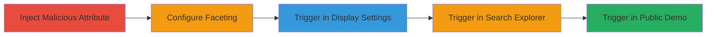

# Stored XSS in Algolia via Malicious JSON Attribute Names and Faceting

Multi-stage attack chain demonstrating the exploitation of a Stored XSS vulnerability in Algolia's handling of JSON record attribute names, leading to arbitrary JavaScript execution on admin panels, search explorers, and public demos.

## Chain Metrics Dashboard

| Metric | Value |
|--------|-------|
| Chain Status | Unverified |
| Total Steps | 5 |
| Execution Time | ~10 minutes |
| Skill Level | Intermediate |
| Complexity | Medium |
| Impact Level | High |

## Attack Flow Visualization

## Prerequisites & Requirements

### Required Tools

- Web browser with developer tools (e.g., Chrome DevTools for payload verification)

### Target Environment

- Algolia account with index management permissions
- Web platform access to Algolia dashboard
- No specific ports required; operates over HTTPS

### Initial Access Requirements

- Authenticated Algolia user session (admin or index editor role)
- Network access to Algolia's web interface (https://www.algolia.com)
- No prior access beyond standard user credentials

## Detailed Attack Procedures

### Step 1: Inject Malicious Attribute
procedure: [[procedures/Inject-Malicious-Attribute-into-Algolia-Record]]

**Objective**: Introduce a JSON record with an attribute name containing an XSS payload to store the malicious script in the index.

**Instructions**: Log in to the Algolia dashboard, navigate to your index, and upload or create a record using the payload attribute name ''. For example, in the API or UI record editor, set the record as {"": "XSS attribute"}.

**Expected Output**: The record is successfully indexed, with the malicious attribute name stored without sanitization.

**Success Indicators**:
- Record appears in the index search results
- Attribute name is visible in raw JSON view without execution

### Step 2: Configure Faceting
procedure: [[procedures/Select-Malicious-Attribute-for-Faceting]]

**Objective**: Select the malicious attribute in the display settings to prepare for XSS triggering during rendering.

**Instructions**: In the Algolia dashboard, go to Indices > Display settings, locate the malicious attribute '' in the attribute list, add it under 'Attributes for Faceting', and click Save.

**Expected Output**: Configuration saves successfully, but XSS may begin executing on save if rendering occurs.

**Success Indicators**:
- Attribute added to faceting list
- No immediate errors in UI

### Step 3: Trigger in Display Settings
procedure: [[procedures/Trigger-XSS-on-Display-Settings-Save]]

**Objective**: Cause the XSS payload to execute multiple times on the admin Display settings page upon saving and viewing.

**Instructions**: After saving the faceting configuration, refresh or revisit the Display settings page. The attribute name renders in HTML without escaping, triggering the onerror alert.

**Expected Output**: Multiple alert popups displaying the document domain, confirming JavaScript execution.

**Success Indicators**:
- Alert dialogs appear on page load or save
- Console logs show script execution

### Step 4: Trigger in Search Explorer
procedure: [[procedures/Trigger-XSS-in-Realtime-Search-Explorer]]

**Objective**: Execute the XSS in the semi-public realtime search explorer interface.

**Instructions**: Navigate to https://www.algolia.com/explorer#?index=your_index_name, where the faceted attribute is displayed, causing the payload to render and execute.

**Expected Output**: Alert popup in the explorer page, demonstrating execution for authenticated or semi-public viewers.

**Success Indicators**:
- XSS alert fires upon loading the explorer with the affected index
- Payload visible in page source

### Step 5: Trigger in Public Demo
procedure: [[procedures/Trigger-XSS-in-Public-UI-Demo]]

**Objective**: Propagate the XSS to a fully public UI demo, allowing execution for any visitor.

**Instructions**: From the index settings, generate a public UI Demo, which creates a shareable URL like https://www.algolia.com/realtime-search-demo/your_index. Visit the public URL to observe the XSS execution.

**Expected Output**: Alert popup on the public demo page, confirming arbitrary JS execution without authentication.

**Success Indicators**:
- Public URL accessible without login
- XSS alert triggers for anonymous users

## Attack Chain Summary

### Key Achievements

1. Stored malicious XSS payload in Algolia index attribute names
2. Triggered execution across authenticated admin, explorer, and public interfaces
3. Demonstrated potential for session hijacking, data theft, or further attacks on viewers

## Technique & Tactic Coverage

### MITRE ATT&CK Techniques

- [[JavaScript]]
- [[Exploit Public-Facing Application]]

### MITRE ATT&CK Tactics

- [[Execution]]

---

*Last updated: 2023-10-01T00:00:00Z*
