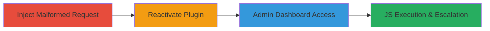

---
tags:
  - xss
  - stored-xss
  - wordpress
  - plugin-vulnerability
  - javascript-execution
  - privilege-escalation
type: attack_chain
tools:
  - '[[tools/Perl]]'
  - '[[tools/OpenSSL-s-client]]'
tactics:
  - '[[Initial Access]]'
  - '[[Execution]]'
  - '[[Privilege Escalation]]'
commands:
  - '[[commands/perl-inject-stored-xss-via-openssl]]'
platforms:
  - Web
  - WordPress
complexity: medium
procedures:
  - '[[procedures/Inject-Malformed-HTTP-Request-to-Trigger-Stored-XSS]]'
  - '[[procedures/Reactivate-All-In-One-Event-Calendar-Plugin]]'
  - '[[procedures/Trigger-XSS-Execution-in-WordPress-Admin-Dashboard]]'
step_count: 3
techniques:
  - '[[Exploit Public-Facing Application]]'
  - '[[JavaScript]]'
description: >-
  A multi-step attack exploiting a stored XSS vulnerability in the All In One
  Event Calendar WordPress plugin to inject JavaScript payloads that execute in
  the admin dashboard, enabling privilege escalation and potential server-side
  compromise.
skill_level: intermediate
impact_level: high
id: 2dc98d01-5974-49a2-8520-3880f00be114
created_at: '2025-12-14T03:16:25.656Z'
updated_at: '2025-12-14T03:16:25.656Z'
verified: false
validated: true
submitted: true
mitre_tactics:
  - '[[Initial Access]]'
  - '[[Execution]]'
  - '[[Privilege Escalation]]'
mitre_techniques:
  - '[[Exploit Public-Facing Application]]'
  - '[[JavaScript]]'
---
# Stored XSS in All In One Event Calendar Plugin Leading to Admin Dashboard Compromise

## Overview

This attack chain exploits a stored cross-site scripting (XSS) vulnerability in the All In One Event Calendar plugin on a WordPress site (e.g., drive.uber.com). By sending a malformed HTTP request, an attacker triggers an SQL format string error in the plugin, injecting an unfiltered JavaScript payload into an error message banner. The payload is stored and executes when an administrator views the WordPress dashboard, allowing JavaScript execution with admin privileges. This can lead to AJAX requests for creating new admin users, editing plugins/themes to insert PHP backdoors, or full server compromise. The chain requires reactivating the plugin after it self-disables on error and relies on the admin logging in to trigger execution.

## Chain Metrics Dashboard

| Metric | Value |
|--------|-------|
| Chain Status | Unverified |
| Total Steps | 3 |
| Execution Time | ~5 minutes |
| Skill Level | Intermediate |
| Complexity | Medium |
| Impact Level | High |

## Attack Flow Visualization



## Prerequisites & Requirements

### Required Tools

- [[tools/Perl]]
- [[tools/OpenSSL-s-client]]

### Target Environment

- WordPress site with All In One Event Calendar plugin enabled
- HTTPS on port 443
- Access to /oh/ endpoint for calendar widget rendering
- nginx/PHP backend

### Initial Access Requirements

- Network access to the target domain (e.g., drive.uber.com:443)
- No authentication needed for injection step
- Administrator credentials for dashboard access to trigger execution

## Detailed Attack Procedures

### Step 1: Inject Malformed HTTP Request
procedure: [[procedures/Inject-Malformed-HTTP-Request-to-Trigger-Stored-XSS]]

**Objective**: Send a crafted GET request to the calendar widget endpoint to trigger an SQL error and store the XSS payload in the error banner without URL encoding.

**Instructions**: Use the Perl script with OpenSSL to send the raw request, as browsers auto-encode special characters. Execute [[commands/perl-inject-stored-xss-via-openssl]]:

```perl
#!/usr/bin/perl
open(NC,"|openssl s_client -connect drive.uber.com:443 -quiet") || die;
print NC "GET /oh/?ai1ec_js_widget=ai1ec_agenda_widget&render=true&events_per_page=$%&xss=<svg/onload=alert(/stored-xss/.source)>\r\n";
print NC "HTTP/1.1\r\n";
print NC "Host: drive.uber.com\r\n";
print NC "\r\n";
close(NC);
```

**Expected Output**: HTTP 302 redirect to the front page, indicating the plugin error has been triggered and payload stored.

**Success Indicators**:
- Redirect response received
- No direct error visible (payload stored for later)

### Step 2: Reactivate Plugin After Error
procedure: [[procedures/Reactivate-All-In-One-Event-Calendar-Plugin]]

**Objective**: Re-enable the plugin, which disables itself upon detecting the error, to allow dashboard rendering.

**Instructions**: Access the WordPress admin panel under Plugins > Installed Plugins, locate "All In One Event Calendar," and click "Activate." No command-line tools needed; perform via web interface.

**Expected Output**: Plugin status changes to "Active."

**Success Indicators**:
- Plugin reactivated without errors
- Dashboard accessible post-reactivation

### Step 3: Trigger XSS Execution in Admin Dashboard
procedure: [[procedures/Trigger-XSS-Execution-in-WordPress-Admin-Dashboard]]

**Objective**: Log in as administrator to view the dashboard, rendering the stored error banner and executing the injected JavaScript.

**Instructions**: Navigate to the WordPress login page, enter admin credentials, and access the dashboard. The payload executes automatically upon rendering the banner.

**Expected Output**: JavaScript alert box displaying "stored-xss" on dashboard load.

**Success Indicators**:
- Alert triggered confirming XSS execution
- Admin privileges available for further exploitation (e.g., AJAX user creation)

## Attack Chain Summary

### Key Achievements

1. Successful injection of unencoded XSS payload via malformed SQL parameter
2. Storage and persistence of payload in admin-facing error banner
3. Execution of JavaScript with admin privileges, enabling escalation to RCE

## Technique & Tactic Coverage

### MITRE ATT&CK Techniques

- [[Exploit Public-Facing Application]]
- [[JavaScript]]

### MITRE ATT&CK Tactics

- [[Initial Access]]
- [[Execution]]
- [[Privilege Escalation]]

---

*Last updated: 2023-10-01*
