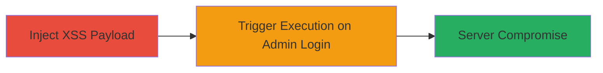

# Stored XSS in All In One Event Calendar Plugin Leading to WordPress Admin Compromise

Multi-stage attack chain demonstrating exploitation of a stored XSS vulnerability in the All In One Event Calendar plugin on drive.uber.com, allowing injection of arbitrary JavaScript that executes in the WordPress admin dashboard under administrator privileges. This can lead to AJAX calls for creating admin users or writing arbitrary PHP code, resulting in full server-side compromise.

## Chain Metrics Dashboard

| Metric | Value |
|--------|-------|
| Chain Status | Unverified |
| Total Steps | 2 |
| Execution Time | ~5 minutes |
| Skill Level | Intermediate |
| Complexity | Medium |
| Impact Level | High |

## Attack Flow Visualization



## Prerequisites & Requirements

### Required Tools

- [[tools/Perl]]
- [[tools/OpenSSL]]

### Target Environment

- WordPress site with All In One Event Calendar plugin enabled
- Access to /oh/ endpoint (calendar page)
- HTTPS on port 443
- nginx or Apache web server

### Initial Access Requirements

- Network access to the target domain (e.g., drive.uber.com)
- No authentication required for injection step
- Administrator login credentials for triggering execution

## Detailed Attack Procedures

### Step 1: Inject XSS Payload
procedure: [[procedures/Inject-XSS-Payload-via-Malformed-HTTP-Request]]

**Objective**: Send a malformed HTTP request to the calendar plugin's endpoint to trigger an SQL error that stores an unfiltered XSS payload in the admin dashboard error banner.

**Instructions**: Use [[commands/perl-inject-xss-http-request]] to craft and send a raw HTTPS GET request without browser encoding, targeting the events_per_page parameter to cause a format string error in the SQL query.

```perl
#!/usr/bin/perl
open(NC,"|openssl s_client -connect drive.uber.com:443 -quiet") || die;
print NC "GET /oh/?ai1ec_js_widget=ai1ec_agenda_widget&render=true&events_per_page=$%&xss=<svg/onload=alert(/stored-xss/.source)>\r\n";
print NC "HTTP/1.1\r\n";
print NC "Host: drive.uber.com\r\n";
print NC "\r\n";
close(NC);
```

**Expected Output**: HTTP 302 redirect to the front page, indicating the plugin error has been triggered and the XSS payload stored.

**Success Indicators**:
- Redirect response received without errors
- No immediate alert (payload is stored, not executed yet)

### Step 2: Trigger XSS Execution
procedure: [[procedures/Trigger-XSS-Execution-on-Admin-Login]]

**Objective**: Have an administrator log in to the WordPress dashboard, causing the stored error banner to render and execute the injected JavaScript under admin privileges.

**Instructions**: Ensure the plugin is active. Log in as an administrator to view the dashboard. The error message will display the unfiltered payload, executing the JavaScript (e.g., alert or AJAX call to create users/write PHP).

No specific command needed; monitor for JavaScript execution like an alert popup or network requests from the dashboard.

**Expected Output**: JavaScript alert (e.g., "stored-xss") or successful AJAX actions like new admin user creation.

**Success Indicators**:
- Alert or payload execution on dashboard load
- Evidence of admin actions (e.g., new users in wp_users table)

## Attack Chain Summary

### Key Achievements

1. Successful injection of unencoded XSS payload via SQL error in plugin
2. Execution of JavaScript in admin context for privilege escalation
3. Potential for server compromise through AJAX/PHP injection

## Technique & Tactic Coverage

### MITRE ATT&CK Techniques

- [[Exploit Public-Facing Application]]
- [[JavaScript]]

### MITRE ATT&CK Tactics

- [[Initial Access]]
- [[Execution]]

---

*Last updated: 2023-10-01T00:00:00Z*
