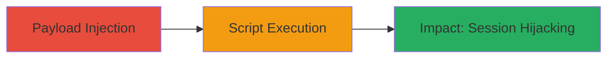

---
tags:
  - xss
  - stored-xss
  - web-injection
  - session-hijacking
type: attack_chain
tools: []
tactics:
  - '[[Execution]]'
  - '[[Initial Access]]'
verified: false
platforms:
  - Web
submitted: true
complexity: medium
created_at: '2024-01-01T00:00:00Z'
procedures:
  - '[[procedures/Exploit-Stored-XSS-in-AREA-Tutorials]]'
step_count: 1
techniques:
  - '[[JavaScript]]'
  - '[[Exploit Public-Facing Application]]'
updated_at: '2025-12-13T23:55:06.281Z'
description: >-
  A stored cross-site scripting attack exploiting insufficient input
  sanitization in Autodesk's AREA tutorials platform to inject and execute
  malicious JavaScript in viewers' browsers, enabling session hijacking or data
  theft.
skill_level: intermediate
impact_level: high
id: c7aa5464-2b7c-4394-af0e-1893e11d1272
validated: true
mitre_tactics:
  - '[[Execution]]'
  - '[[Initial Access]]'
mitre_techniques:
  - '[[JavaScript]]'
  - '[[Exploit Public-Facing Application]]'
---
# Stored XSS in Autodesk AREA Tutorials for Arbitrary JavaScript Execution

Multi-stage attack chain demonstrating a complete attack workflow exploiting a stored XSS vulnerability in Autodesk's AREA tutorials platform.

## Chain Metrics Dashboard

| Metric | Value |
|--------|-------|
| Chain Status | Unverified |
| Total Steps | 1 |
| Execution Time | ~5 minutes |
| Skill Level | Intermediate |
| Complexity | Medium |
| Impact Level | High |

## Attack Flow Visualization

## Prerequisites & Requirements

### Required Tools

- Browser with developer tools (e.g., Chrome DevTools)
- Optional: Proxy tool like Burp Suite for request interception

### Target Environment

- Web platform
- Autodesk AREA tutorials service
- User account with publishing privileges on AREA platform

### Initial Access Requirements

- Valid Autodesk account with ability to create and publish tutorials
- No special network access beyond internet connectivity
- Prior knowledge of the platform's tutorial creation interface

## Detailed Attack Procedures

### Step 1: Exploit Stored XSS
procedure: [[procedures/Exploit-Stored-XSS-in-AREA-Tutorials]]

**Objective**: Inject malicious JavaScript payload into a tutorial publication, which persists and executes in the browsers of users viewing the tutorial, potentially leading to session hijacking or client-side attacks.

**Instructions**: Log in to the Autodesk AREA platform, create a new tutorial, and insert a malicious payload in user-input fields (e.g., description or content sections) that lack proper sanitization. Publish the tutorial, then have a victim view it to trigger execution.

**Expected Output**: The payload executes as an alert or steals session data when the tutorial is loaded in a victim's browser.

**Success Indicators**:
- Payload appears in the published tutorial without escaping
- JavaScript executes (e.g., alert pops up or cookie is exfiltrated) when viewing the tutorial
- Victim's session cookie is captured and sent to attacker-controlled server

## Attack Chain Summary

### Key Achievements

1. Successful injection of persistent malicious script into tutorial content
2. Execution of arbitrary JavaScript in multiple victim browsers
3. Potential for session hijacking or data exfiltration from authenticated users

## Technique & Tactic Coverage

### MITRE ATT&CK Techniques

- [[JavaScript]]
- [[Exploit Public-Facing Application]]

### MITRE ATT&CK Tactics

- [[Execution]]
- [[Initial Access]]

---
*Last updated: 2024-01-01T00:00:00Z*
