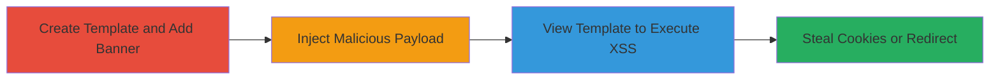

---
tags:
  - xss
  - stored-xss
  - web
  - javascript
  - cookie-theft
type: attack_chain
tools: []
tactics:
  - '[[Execution]]'
  - '[[Collection]]'
verified: false
platforms:
  - Web
submitted: true
created_at: '2023-10-01T00:00:00Z'
procedures:
  - '[[procedures/Create-New-Template-and-Add-Banner-Block]]'
  - '[[procedures/Inject-Malicious-Payload-into-Banner-Description]]'
  - '[[procedures/View-Template-to-Execute-Stored-XSS]]'
step_count: 3
techniques:
  - '[[JavaScript]]'
updated_at: '2025-12-13T23:52:24.151Z'
description: >-
  A multi-stage attack exploiting stored XSS in Stripo's email template editor
  banner block to inject and execute malicious JavaScript, enabling cookie theft
  or redirects when victims view the template.
id: 0478ec62-19df-471b-ade8-73f6f52b4341
validated: true
mitre_tactics:
  - '[[Execution]]'
  - '[[Collection]]'
mitre_techniques:
  - '[[JavaScript]]'
---
---

# Stored XSS in Banner Block Description for Cookie Theft

Multi-stage attack chain demonstrating a complete attack workflow exploiting stored XSS in Stripo Inc's email template editor.

## Chain Metrics Dashboard

| Metric | Value |
|--------|-------|
| Chain Status | Unverified |
| Total Steps | 3 |
| Execution Time | ~5 minutes |
| Skill Level | Intermediate |
| Complexity | Medium |
| Impact Level | High |

## Attack Flow Visualization

## Prerequisites & Requirements

### Required Tools

- Web browser (e.g., Chrome with developer tools)

### Target Environment

- Stripo Inc email template editor (web application)
- Authenticated user account with template creation permissions

### Initial Access Requirements

- Valid login credentials to Stripo platform
- Network access to the web application
- No prior access needed beyond authentication

## Detailed Attack Procedures

### Step 1: Create Template and Add Banner Block
procedure: [[procedures/Create-New-Template-and-Add-Banner-Block]]

**Objective**: Set up a new email template and insert a banner block to prepare for payload injection.

**Instructions**: Log in to the Stripo email template editor, navigate to the template creation interface, and add a banner block to the canvas.

**Expected Output**: A new template with an empty banner block added.

**Success Indicators**:
- Template created successfully
- Banner block visible on the template canvas

### Step 2: Inject Malicious Payload into Banner Description
procedure: [[procedures/Inject-Malicious-Payload-into-Banner-Description]]

**Objective**: Insert a JavaScript payload into the banner block's description field, which will be stored without sanitization.

**Instructions**: In the banner block settings, locate the description field and input the payload `">`. Save the changes to store the payload.

**Expected Output**: Payload saved in the description field without errors.

**Success Indicators**:
- Description field accepts and stores the payload
- No immediate execution or validation errors

### Step 3: View Template to Execute Stored XSS
procedure: [[procedures/View-Template-to-Execute-Stored-XSS]]

**Objective**: Render the template to trigger the stored XSS, executing the injected script in the viewer's browser.

**Instructions**: Save and preview or share the template. When a victim (or the attacker in testing) views the template, the description renders the payload, executing the onerror handler.

**Expected Output**: Alert box displaying the document domain, confirming XSS execution.

**Success Indicators**:
- JavaScript alert triggers on template view
- Potential for cookie access or redirect in production payloads

## Attack Chain Summary

### Key Achievements

1. Successful injection of stored XSS payload in a web-based email editor
2. Execution of arbitrary JavaScript in victim browsers upon template rendering
3. Potential for session hijacking or data exfiltration via cookie theft

## Technique & Tactic Coverage

### MITRE ATT&CK Techniques

- [[JavaScript]]

### MITRE ATT&CK Tactics

- [[Execution]]
- [[Collection]]

---

*Last updated: 2023-10-01T00:00:00Z*
