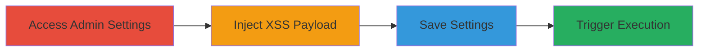

---
id: ac-9375-stored-xss-bgmp
name: Stored XSS in Basic Google Maps Placemarks Plugin Settings for Admin JavaScript Execution
type: attack_chain
description: A multi-step attack exploiting a stored XSS vulnerability in the Basic Google Maps Placemarks WordPress plugin to inject and execute malicious JavaScript in the admin settings page, enabling potential session hijacking for other administrators.
verified: false
submitted: false
step_count: 4
created_at: 2024-01-01T00:00:00Z
updated_at: 2024-01-01T00:00:00Z
procedures: [[procedures/Inject-Stored-XSS-in-BGMP-Plugin-Settings]]
techniques: [[JavaScript]]
tactics: [[Execution]], [[Collection]]
tags: xss, stored-xss, wordpress, plugin-vulnerability, javascript-execution
platforms: Web, WordPress
tools: []
---

# Stored XSS in Basic Google Maps Placemarks Plugin Settings for Admin JavaScript Execution

Multi-stage attack chain demonstrating a complete attack workflow exploiting a stored XSS vulnerability in the Basic Google Maps Placemarks (BGMP) WordPress plugin version 1.10.2.

## Chain Metrics Dashboard

| Metric | Value |
|--------|-------|
| Chain Status | Unverified |
| Total Steps | 4 |
| Execution Time | ~5 minutes |
| Skill Level | Intermediate |
| Complexity | Medium |
| Impact Level | High |

## Attack Flow Visualization

## Prerequisites & Requirements

### Required Tools

- None (manual browser-based exploitation)

### Target Environment

- WordPress site with Basic Google Maps Placemarks plugin version 1.10.2 or vulnerable equivalent
- PHP-based web server
- Admin access to the WordPress dashboard

### Initial Access Requirements

- Valid administrator credentials for the target WordPress site
- Direct network access to the admin panel (e.g., via browser)
- No prior access needed beyond admin login

## Detailed Attack Procedures

### Step 1: Access the Plugin Settings Page
procedure: [[procedures/Inject-Stored-XSS-in-BGMP-Plugin-Settings]]

**Objective**: Gain access to the vulnerable settings page as an administrator to prepare for payload injection.

**Instructions**: Log in to the WordPress admin dashboard and navigate to the BGMP settings page at `http://www.site.com/wp-admin/options-general.php?page=bgmp_settings`.

**Expected Output**: The settings form loads, displaying input fields for placemark configurations.

**Success Indicators**:
- Admin dashboard accessible
- BGMP settings page loaded without errors

### Step 2: Inject XSS Payload into Input Fields
procedure: [[procedures/Inject-Stored-XSS-in-BGMP-Plugin-Settings]]

**Objective**: Insert malicious JavaScript into unsanitized input fields to store the payload persistently.

**Instructions**: In any input field on the settings page (e.g., map title or description fields), enter a payload such as `` or more advanced like `` to exfiltrate cookies.

**Expected Output**: The payload is accepted without validation errors.

**Success Indicators**:
- Payload entered successfully
- No immediate sanitization or escape applied

### Step 3: Save the Settings to Store the Payload
procedure: [[procedures/Inject-Stored-XSS-in-BGMP-Plugin-Settings]]

**Objective**: Persist the injected script in the plugin's database settings for later execution.

**Instructions**: Submit the settings form by clicking the save button, which stores the unsanitized input in the WordPress options table.

**Expected Output**: Settings saved confirmation message; payload now stored in the backend.

**Success Indicators**:
- Form submission successful
- No errors during save process

### Step 4: Trigger the XSS by Viewing the Settings Page
procedure: [[procedures/Inject-Stored-XSS-in-BGMP-Plugin-Settings]]

**Objective**: Execute the stored JavaScript when another administrator views the page, leading to code execution in their browser context.

**Instructions**: Have another admin (or reload as the same admin) access the settings page at `http://www.site.com/wp-admin/options-general.php?page=bgmp_settings`. The plugin renders the stored fields without output escaping, triggering the script.

**Expected Output**: JavaScript executes, e.g., alert popup or cookie exfiltration to attacker-controlled server.

**Success Indicators**:
- Script runs in victim's browser
- Potential session data stolen or page manipulated

## Attack Chain Summary

### Key Achievements

1. Successful injection and storage of arbitrary JavaScript via admin-only settings fields
2. Execution of payload in the context of other administrators viewing the page
3. Potential for session hijacking, cookie theft, or further admin compromise

## Technique & Tactic Coverage

### MITRE ATT&CK Techniques

- [[JavaScript]]

### MITRE ATT&CK Tactics

- [[Execution]]
- [[Collection]]

---
*Last updated: 2024-01-01T00:00:00Z*
