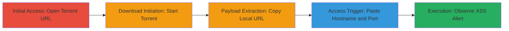

# Stored XSS in Brave Browser Torrent Downloader for Localhost Service Access

Multi-stage attack chain demonstrating exploitation of a stored XSS vulnerability in Brave's torrent downloader to inject and execute JavaScript on localhost ports, allowing persistence via service workers and theft of sensitive data from local web services.

## Chain Metrics Dashboard

| Metric | Value |
|--------|-------|
| Chain Status | Unverified |
| Total Steps | 5 |
| Execution Time | ~2 minutes |
| Skill Level | Intermediate |
| Complexity | Medium |
| Impact Level | High |

## Attack Flow Visualization

## Prerequisites & Requirements

### Required Tools

- None (uses built-in Brave Browser features)

### Target Environment

- Brave Browser version 0.68.131 or vulnerable equivalent (based on Chromium 76.0.3809.100)
- Local web services running on ports like 8080
- Network access to download torrent files

### Initial Access Requirements

- Victim must use vulnerable Brave Browser
- No credentials required
- Attacker needs to host or provide crafted torrent URL

## Detailed Attack Procedures

### Step 1: Open Crafted Torrent URL
procedure: [[procedures/Exploit-Stored-XSS-via-Crafted-Torrent-in-Brave]]

**Objective**: Initiate the download of a malicious torrent file containing an unsanitized filename with XSS payload.

**Instructions**: Navigate to the crafted torrent URL in Brave Browser, such as https://exec.ga/browser/brave/xss.torrent, to trigger the integrated torrent downloader.

**Expected Output**: Brave's torrent downloader interface appears, prompting to start the download.

**Success Indicators**:
- Torrent file begins loading
- Downloader UI shows the file

### Step 2: Start Torrent Download
procedure: [[procedures/Exploit-Stored-XSS-via-Crafted-Torrent-in-Brave]]

**Objective**: Process the torrent file, allowing the unsanitized filename to be handled and store the XSS payload locally.

**Instructions**: Click the 'Start Torrent' button in the Brave torrent downloader to begin processing the file.

**Expected Output**: The downloader processes the torrent, generating a local URL for the file.

**Success Indicators**:
- Download progress starts
- Local file path or URL is generated

### Step 3: Copy Local URL
procedure: [[procedures/Exploit-Stored-XSS-via-Crafted-Torrent-in-Brave]]

**Objective**: Extract the localhost URL created by the downloader for the stored file containing the payload.

**Instructions**: Right-click the 'Save File' button in the downloader and copy its link address to obtain the full local URL.

**Expected Output**: A URL like http://localhost:8080/path/to/file is copied to clipboard.

**Success Indicators**:
- Valid localhost URL obtained
- URL references port 8080 or similar

### Step 4: Access via Hostname and Port
procedure: [[procedures/Exploit-Stored-XSS-via-Crafted-Torrent-in-Brave]]

**Objective**: Trigger the stored XSS by accessing the local URL, executing the injected JavaScript.

**Instructions**: Paste only the hostname and port (e.g., http://localhost:8080) into the browser's URL bar and navigate to it.

**Expected Output**: The page loads, and the service worker persists the payload, making it accessible.

**Success Indicators**:
- Page loads without errors
- Any local service on the port responds

### Step 5: Observe XSS Execution
procedure: [[procedures/Exploit-Stored-XSS-via-Crafted-Torrent-in-Brave]]

**Objective**: Confirm the XSS payload execution, demonstrating potential for data theft.

**Instructions**: Upon accessing the URL, the injected JavaScript should execute automatically.

**Expected Output**: An alert box pops up (in PoC), or arbitrary JS runs, potentially stealing data from local services.

**Success Indicators**:
- Alert dialog appears
- Console shows JS execution
- Sensitive data from localhost services can be accessed

## Attack Chain Summary

### Key Achievements

1. Successful injection of XSS via torrent filename
2. Persistence of malicious script on localhost ports using service workers
3. Demonstration of arbitrary JS execution for data exfiltration from local web services

## Technique & Tactic Coverage

### MITRE ATT&CK Techniques

- [[JavaScript]]

### MITRE ATT&CK Tactics

- [[Execution]]
- [[Collection]]

---
*Last updated: 2023-10-01T00:00:00Z*
