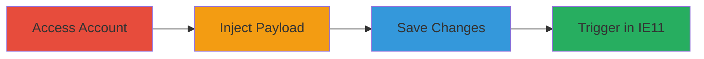

---
tags:
  - xss
  - stored-xss
  - bridge-cms
  - ie11
  - twig
  - php
type: attack_chain
tools:
  - '[[tools/Internet-Explorer-11]]'
  - '[[tools/Inspect-Element]]'
tactics:
  - '[[Execution]]'
verified: false
platforms:
  - Web
submitted: true
complexity: medium
created_at: '2023-10-05T12:00:00Z'
procedures:
  - '[[procedures/Access-Bridge-CMS-User-Account]]'
  - '[[procedures/Inject-XSS-Payload-into-Display-Name]]'
  - '[[procedures/Save-Malicious-Profile-Changes]]'
  - '[[procedures/Execute-XSS-in-Internet-Explorer-11]]'
step_count: 4
techniques:
  - '[[JavaScript]]'
updated_at: '2025-12-14T03:15:47.111Z'
description: >-
  A multi-step attack exploiting a stored XSS vulnerability in the Bridge CMS
  user display name field, allowing script execution in Internet Explorer 11 due
  to inadequate sanitization and lack of CSP enforcement.
skill_level: intermediate
impact_level: medium
id: c1a9ed23-4377-4a14-89d2-a2659e67a1c5
validated: true
mitre_tactics:
  - '[[Execution]]'
mitre_techniques:
  - '[[JavaScript]]'
---
# Stored XSS in Bridge CMS via Custom Profile Display Name

Multi-stage attack chain demonstrating a stored XSS vulnerability in the Bridge CMS application, where an attacker injects a malicious script into the custom profile display name field. The payload is stored without proper server-side sanitization and rendered unsafely in Twig templates, executing only in Internet Explorer 11 due to the absence of Content-Security-Policy (CSP) support. This can lead to self-XSS or, with account access, potential account takeover if the victim uses a vulnerable browser.

## Chain Metrics Dashboard

| Metric | Value |
|--------|-------|
| Chain Status | Unverified |
| Total Steps | 4 |
| Execution Time | ~5 minutes |
| Skill Level | Intermediate |
| Complexity | Medium |
| Impact Level | Medium |

## Attack Flow Visualization

## Prerequisites & Requirements

### Required Tools

- [[tools/Internet-Explorer-11]]
- [[tools/Inspect-Element]]

### Target Environment

- Bridge CMS application (PHP-based with Twig templating)
- Web platform with user account access
- No specific ports required beyond standard HTTPS (443)

### Initial Access Requirements

- Valid user credentials for the Bridge CMS account
- Direct network access to the application (e.g., https://bridge.cspr.ng)
- No prior elevated access needed, but attacker must control the target account

## Detailed Attack Procedures

### Step 1: Access User Account
procedure: [[procedures/Access-Bridge-CMS-User-Account]]

**Objective**: Gain access to the user account page to prepare for payload injection.

**Instructions**: Open a web browser and navigate to the account management endpoint. Enter valid credentials if prompted to log in.

**Expected Output**: The user account dashboard loads, displaying options for profile customization.

**Success Indicators**:
- Account page accessible at https://bridge.cspr.ng/my/account
- Profile editing fields visible

### Step 2: Inject XSS Payload
procedure: [[procedures/Inject-XSS-Payload-into-Display-Name]]

**Objective**: Enable the custom profile option and insert the malicious XSS payload into the display name field.

**Instructions**: Locate the custom profile field option checkbox and enable it. In the display name input field, enter the payload `` prefixed with a benign character like 'p' to avoid immediate detection, e.g., `p`.

**Expected Output**: The payload is entered into the form field without errors.

**Success Indicators**:
- Custom profile option checked
- Payload visible in the display name input

### Step 3: Save Profile Changes
procedure: [[procedures/Save-Malicious-Profile-Changes]]

**Objective**: Submit the form to store the unsanitized payload on the server.

**Instructions**: Click the submit or update button to save the profile changes. The server processes the input without sanitization, storing the payload in the database.

**Expected Output**: Confirmation message indicating successful update; profile reflects the new display name.

**Success Indicators**:
- Form submission succeeds
- No validation errors on payload

### Step 4: Trigger XSS Execution
procedure: [[procedures/Execute-XSS-in-Internet-Explorer-11]]

**Objective**: View the profile in a vulnerable browser to execute the stored script.

**Instructions**: Switch to Internet Explorer 11 and reload or navigate to the account page (https://bridge.cspr.ng/my/account). Use [[tools/Inspect-Element]] to verify the payload in the DOM if needed. The Twig template renders the display name with `|raw` escaping bypassed in this context, executing the alert.

**Expected Output**: JavaScript alert box pops up displaying 'xss'.

**Success Indicators**:
- Alert executes in IE11
- No execution in modern browsers due to CSP

## Attack Chain Summary

### Key Achievements

1. Successful injection and storage of XSS payload in user display name
2. Bypassing Twig escaping via concatenation and |raw filter
3. Script execution in legacy browser (IE11) without CSP
4. Demonstration of potential for self-XSS or account takeover

## Technique & Tactic Coverage

### MITRE ATT&CK Techniques

- [[JavaScript]]

### MITRE ATT&CK Tactics

- [[Execution]]

---
*Last updated: 2023-10-05T12:00:00Z*
