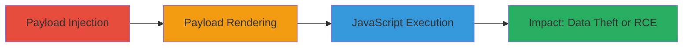

---
tags:
  - xss
  - stored-xss
  - wordpress
  - buddypress
  - javascript
type: attack_chain
tools: []
tactics:
  - '[[Execution]]'
commands: []
platforms:
  - Web
complexity: medium
procedures:
  - '[[procedures/Inject-Malicious-HTML-Payload-into-BuddyPress-Group-Name]]'
  - '[[procedures/Access-BuddyPress-Group-Page-to-Render-Payload]]'
  - '[[procedures/Trigger-XSS-Payload-Using-Accesskey-Keyboard-Shortcut]]'
step_count: 3
techniques:
  - '[[JavaScript]]'
description: >-
  A multi-step attack exploiting a stored XSS vulnerability in the BuddyPress
  WordPress plugin by injecting malicious HTML into a group name, rendering it
  on the group page, and triggering execution via accesskey for JavaScript alert
  and potential RCE.
skill_level: intermediate
impact_level: high
id: a9baced5-07f3-4917-a1ad-0b4eecbd469a
created_at: '2025-12-13T23:56:03.793Z'
updated_at: '2025-12-13T23:56:03.793Z'
verified: false
validated: true
submitted: true
mitre_tactics:
  - '[[Execution]]'
mitre_techniques:
  - '[[JavaScript]]'
---
# Stored XSS in BuddyPress Group Name Leading to Arbitrary JavaScript Execution

## Overview

This attack chain demonstrates the exploitation of a stored cross-site scripting (XSS) vulnerability in the BuddyPress plugin for WordPress. An attacker injects a malicious HTML anchor tag with an accesskey and onclick event into the group name field. The payload is stored in the database and rendered unsanitized on the group page as a link. Victims accessing the page can trigger the payload by pressing specific keyboard shortcuts (Shift+Ctrl+Option+X on macOS or Shift+Alt+X on Windows), executing arbitrary JavaScript in their browser context. This can lead to session hijacking, data theft, or further exploitation toward remote code execution (RCE).

## Chain Metrics Dashboard

| Metric | Value |
|--------|-------|
| Chain Status | Unverified |
| Total Steps | 3 |
| Execution Time | ~5 minutes |
| Skill Level | Intermediate |
| Complexity | Medium |
| Impact Level | High |

## Attack Flow Visualization

## Prerequisites & Requirements

### Required Tools

- Web browser (e.g., Chrome, Firefox)
- Access to a WordPress site with BuddyPress plugin enabled

### Target Environment

- WordPress platform with BuddyPress plugin
- User account with permission to create or edit groups (e.g., logged-in user)
- Web-based interface; no specific ports or services beyond HTTP/HTTPS

### Initial Access Requirements

- Valid user credentials for the WordPress site
- Network access to the target WordPress instance
- No prior elevated privileges needed; standard user suffices for injection

## Detailed Attack Procedures

### Step 1: Payload Injection
procedure: [[procedures/Inject-Malicious-HTML-Payload-into-BuddyPress-Group-Name]]

**Objective**: Inject a stored XSS payload into the BuddyPress group name field to persist malicious HTML that will be rendered later.

**Instructions**: Log in to the WordPress site, navigate to the BuddyPress groups section, and create a new group or edit an existing one. Set the group name to the payload `` (space-compressed variant: `` to bypass basic filters). Save the group.

**Expected Output**: Group created or updated successfully; payload stored in the database without immediate error.

**Success Indicators**:
- Group name appears altered in the admin interface (may show as plain text)
- No sanitization errors during save

### Step 2: Payload Rendering
procedure: [[procedures/Access-BuddyPress-Group-Page-to-Render-Payload]]

**Objective**: Access the group page where the injected payload is rendered as HTML, making it available for triggering by victims.

**Instructions**: Navigate to the BuddyPress group page URL (e.g., `/groups/group-name/`) in a web browser. Inspect the page source to confirm the group name renders as an `<a>` tag with the accesskey and onclick attributes intact.

**Expected Output**: Page loads with the group name displayed as a clickable link containing the malicious attributes.

**Success Indicators**:
- HTML source shows `<a accesskey="x" onclick="alert(document.domain)">` or similar
- No escaping of the payload (e.g., attributes not quoted or neutralized)

### Step 3: XSS Triggering
procedure: [[procedures/Trigger-XSS-Payload-Using-Accesskey-Keyboard-Shortcut]]

**Objective**: Activate the stored payload to execute arbitrary JavaScript in the victim's browser context.

**Instructions**: With the group page loaded, press the accesskey combination: Shift+Control+Option+X on macOS or Shift+Alt+X on Windows. This focuses the anchor tag and fires the onclick event.

**Expected Output**: JavaScript alert box pops up displaying the document domain (e.g., "example.com").

**Success Indicators**:
- Alert dialog appears confirming JS execution
- Browser console shows no errors; payload executes in site context

## Attack Chain Summary

### Key Achievements

1. Successful injection and storage of XSS payload in BuddyPress group name
2. Rendering of unsanitized HTML on group page accessible to victims
3. Triggering of arbitrary JS execution via accesskey, enabling further attacks like cookie theft

## Technique & Tactic Coverage

### MITRE ATT&CK Techniques

- [[JavaScript]]

### MITRE ATT&CK Tactics

- [[Execution]]

---
*Last updated: 2023-10-01T00:00:00Z*
