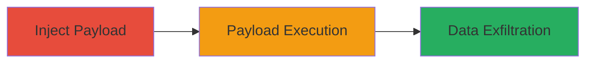

---
tags:
  - xss
  - stored-xss
  - javascript
  - cookie-theft
  - web-vulnerability
type: attack_chain
tools: []
tactics:
  - '[[Execution]]'
  - '[[Collection]]'
commands: []
platforms:
  - Web
complexity: medium
procedures:
  - '[[procedures/Inject-XSS-Payload-into-Bumble-Biodata]]'
  - '[[procedures/Observe-XSS-Payload-Execution-on-Profile-View]]'
step_count: 2
techniques:
  - '[[JavaScript]]'
  - '[[Steal Web Session Cookie]]'
description: >-
  A stored XSS vulnerability in the Bumble app's biodata field allows injection
  of JavaScript payloads that execute when profiles are viewed, enabling
  potential session hijacking via cookie theft.
skill_level: intermediate
impact_level: high
id: acde5851-95a0-4852-a10f-431f20fb1e8e
created_at: '2025-12-14T03:15:10.394Z'
updated_at: '2025-12-14T03:15:10.394Z'
verified: false
validated: true
submitted: true
mitre_tactics:
  - '[[Execution]]'
  - '[[Collection]]'
mitre_techniques:
  - '[[JavaScript]]'
  - '[[Steal Web Session Cookie]]'
---
# Stored XSS in Bumble Biodata Field for Cookie Theft

## Overview

This attack chain exploits a stored Cross-Site Scripting (XSS) vulnerability in the biodata field of the Bumble dating application's user profile. An attacker with a Bumble account can inject a malicious JavaScript payload into the biodata section during profile editing. Due to insufficient input sanitization, the payload is stored on the server and reflected unsanitized when other users view the tampered profile. Upon execution in the viewer's browser, the payload can steal sensitive data such as cookies or session tokens, potentially leading to account takeover or session hijacking. The vulnerability was reported via HackerOne (Report #949823) and demonstrates a classic stored XSS scenario in a web-based mobile app.

## Chain Metrics Dashboard

| Metric | Value |
|--------|-------|
| Chain Status | Unverified |
| Total Steps | 2 |
| Execution Time | ~5 minutes |
| Skill Level | Intermediate |
| Complexity | Medium |
| Impact Level | High |

## Attack Flow Visualization

## Prerequisites & Requirements

### Required Tools

- Web browser (e.g., Chrome with developer tools for payload testing)
- Bumble account (attacker-controlled)
- Victim account or simulated viewer (for testing execution)

### Target Environment

- Bumble web or mobile app (web platform)
- No specific ports or services required beyond standard HTTPS access
- Internet connectivity for profile submission and viewing

### Initial Access Requirements

- Valid Bumble user account for injection
- Ability to edit profile biodata field
- Access to view profiles (public or matched users)

## Detailed Attack Procedures

### Step 1: Payload Injection
procedure: [[procedures/Inject-XSS-Payload-into-Bumble-Biodata]]

**Objective**: Introduce a malicious JavaScript payload into the biodata field to store it server-side without sanitization.

**Instructions**: Log in to your Bumble account via the web interface. Navigate to the profile editing section and locate the biodata field (a free-text input for user bio or additional info). Craft a simple JavaScript payload, such as ``, and insert it into the field. Submit the profile update. Initial tests may trigger an error upon submission (e.g., after pressing OK), but refine the payload to bypass basic checks, ensuring it executes on reflection.

**Expected Output**: Profile updates successfully, with the payload stored. No immediate execution, but confirmation via backend storage (if inspectable) or error logs.

**Success Indicators**:
- No rejection of the payload during submission
- Profile saves with injected content
- Error on first attempt indicates partial sanitization, guiding payload refinement

### Step 2: Payload Execution and Impact
procedure: [[procedures/Observe-XSS-Payload-Execution-on-Profile-View]]

**Objective**: Trigger the stored payload execution in a viewer's browser to demonstrate arbitrary JavaScript execution and potential data theft.

**Instructions**: Have a victim (or use a secondary account) view the tampered profile. The biodata field reflects the unsanitized input, executing the JavaScript in the viewer's context. For proof-of-concept, use an alert payload; for real impact, replace with code to exfiltrate cookies, e.g., ``. Monitor attacker server for incoming data.

**Expected Output**: JavaScript executes (e.g., alert pops or network request to attacker domain), confirming vulnerability. Video evidence can capture the execution in browser dev tools.

**Success Indicators**:
- Alert or console log appears on profile view
- Network request sent with stolen cookies
- Session data accessible to attacker

## Attack Chain Summary

### Key Achievements

1. Successful injection and storage of unsanitized JavaScript in user-controlled biodata field
2. Reflection and execution of payload in victim browsers upon profile viewing
3. Potential for real-world impact including cookie theft and session hijacking

## Technique & Tactic Coverage

### MITRE ATT&CK Techniques

- [[JavaScript]]
- [[Steal Web Session Cookie]]

### MITRE ATT&CK Tactics

- [[Execution]]
- [[Collection]]

---
*Last updated: 2023-10-01T00:00:00Z*
