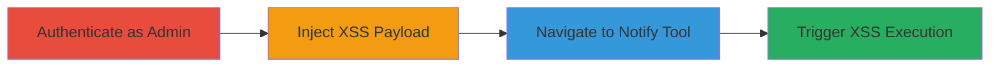

# Stored XSS in CampTix WordPress Plugin via Admin Notify Tool

Multi-stage attack chain demonstrating a complete attack workflow for exploiting a stored XSS vulnerability in the CampTix Event Ticketing plugin.

## Chain Metrics Dashboard

| Metric | Value |
|--------|-------|
| Chain Status | Unverified |
| Total Steps | 4 |
| Execution Time | ~5 minutes |
| Skill Level | Intermediate |
| Complexity | Low |
| Impact Level | Low |

## Attack Flow Visualization

## Prerequisites & Requirements

### Required Tools

- [[tools/Dropbox]]

### Target Environment

- WordPress with CampTix Event Ticketing plugin installed and active
- Administrative access to the WordPress site
- Web browser for interaction

### Initial Access Requirements

- Valid administrator credentials for the WordPress site
- Direct access to the admin panel (e.g., /wp-admin)
- No additional network access beyond HTTP/HTTPS to the site

## Detailed Attack Procedures

### Step 1: Authenticate as Administrator
procedure: [[procedures/Exploit-Stored-XSS-in-CampTix-Notify-Tool]]

**Objective**: Gain access to the WordPress admin panel to enable payload injection.

**Instructions**: Log in to the WordPress admin dashboard using administrator credentials. Navigate to the login page at `/wp-login.php` and enter the username and password.

**Expected Output**: Successful login redirecting to the dashboard at `/wp-admin/`.

**Success Indicators**:
- Dashboard loads with admin menu visible
- Access to CampTix sections available

### Step 2: Inject XSS Payload into Ticket Data
procedure: [[procedures/Exploit-Stored-XSS-in-CampTix-Notify-Tool]]

**Objective**: Store a malicious JavaScript payload in ticket content or related fields for later reflection.

**Instructions**: Access the CampTix ticket management area (e.g., via Tickets > Add New). In the ticket content or custom fields, insert an XSS payload such as ``. Save the ticket to store the payload.

**Expected Output**: Ticket saved successfully with the payload embedded in the database.

**Success Indicators**:
- Ticket creation confirmation
- Payload visible in ticket edit view (escaped, but stored)

### Step 3: Navigate to CampTix Tools Notify Section
procedure: [[procedures/Exploit-Stored-XSS-in-CampTix-Notify-Tool]]

**Objective**: Access the Notify tool where the stored payload is reflected without sanitization.

**Instructions**: From the admin menu, go to CampTix > Tools > Notify, or directly access the URL `/wp-admin/edit.php?post_type=tix_ticket&page=camptix_tools&tix_section=notify`. The 'to :' field will populate with ticket data containing the injected payload.

**Expected Output**: Notify page loads with the 'to :' field showing unsanitized input from the ticket.

**Success Indicators**:
- Page loads without errors
- Injected content appears in the 'to :' field

### Step 4: Trigger XSS Execution
procedure: [[procedures/Exploit-Stored-XSS-in-CampTix-Notify-Tool]]

**Objective**: Cause the reflected payload to execute JavaScript in the browser.

**Instructions**: Simply view or interact with the Notify page. The unsanitized payload in the 'to :' field will execute automatically upon rendering.

**Expected Output**: JavaScript alert or other payload effects trigger in the browser.

**Success Indicators**:
- Alert box or console logs appear
- Arbitrary JS executes (e.g., document.cookie access)

## Attack Chain Summary

### Key Achievements

1. Successful authentication and payload injection into stored ticket data
2. Reflection of payload in admin Notify tool without escaping
3. Execution of JavaScript in admin browser context, potentially allowing session hijacking or data exfiltration if escalated

## Technique & Tactic Coverage

### MITRE ATT&CK Techniques

- [[JavaScript]]

### MITRE ATT&CK Tactics

- [[Execution]]

---

*Last updated: 2023-10-01T00:00:00Z*
