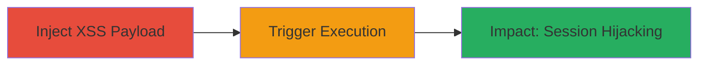

---
tags:
  - xss
  - stored-xss
  - javascript
  - web
  - session-hijacking
type: attack_chain
tools: []
tactics:
  - '[[Execution]]'
  - '[[Initial Access]]'
verified: false
platforms:
  - Web
submitted: true
complexity: medium
created_at: '2023-10-01T00:00:00Z'
procedures:
  - '[[procedures/Inject-XSS-Payload-into-Chaturbate-App-Name]]'
  - '[[procedures/Trigger-Stored-XSS-via-Apps-Page-Tooltip]]'
step_count: 2
techniques:
  - '[[JavaScript]]'
  - '[[Exploit Public-Facing Application]]'
updated_at: '2025-12-14T03:16:37.158Z'
description: >-
  A multi-stage attack exploiting a stored XSS vulnerability in Chaturbate's
  application name field to execute arbitrary JavaScript on all users viewing
  the apps page, potentially leading to session hijacking or phishing.
skill_level: intermediate
impact_level: high
id: 21d35152-a9c3-44db-a910-39931d7acc1b
validated: true
mitre_tactics:
  - '[[Execution]]'
  - '[[Initial Access]]'
mitre_techniques:
  - '[[JavaScript]]'
  - '[[Exploit Public-Facing Application]]'
---
# Stored XSS in Chaturbate App Name for Arbitrary JavaScript Execution Against All Users

Multi-stage attack chain demonstrating a complete attack workflow exploiting a stored XSS vulnerability in Chaturbate's application management system.

## Chain Metrics Dashboard

| Metric | Value |
|--------|-------|
| Chain Status | Unverified |
| Total Steps | 2 |
| Execution Time | ~5 minutes |
| Skill Level | Intermediate |
| Complexity | Medium |
| Impact Level | High |

## Attack Flow Visualization

## Prerequisites & Requirements

### Required Tools

- Web browser (e.g., Chrome with developer tools)

### Target Environment

- Chaturbate web application
- Access to create applications (authenticated user account)
- Network access to Chaturbate's /apps/ endpoint

### Initial Access Requirements

- Valid Chaturbate user account with permission to create apps
- No special privileges required beyond standard user access

## Detailed Attack Procedures

### Step 1: Inject XSS Payload
procedure: [[procedures/Inject-XSS-Payload-into-Chaturbate-App-Name]]

**Objective**: Create a malicious application with an unsanitized XSS payload in the name field to store the script for later execution.

**Instructions**: Log in to Chaturbate, navigate to the app creation page, and submit a payload like `` in the name field. The payload is stored without sanitization.

**Expected Output**: Application created successfully, payload persisted in the backend.

**Success Indicators**:
- App appears in the user's app list without errors
- Payload is visible in the app details (inspect via dev tools)

### Step 2: Trigger Stored XSS
procedure: [[procedures/Trigger-Stored-XSS-via-Apps-Page-Tooltip]]

**Objective**: Navigate to the /apps/ page and hover over the malicious app to execute the stored JavaScript against the viewer's session.

**Instructions**: Visit the /apps/ page where the app list is displayed. Hover the mouse over the malicious app's entry to trigger the tooltip, executing the payload in the context of any viewing user's browser.

**Expected Output**: JavaScript alert or custom script runs, confirming execution.

**Success Indicators**:
- Script executes on hover (e.g., alert pops up)
- Potential for further actions like stealing cookies via `document.cookie`

## Attack Chain Summary

### Key Achievements

1. Successful storage of XSS payload in app name without sanitization
2. Arbitrary JavaScript execution against all users on the /apps/ page
3. Potential for session hijacking or phishing attacks on viewers

## Technique & Tactic Coverage

### MITRE ATT&CK Techniques

- [[JavaScript]]
- [[Exploit Public-Facing Application]]

### MITRE ATT&CK Tactics

- [[Execution]]
- [[Initial Access]]

---
*Last updated: 2023-10-01T00:00:00Z*
