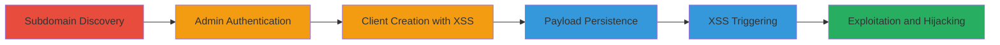

---
tags:
  - xss
  - stored-xss
  - javascript
  - session-hijacking
  - account-takeover
type: attack_chain
tools:
  - '[[tools/XSS-Hunter]]'
tactics:
  - '[[Execution]]'
  - '[[Collection]]'
verified: false
platforms:
  - Web
submitted: true
complexity: medium
created_at: '2023-10-01T00:00:00Z'
procedures:
  - '[[procedures/Discover-Subdomain]]'
  - '[[procedures/Authenticate-as-Administrator]]'
  - '[[procedures/Create-Client-with-XSS-Payload]]'
  - '[[procedures/Save-Client-and-Trigger-XSS]]'
  - '[[procedures/Demonstrate-Exploitation-with-XSS-Hunter]]'
step_count: 8
techniques:
  - '[[JavaScript]]'
  - '[[Drive-by Compromise]]'
updated_at: '2025-12-14T03:47:18.411Z'
description: >-
  A multi-stage attack exploiting a stored XSS vulnerability in the Ubiquiti
  UCRM billing demo application to inject malicious JavaScript into client
  custom attributes, enabling arbitrary code execution in other users' browsers
  for potential session hijacking or account takeover.
skill_level: intermediate
impact_level: high
id: 067e14d8-cafe-4f01-a7c8-3d970fa4d414
validated: true
mitre_tactics:
  - '[[Execution]]'
  - '[[Collection]]'
mitre_techniques:
  - '[[JavaScript]]'
  - '[[Drive-by Compromise]]'
---
# Stored XSS in Client Custom Attribute for Session Hijacking

Multi-stage attack chain demonstrating a complete workflow for exploiting a stored XSS vulnerability in the Ubiquiti UCRM billing demo application at dev-ucrm-billing-demo.ubnt.com. The attack involves discovering the subdomain, authenticating as an admin, injecting a malicious payload into a client custom attribute, saving it to persist the XSS, and triggering execution when viewed by other users, leading to potential session hijacking via tools like XSS Hunter.

## Chain Metrics Dashboard

| Metric | Value |
|--------|-------|
| Chain Status | Unverified |
| Total Steps | 8 |
| Execution Time | ~10 minutes |
| Skill Level | Intermediate |
| Complexity | Medium |
| Impact Level | High |

## Attack Flow Visualization

## Prerequisites & Requirements

### Required Tools

- [[tools/XSS-Hunter]]

### Target Environment

- Web application (Ubiquiti UCRM billing demo)
- Admin credentials for the target application
- Network access to the subdomain https://dev-ucrm-billing-demo.ubnt.com/

### Initial Access Requirements

- Valid admin username and password
- Browser for manual interaction (e.g., Chrome with developer tools)
- No prior access needed beyond public subdomain exposure

## Detailed Attack Procedures

### Step 1: Subdomain Discovery
procedure: [[procedures/Discover-Subdomain]]

**Objective**: Identify the vulnerable subdomain during reconnaissance to expand the attack surface.

**Instructions**: Manually identify or use subdomain enumeration tools to find https://dev-ucrm-billing-demo.ubnt.com/ while testing Ubiquiti-related domains.

**Expected Output**: Confirmation of the subdomain's existence and accessibility.

**Success Indicators**:
- Subdomain resolves and loads the login page
- No immediate security blocks

### Step 2: Admin Authentication
procedure: [[procedures/Authenticate-as-Administrator]]

**Objective**: Gain administrative access to the application to perform privileged actions like client creation.

**Instructions**: Navigate to the login page at https://dev-ucrm-billing-demo.ubnt.com/ and enter admin credentials to authenticate.

**Expected Output**: Successful login redirect to the admin dashboard.

**Success Indicators**:
- Access to admin panel features
- Session established without errors

### Step 3: Client Creation
procedure: [[procedures/Create-Client-with-XSS-Payload]]

**Objective**: Prepare a new client entry to serve as the vector for injecting the XSS payload.

**Instructions**: In the admin panel, navigate to the client creation form and fill in basic details for a new client.

**Expected Output**: Form ready for submission with custom fields available.

**Success Indicators**:
- Client creation form loads successfully
- Custom Attribute fields visible

### Step 4: XSS Payload Injection
procedure: [[procedures/Create-Client-with-XSS-Payload]]

**Objective**: Inject malicious JavaScript into the Custom Attribute 1 field to store the XSS payload persistently.

**Instructions**: In the Custom Attribute 1 field, enter the payload: `` or a more complex one like `">"">><marquee></marquee>"/`.

**Expected Output**: Payload entered without immediate validation errors.

**Success Indicators**:
- Payload accepted in the form field
- No client-side sanitization blocking input

### Step 5: Save Client
procedure: [[procedures/Save-Client-and-Trigger-XSS]]

**Objective**: Persist the injected payload in the database by submitting the client form.

**Instructions**: Submit the client creation form to save the new client with the embedded XSS payload to the backend.

**Expected Output**: Confirmation of client creation, e.g., new client ID assigned.

**Success Indicators**:
- Client saved successfully
- No server-side rejection of the payload

### Step 6: View Client Page
procedure: [[procedures/Save-Client-and-Trigger-XSS]]

**Objective**: Access the client details page where the custom attributes are rendered.

**Instructions**: Navigate to the client details URL, such as https://dev-ucrm-billing-demo.ubnt.com/client/24, to load the stored data.

**Expected Output**: Client details page loads with custom attributes section.

**Success Indicators**:
- Page accessible without authentication issues (for admin)
- Custom attributes visible but not yet expanded

### Step 7: Trigger XSS
procedure: [[procedures/Save-Client-and-Trigger-XSS]]

**Objective**: Execute the stored XSS payload by interacting with the rendered content.

**Instructions**: On the client details page, click 'Show more' under Custom Attribute 1 to render the unsanitized payload, triggering JavaScript execution like alert prompts.

**Expected Output**: JavaScript alerts or prompts appear, such as prompt(1) and confirm(3).

**Success Indicators**:
- Malicious JavaScript executes in the browser context
- Alerts confirm payload activation

### Step 8: Demonstrate Exploitation
procedure: [[procedures/Demonstrate-Exploitation-with-XSS-Hunter]]

**Objective**: Simulate real-world impact by capturing victim interactions for session hijacking or data theft.

**Instructions**: Replace the test payload with one that beacons to XSS Hunter (e.g., an img src pointing to your XSS Hunter domain) and have another user view the client page to trigger callback with cookies/IP.

**Expected Output**: XSS Hunter dashboard receives interaction data, including victim cookies or location.

**Success Indicators**:
- Callback received in XSS Hunter
- Potential for session token theft confirmed

## Attack Chain Summary

### Key Achievements

1. Persistent storage of XSS payload in client custom attributes without sanitization.
2. Triggering of arbitrary JavaScript in victim browsers upon viewing client details.
3. Demonstration of high-impact exploitation via session hijacking using XSS Hunter.

## Technique & Tactic Coverage

### MITRE ATT&CK Techniques

- [[JavaScript]]
- [[Drive-by Compromise]]

### MITRE ATT&CK Tactics

- [[Execution]]
- [[Collection]]

---
*Last updated: 2023-10-01T00:00:00Z*
