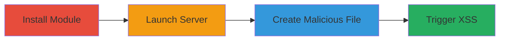

---
tags:
  - xss
  - stored-xss
  - nodejs
  - web-vulnerability
type: attack_chain
tools:
  - '[[tools/npm]]'
  - '[[tools/cloudcmd]]'
  - '[[tools/touch]]'
  - '[[tools/bash]]'
  - '[[tools/Chrome]]'
tactics:
  - '[[Initial Access]]'
  - '[[Execution]]'
  - '[[Collection]]'
verified: false
platforms:
  - Web
  - Node.js
  - Linux
  - macOS
submitted: true
complexity: medium
created_at: '2023-10-01T00:00:00Z'
procedures:
  - '[[procedures/Install-CloudCMD-Module]]'
  - '[[procedures/Launch-CloudCMD-Server]]'
  - '[[procedures/Create-Malicious-Filename-for-XSS]]'
  - '[[procedures/Trigger-XSS-in-Browser]]'
step_count: 4
techniques:
  - '[[JavaScript]]'
updated_at: '2025-12-14T03:15:31.097Z'
description: >-
  A multi-step attack exploiting a stored XSS vulnerability in the CloudCMD
  Node.js file manager by creating a file with a malicious JavaScript payload in
  its name, leading to arbitrary code execution in viewers' browsers.
skill_level: intermediate
impact_level: high
id: 19943abf-5691-42f8-b27e-393cdc2d8d12
validated: true
mitre_tactics:
  - '[[Initial Access]]'
  - '[[Execution]]'
  - '[[Collection]]'
mitre_techniques:
  - '[[JavaScript]]'
---
# Stored XSS in CloudCMD File Manager via Malicious Filename

Multi-stage attack chain demonstrating exploitation of a stored XSS vulnerability in CloudCMD version 9.1.5, where unsanitized filenames inject JavaScript into the directory listing HTML, enabling arbitrary code execution in browsers of users viewing the file manager interface. This can lead to session hijacking, data theft, or further client-side attacks.

## Chain Metrics Dashboard

| Metric | Value |
|--------|-------|
| Chain Status | Unverified |
| Total Steps | 4 |
| Execution Time | ~5 minutes |
| Skill Level | Intermediate |
| Complexity | Medium |
| Impact Level | High |

## Attack Flow Visualization



## Prerequisites & Requirements

### Required Tools

- [[tools/npm]]
- [[tools/cloudcmd]]
- [[tools/touch]]
- [[tools/bash]]
- [[tools/Chrome]]

### Target Environment

- Node.js runtime
- Linux or macOS for command execution
- Port 8080 available
- Web browser for triggering

### Initial Access Requirements

- Local machine with npm installed
- No network credentials needed; local exploitation
- Administrative access to run server

## Detailed Attack Procedures

### Step 1: Install CloudCMD Module
procedure: [[procedures/Install-CloudCMD-Module]]

**Objective**: Obtain the vulnerable CloudCMD module from the npm registry to set up the file manager environment.

**Instructions**: Use [[commands/npm-i-cloudcmd]] to install the package:

```bash
npm i cloudcmd
```

**Expected Output**: Installation logs confirming the package is added to node_modules/cloudcmd.

**Success Indicators**:
- node_modules directory created with cloudcmd folder
- No installation errors

### Step 2: Launch CloudCMD Server
procedure: [[procedures/Launch-CloudCMD-Server]]

**Objective**: Start the web file manager server to host the vulnerable directory listing interface.

**Instructions**: Execute [[commands/cloudcmd-launch-server]] from the installation directory:

```bash
./node_modules/cloudcmd/bin/cloudcmd.js --root .
```

**Expected Output**: Server startup message indicating it's listening on http://127.0.0.1:8080.

**Success Indicators**:
- Web server running on port 8080
- Accessible via browser at localhost:8080

### Step 3: Create Malicious Filename for XSS
procedure: [[procedures/Create-Malicious-Filename-for-XSS]]

**Objective**: Create a file in the root directory with a filename that contains an XSS payload to inject malicious JavaScript.

**Instructions**: Use [[commands/touch-malicious-filename]] in the current directory:

```bash
touch '"><svg onload=alert(3);>'
```

**Expected Output**: No output; file created successfully in the directory.

**Success Indicators**:
- File with name '"><svg onload=alert(3);>' exists in the root directory
- Listed in the file system

### Step 4: Trigger XSS in Browser
procedure: [[procedures/Trigger-XSS-in-Browser]]

**Objective**: Access the directory listing to render the malicious filename and execute the injected JavaScript.

**Instructions**: Open [[tools/Chrome]] and navigate to http://127.0.0.1:8080/ to view the interface.

**Expected Output**: Alert dialog with '3' pops up due to the onload script execution.

**Success Indicators**:
- JavaScript alert triggered
- Arbitrary code executes in the browser context

## Attack Chain Summary

### Key Achievements

1. Successful installation and launch of vulnerable CloudCMD server
2. Creation of stored XSS payload via filename injection
3. Execution of arbitrary JavaScript in victim browsers viewing the directory

## Technique & Tactic Coverage

### MITRE ATT&CK Techniques

- [[JavaScript]]

### MITRE ATT&CK Tactics

- [[Initial Access]]
- [[Execution]]
- [[Collection]]

---
*Last updated: 2023-10-01T00:00:00Z*
