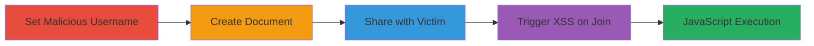

# Stored XSS in Collabora Online via Unsanitized User Display Name Leading to JavaScript Execution

Multi-stage attack chain demonstrating a complete attack workflow exploiting a stored XSS vulnerability in the integration between Nextcloud and Collabora Online.

## Chain Metrics Dashboard

| Metric | Value |
|--------|-------|
| Chain Status | Unverified |
| Total Steps | 4 |
| Execution Time | ~5 minutes |
| Skill Level | Intermediate |
| Complexity | Medium |
| Impact Level | High |

## Attack Flow Visualization

## Prerequisites & Requirements

### Required Tools

- None (web interface only)

### Target Environment

- Nextcloud instance with Collabora Online (CODE) integration enabled
- Web browser access to Nextcloud
- Attacker account with document creation and sharing permissions

### Initial Access Requirements

- Valid attacker credentials in Nextcloud
- Victim account that can access shared documents
- No special network access beyond standard web connectivity

## Detailed Attack Procedures

### Step 1: Set Malicious Username
procedure: [[procedures/Set-Malicious-Username-in-Nextcloud]]

**Objective**: Inject a stored XSS payload into the attacker's display name, which will be persisted and displayed unsanitized in collaborative sessions.

**Instructions**: Log in to the Nextcloud account and update the profile to include the malicious payload in the display name field.

**Expected Output**: Username updated successfully; payload stored in the backend.

**Success Indicators**:
- Profile update confirmation
- Payload visible in account settings without sanitization errors

### Step 2: Create Document
procedure: [[procedures/Create-Document-in-Nextcloud]]

**Objective**: Generate a new document that can be used for collaborative editing in Collabora Online.

**Instructions**: Navigate to the files section in Nextcloud and create a new office document via the web interface.

**Expected Output**: New document file created and listed in the user's files.

**Success Indicators**:
- Document appears in file list
- Document can be opened in Collabora for editing

### Step 3: Share Document with Victim
procedure: [[procedures/Share-Document-with-Victim]]

**Objective**: Make the document accessible to the victim, setting up the conditions for the collaborative session.

**Instructions**: Use Nextcloud's sharing feature to send the document link to the victim or admin account.

**Expected Output**: Share confirmation; document appears in victim's shared files.

**Success Indicators**:
- Victim receives share notification
- Victim can access and open the document

### Step 4: Trigger XSS in Editing Session
procedure: [[procedures/Trigger-XSS-in-Collabora-Editing-Session]]

**Objective**: Initiate collaborative editing to render the malicious username, executing the XSS payload in the victim's browser.

**Instructions**: Open the document in Collabora Online and wait for the victim to join the session.

**Expected Output**: Payload executes as an alert or other JS action when victim views user list.

**Success Indicators**:
- Alert pops up in victim's browser
- Console logs show JavaScript execution from the payload

## Attack Chain Summary

### Key Achievements

1. Successful storage of XSS payload in user display name
2. Delivery of payload via shared collaborative document
3. Arbitrary JavaScript execution in victim's browser context
4. Potential for session hijacking or data exfiltration within Nextcloud

## Technique & Tactic Coverage

### MITRE ATT&CK Techniques

- [[JavaScript]]

### MITRE ATT&CK Tactics

- [[Execution]]
- [[Collection]]

---
*Last updated: 2023-10-01T00:00:00Z*
