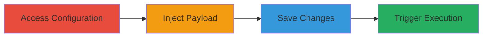

# Stored XSS in Concrete CMS Blog Page Tile for Arbitrary JavaScript Execution

Multi-stage attack chain demonstrating a complete attack workflow exploiting a stored cross-site scripting vulnerability in Concrete CMS to inject and execute malicious JavaScript via the blog page tile's Custom Title Text field. The payload is persisted in the database and triggers when any user views the affected blog page, potentially leading to session hijacking, data theft, or further attacks.

## Chain Metrics Dashboard

| Metric | Value |
|--------|-------|
| Chain Status | Unverified |
| Total Steps | 4 |
| Execution Time | ~5 minutes |
| Skill Level | Intermediate |
| Complexity | Medium |
| Impact Level | High |

## Attack Flow Visualization

## Prerequisites & Requirements

### Required Tools

- Web browser (e.g., Chrome with developer tools)

### Target Environment

- Concrete CMS instance (version vulnerable to this issue, e.g., pre-5.7.5)
- Administrative access to the CMS dashboard
- Web platform with PHP backend

### Initial Access Requirements

- Valid admin credentials for Concrete CMS
- Direct network access to the CMS dashboard
- No prior access needed beyond authentication

## Detailed Attack Procedures

### Step 1: Access Blog Page Configuration
procedure: [[procedures/Access-Blog-Page-Configuration-in-Concrete-CMS]]

**Objective**: Gain access to the blog page tile settings to locate the vulnerable Custom Title Text field.

**Instructions**: Log in to the Concrete CMS dashboard as an administrator. Navigate to the page management section, select the blog page, and access the tile editing interface for the blog tile. Locate the Custom Title Text input field.

**Expected Output**: The editing form for the blog page tile is loaded, displaying the Custom Title Text field.

**Success Indicators**:
- Dashboard accessible with admin privileges
- Blog page tile settings form visible

### Step 2: Inject XSS Payload
procedure: [[procedures/Inject-XSS-Payload-into-Custom-Title-Text-Field]]

**Objective**: Insert a malicious JavaScript payload into the Custom Title Text field to bypass sanitization and enable script execution.

**Instructions**: In the Custom Title Text field, enter the payload `'>` to prematurely close any surrounding HTML attributes and inject an inline script that executes on load error.

**Expected Output**: The payload is entered into the field without immediate errors or sanitization feedback.

**Success Indicators**:
- Payload accepted in the input field
- No client-side validation blocks the input

### Step 3: Save Malicious Changes
procedure: [[procedures/Save-Malicious-Changes-to-Blog-Page-Tile]]

**Objective**: Persist the injected payload in the CMS database by submitting the form, exploiting the lack of server-side validation.

**Instructions**: Submit the form to save the changes to the blog page tile configuration.

**Expected Output**: Confirmation that the tile has been updated, with the malicious title stored in the database.

**Success Indicators**:
- Form submission succeeds without errors
- Changes reflected in the dashboard preview (if available)

### Step 4: Trigger Stored XSS
procedure: [[procedures/Trigger-Stored-XSS-by-Viewing-Blog-Page]]

**Objective**: Load the affected blog page in a browser to execute the stored JavaScript payload, demonstrating arbitrary code execution.

**Instructions**: Navigate to the public-facing blog page in a browser. The injected script should execute automatically upon rendering the title.

**Expected Output**: An alert box pops up displaying "1", confirming JavaScript execution.

**Success Indicators**:
- Alert or other payload effect (e.g., console log) observed
- No errors in browser console related to script blocking

## Attack Chain Summary

### Key Achievements

1. Persistent storage of malicious JavaScript in the CMS database via unsanitized input.
2. Arbitrary code execution in the context of any user's browser viewing the blog page.
3. Potential for session hijacking, keystroke logging, or data exfiltration from victims.

## Technique & Tactic Coverage

### MITRE ATT&CK Techniques

- [[JavaScript]]

### MITRE ATT&CK Tactics

- [[Execution]]

---
*Last updated: 2023-10-01T12:00:00Z*
