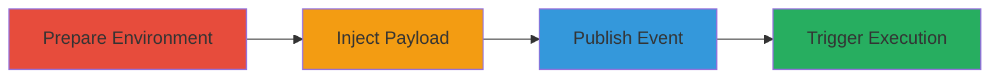

---
tags:
  - xss
  - stored-xss
  - concrete-cms
  - javascript-injection
type: attack_chain
tools:
  - '[[tools/Firefox]]'
  - '[[tools/Chrome]]'
tactics:
  - '[[Execution]]'
commands: []
platforms:
  - Web
complexity: medium
procedures:
  - '[[procedures/Prepare-Test-Environment-in-Concrete-CMS]]'
  - '[[procedures/Create-Malicious-Calendar-Event-with-XSS]]'
  - '[[procedures/Publish-Event-and-Trigger-XSS-as-Admin]]'
step_count: 4
techniques:
  - '[[JavaScript]]'
description: >-
  A multi-stage attack exploiting a stored XSS vulnerability in the Add Event
  feature of Concrete CMS to inject and trigger malicious JavaScript against
  authenticated users viewing the calendar.
skill_level: intermediate
impact_level: high
id: d2382201-2c3c-4805-b67f-7ac35dd65f9b
created_at: '2025-12-14T03:16:20.416Z'
updated_at: '2025-12-14T03:16:20.416Z'
verified: false
validated: true
submitted: true
mitre_tactics:
  - '[[Execution]]'
mitre_techniques:
  - '[[JavaScript]]'
---
# Stored XSS in Concrete CMS Calendar Event Name Leading to Admin JavaScript Execution

Multi-stage attack chain demonstrating exploitation of a stored XSS vulnerability in Concrete CMS version 8.3.1's Calendar & Events dashboard. An attacker with event creation permissions injects a JavaScript payload into the event name, which is stored and rendered unsafely, executing arbitrary code in the browsers of other authenticated users, such as admins, when they view the calendar page. This enables client-side attacks like phishing or defacement, though HttpOnly cookies limit direct session hijacking.

## Chain Metrics Dashboard

| Metric | Value |
|--------|-------|
| Chain Status | Unverified |
| Total Steps | 4 |
| Execution Time | ~15 minutes |
| Skill Level | Intermediate |
| Complexity | Medium |
| Impact Level | High |

## Attack Flow Visualization

## Prerequisites & Requirements

### Required Tools

- [[tools/Firefox]]
- [[tools/Chrome]]

### Target Environment

- Concrete CMS version 8.3.1 or similar vulnerable release
- Web platform with PHP backend
- Authenticated access to dashboard

### Initial Access Requirements

- Admin credentials for setup
- Permissions to create users and events in Calendar & Events
- Local or remote access to the CMS instance

## Detailed Attack Procedures

### Step 1: Prepare Test Environment
procedure: [[procedures/Prepare-Test-Environment-in-Concrete-CMS]]

**Objective**: Set up admin and test user accounts to simulate multi-user exploitation.

**Instructions**: Log in as admin, create a secondary admin user, and prepare separate browser sessions.

**Expected Output**: Two active admin sessions ready for testing.

**Success Indicators**:
- Secondary user (user2) created and added to Administrators group
- Incognito session logged in as user2

### Step 2: Create Calendar and Inject XSS Payload
procedure: [[procedures/Create-Malicious-Calendar-Event-with-XSS]]

**Objective**: Create a calendar and event with an injected XSS payload in the name field.

**Instructions**: As user2, navigate to Calendar & Events, add a calendar, then add an event and inject the payload in the Name field.

**Expected Output**: Event saved with payload, triggering a prompt in user2's session.

**Success Indicators**:
- Payload executes immediately upon save in creator's browser
- Domain prompt appears confirming XSS

### Step 3: Publish the Malicious Event
procedure: [[procedures/Publish-Event-and-Trigger-XSS-as-Admin]]

**Objective**: Publish the event to make it visible and trigger the XSS against the admin viewer.

**Instructions**: Edit and publish the event as user2, then switch to admin session to view the calendar.

**Expected Output**: XSS triggers in admin's browser upon viewing the event list.

**Success Indicators**:
- Event published successfully
- Prompt appears in admin's browser showing the domain

### Step 4: Validate Exploitation Impact
procedure: [[procedures/Publish-Event-and-Trigger-XSS-as-Admin]]

**Objective**: Confirm arbitrary JavaScript execution and assess potential impacts.

**Instructions**: Replace the test payload with more malicious code (e.g., for phishing) and observe execution in victim context.

**Expected Output**: Arbitrary JS runs in victim's browser, limited by HttpOnly cookies.

**Success Indicators**:
- JS payload executes without errors
- No direct cookie access, but client-side attacks possible

## Attack Chain Summary

### Key Achievements

1. Successful injection and storage of XSS payload in event name
2. Immediate execution in creator's session and deferred execution in viewer's session
3. Demonstration of cross-user impact within authenticated dashboard

## Technique & Tactic Coverage

### MITRE ATT&CK Techniques

- [[JavaScript]]

### MITRE ATT&CK Tactics

- [[Execution]]

---

*Last updated: 2023-10-01T00:00:00Z*
