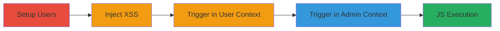

---
tags:
  - xss
  - stored-xss
  - concrete-cms
  - javascript-execution
type: attack_chain
tools:
  - '[[tools/Firefox]]'
  - '[[tools/Chrome]]'
tactics:
  - '[[Execution]]'
verified: false
platforms:
  - Web
submitted: true
complexity: medium
created_at: '2023-10-01T00:00:00Z'
procedures:
  - '[[procedures/Setup-Test-Users-in-Concrete-CMS]]'
  - '[[procedures/Inject-Stored-XSS-in-Calendar-Name]]'
  - '[[procedures/Trigger-XSS-as-Admin]]'
step_count: 4
techniques:
  - '[[JavaScript]]'
updated_at: '2025-12-14T03:16:20.397Z'
description: >-
  A multi-step attack exploiting stored XSS in the Concrete CMS calendar name
  field to execute arbitrary JavaScript in the context of administrators and
  other users.
skill_level: intermediate
impact_level: high
id: 6fdfd0bf-7b03-4e40-af6e-27d9fb47dd10
validated: true
mitre_tactics:
  - '[[Execution]]'
mitre_techniques:
  - '[[JavaScript]]'
---
# Stored XSS in Concrete CMS Calendar Name for Admin JavaScript Execution

Multi-stage attack chain demonstrating a complete attack workflow exploiting stored XSS in Concrete CMS 8.3.1 to execute JavaScript in user and admin contexts.

## Chain Metrics Dashboard

| Metric | Value |
|--------|-------|
| Chain Status | Unverified |
| Total Steps | 4 |
| Execution Time | ~10 minutes |
| Skill Level | Intermediate |
| Complexity | Medium |
| Impact Level | High |

## Attack Flow Visualization

## Prerequisites & Requirements

### Required Tools

- [[tools/Firefox]]
- [[tools/Chrome]]

### Target Environment

- Web platform with Concrete CMS 8.3.1
- PHP backend
- Administrative access to the CMS instance

### Initial Access Requirements

- Valid admin credentials for Concrete CMS
- Network access to the web application
- No prior access needed beyond login

## Detailed Attack Procedures

### Step 1: Setup Test Environment
procedure: [[procedures/Setup-Test-Users-in-Concrete-CMS]]

**Objective**: Prepare the environment by logging in as admin, creating a test user, and setting up a separate session to simulate multi-user interaction.

**Instructions**: Open [[tools/Firefox]] or [[tools/Chrome]] and navigate to the Concrete CMS login page. Log in with admin credentials, then create a new user and add it to the Administrators group. Open an incognito window and log in as the new user.

**Expected Output**: Successful logins in both sessions, with the test user having admin privileges.

**Success Indicators**:
- Admin session active
- Test user (e.g., user2) created and logged in separately

### Step 2: Inject XSS Payload
procedure: [[procedures/Inject-Stored-XSS-in-Calendar-Name]]

**Objective**: Create a calendar with a malicious name containing an XSS payload to store the script for later execution.

**Instructions**: In the test user's session, navigate to Dashboard > Calendar & Events > Add Calendar. Enter the payload `` prefixed with benign text like 'Hi, Admin' in the Calendar Name field. Submit the form.

**Expected Output**: Calendar created successfully, with immediate execution of the payload in the test user's browser showing a prompt with the current URL.

**Success Indicators**:
- Payload executes in test user context
- Calendar listed in the dashboard with the malicious name

### Step 3: Trigger XSS in User Context
procedure: [[procedures/Inject-Stored-XSS-in-Calendar-Name]]

**Objective**: Verify the stored XSS executes upon creation in the injecting user's session.

**Instructions**: After submission, observe the alert prompt in the test user's browser. Close the prompt to continue.

**Expected Output**: JavaScript alert displaying the document location.

**Success Indicators**:
- Prompt appears and can be dismissed
- No errors in calendar creation

### Step 4: Trigger XSS as Admin
procedure: [[procedures/Trigger-XSS-as-Admin]]

**Objective**: Switch to the admin session and view the malicious calendar to execute the XSS in the privileged context.

**Instructions**: Switch to the admin browser window, navigate to Dashboard > Calendar & Events, select the malicious calendar (e.g., 'Hi, Admin'), and observe the execution.

**Expected Output**: JavaScript alert prompt in the admin's browser displaying the document location.

**Success Indicators**:
- Payload executes in admin context
- Arbitrary JS runs with admin privileges (e.g., potential for keylogging or DOM manipulation)

## Attack Chain Summary

### Key Achievements

1. Successful storage of XSS payload in calendar name without sanitization
2. Execution in both user and admin contexts upon viewing
3. Demonstration of impact like URL prompting, extensible to more severe actions

## Technique & Tactic Coverage

### MITRE ATT&CK Techniques

- [[JavaScript]]

### MITRE ATT&CK Tactics

- [[Execution]]

---

*Last updated: 2023-10-01T00:00:00Z*
