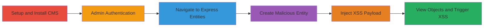

---
tags:
  - xss
  - stored-xss
  - concrete-cms
  - web-vulnerability
  - javascript-execution
type: attack_chain
tools: []
tactics:
  - '[[Execution]]'
verified: false
platforms:
  - Web
submitted: true
complexity: medium
created_at: '2023-10-01T00:00:00Z'
procedures:
  - '[[procedures/Install-and-Setup-Concrete-CMS-8-5-2]]'
  - '[[procedures/Login-as-Admin-to-Concrete-CMS]]'
  - '[[procedures/Create-Express-Entity-with-XSS-Payload]]'
  - '[[procedures/Trigger-Stored-XSS-in-View-Objects]]'
step_count: 6
techniques:
  - '[[JavaScript]]'
updated_at: '2025-12-14T03:16:02.525Z'
description: >-
  A multi-stage attack exploiting a stored XSS vulnerability in the Name field
  of Express entities in Concrete CMS 8.5.2, allowing arbitrary JavaScript
  execution in the browser of an authenticated admin user.
skill_level: intermediate
impact_level: high
id: 7178db29-2835-4106-9873-d9c2b8236158
validated: true
mitre_tactics:
  - '[[Execution]]'
mitre_techniques:
  - '[[JavaScript]]'
---
# Stored XSS in Concrete CMS Express Entities Name Field

Multi-stage attack chain demonstrating a complete attack workflow exploiting stored XSS in Concrete CMS 8.5.2.

## Chain Metrics Dashboard

| Metric | Value |
|--------|-------|
| Chain Status | Unverified |
| Total Steps | 6 |
| Execution Time | ~10 minutes |
| Skill Level | Intermediate |
| Complexity | Medium |
| Impact Level | High |

## Attack Flow Visualization

## Prerequisites & Requirements

### Required Tools

- Web browser (e.g., Chrome, Firefox)
- Access to download Concrete CMS 8.5.2

### Target Environment

- Web platform running PHP
- Concrete CMS 8.5.2 installed
- Admin privileges required

### Initial Access Requirements

- Valid admin credentials for the Concrete CMS instance
- Local or remote access to install and run the CMS
- No prior network access beyond standard web connectivity

## Detailed Attack Procedures

### Step 1: Install and Setup Concrete CMS
procedure: [[procedures/Install-and-Setup-Concrete-CMS-8-5-2]]

**Objective**: Prepare a vulnerable Concrete CMS 8.5.2 instance for exploitation.

**Instructions**: Download the Concrete CMS 8.5.2 package from the official source and perform a standard installation on a PHP-enabled web server. Follow the setup wizard to configure the database and complete the installation.

**Expected Output**: A running Concrete CMS instance accessible via web browser at the configured URL (e.g., http://localhost/concrete).

**Success Indicators**:
- Installation completes without errors
- Dashboard is accessible

### Step 2: Login as Admin
procedure: [[procedures/Login-as-Admin-to-Concrete-CMS]]

**Objective**: Gain authenticated access to the admin dashboard to perform entity creation.

**Instructions**: Navigate to the login page (typically /index.php/login) and enter admin credentials. Submit the form to authenticate.

**Expected Output**: Redirect to the dashboard with admin privileges.

**Success Indicators**:
- Successful login message or dashboard access
- Admin menu options visible

### Step 3: Create Express Entity with XSS Payload
procedure: [[procedures/Create-Express-Entity-with-XSS-Payload]]

**Objective**: Navigate to the Express entities section and create a new entity while injecting the XSS payload into the Name field.

**Instructions**: From the dashboard, go to System Settings > Express Entities (/index.php/dashboard/system/express/entities). Click 'Create' to start a new entity. In the Name field, enter the payload `</h1><h1>`. Configure other fields as needed and save the entity.

**Expected Output**: Entity saved successfully without errors.

**Success Indicators**:
- Entity appears in the list
- No validation errors on save

### Step 4: Trigger Stored XSS in View Objects
procedure: [[procedures/Trigger-Stored-XSS-in-View-Objects]]

**Objective**: Render the malicious entity to execute the injected JavaScript in the browser.

**Instructions**: In the Express entities section, switch to the 'View Objects' tab. The Name field will render the payload, triggering the XSS.

**Expected Output**: Alert box with '1' pops up in the browser, confirming JavaScript execution.

**Success Indicators**:
- JavaScript alert executes
- Potential for further payload like session theft if shared

## Attack Chain Summary

### Key Achievements

1. Successful installation and setup of vulnerable Concrete CMS 8.5.2
2. Creation of a malicious Express entity with stored XSS payload
3. Arbitrary JavaScript execution upon viewing the entity, enabling potential session hijacking or data theft

## Technique & Tactic Coverage

### MITRE ATT&CK Techniques

- [[JavaScript]]

### MITRE ATT&CK Tactics

- [[Execution]]

---
*Last updated: 2023-10-01T00:00:00Z*
