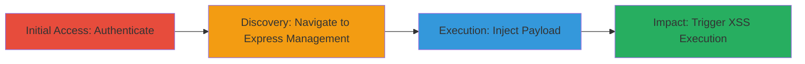

---
tags:
  - xss
  - stored-xss
  - concrete-cms
  - javascript-injection
  - client-side-attack
type: attack_chain
tools:
  - '[[tools/Firefox]]'
tactics:
  - '[[Execution]]'
verified: false
platforms:
  - Web
submitted: true
complexity: medium
created_at: '2023-10-01T00:00:00Z'
procedures:
  - '[[procedures/Authenticate-to-Concrete-CMS-Dashboard]]'
  - '[[procedures/Navigate-to-Express-Objects-Management]]'
  - '[[procedures/Inject-Malicious-Payload-into-Express-Object-Name]]'
  - '[[procedures/Trigger-Stored-XSS-by-Viewing-Entries]]'
step_count: 4
techniques:
  - '[[JavaScript]]'
updated_at: '2025-12-14T03:16:25.138Z'
description: >-
  A multi-stage attack exploiting a stored XSS vulnerability in Concrete CMS
  v8.1.0 to inject and execute malicious JavaScript in the browsers of
  authenticated users viewing the Express entries page.
skill_level: intermediate
impact_level: high
id: ce4e6bcf-f658-4c22-8185-c3ae2c919230
validated: true
mitre_tactics:
  - '[[Execution]]'
mitre_techniques:
  - '[[JavaScript]]'
---
# Stored XSS in Concrete CMS Express Objects for Client-Side JavaScript Execution

Multi-stage attack chain demonstrating a complete workflow to exploit a stored XSS vulnerability in Concrete CMS v8.1.0, allowing injection of HTML and JavaScript into the 'name' parameter of Express Objects, which executes in the browser of any authenticated user viewing the affected page.

## Chain Metrics Dashboard

| Metric | Value |
|--------|-------|
| Chain Status | Unverified |
| Total Steps | 4 |
| Execution Time | ~5 minutes |
| Skill Level | Intermediate |
| Complexity | Medium |
| Impact Level | High |

## Attack Flow Visualization

## Prerequisites & Requirements

### Required Tools

- [[tools/Firefox]]

### Target Environment

- Web platform running Concrete CMS v8.1.0
- Services: PHP-based web application, potentially hosted on AWS EC2
- Required ports: 80/443 (HTTP/HTTPS)
- Network access: Direct access to the login and dashboard endpoints

### Initial Access Requirements

- Valid authenticated credentials for Concrete CMS (e.g., admin or editor role with Express Objects permissions)
- Network position: Internal or external access to the CMS instance
- Prior access: None, assuming credentials are available

## Detailed Attack Procedures

### Step 1: Authenticate to Dashboard
procedure: [[procedures/Authenticate-to-Concrete-CMS-Dashboard]]

**Objective**: Gain authenticated access to the Concrete CMS dashboard to enable interaction with Express Objects management.

**Instructions**: Open [[tools/Firefox]] and navigate to the login page. Enter valid credentials to authenticate.

**Expected Output**: Successful login redirecting to the dashboard at /index.php/dashboard.

**Success Indicators**:
- Dashboard loads without errors
- User session is active (visible in browser developer tools)

### Step 2: Navigate to Express Objects Management
procedure: [[procedures/Navigate-to-Express-Objects-Management]]

**Objective**: Access the Express entries section to prepare for object creation.

**Instructions**: From the dashboard, navigate to the Express entries page and locate the 'Add Object' functionality.

**Expected Output**: The /index.php/dashboard/express/entries page loads, displaying existing entries and an 'Add Object' button.

**Success Indicators**:
- Entries page is accessible
- 'Add Object' option is visible and clickable

### Step 3: Inject Malicious Payload
procedure: [[procedures/Inject-Malicious-Payload-into-Express-Object-Name]]

**Objective**: Submit a form with a malicious payload in the 'name' field to store unsanitized input in the database.

**Instructions**: Click 'Add Object' and fill the form, injecting the payload "><svg/onload=confirm(document.domain)> into the 'name' parameter. Complete other required fields like handle and plural_handle, then submit via POST to /index.php/dashboard/system/express/entities/add, including the ccm_token.

**Expected Output**: Object creation succeeds, and the payload is stored without sanitization.

**Success Indicators**:
- No form validation errors
- New object appears in the entries list (payload may render harmlessly in creator's view)

### Step 4: Trigger Stored XSS Execution
procedure: [[procedures/Trigger-Stored-XSS-by-Viewing-Entries]]

**Objective**: Visit the affected page to execute the injected JavaScript in the browser context.

**Instructions**: Navigate to /index.php/dashboard/express/entries or /index.php/dashboard/system/express/entities to view the entries, triggering the payload execution.

**Expected Output**: JavaScript alert (e.g., confirm dialog showing document.domain) pops up in the browser.

**Success Indicators**:
- Malicious script executes (e.g., alert fires)
- Potential for further exploitation like session hijacking if payload is modified

## Attack Chain Summary

### Key Achievements

1. Successful authentication and navigation to vulnerable Express Objects interface
2. Injection of stored XSS payload bypassing input sanitization
3. Execution of client-side JavaScript on page load for any viewing user
4. Demonstration of high-impact potential for data theft or session compromise

## Technique & Tactic Coverage

### MITRE ATT&CK Techniques

- [[JavaScript]]

### MITRE ATT&CK Tactics

- [[Execution]]

---
*Last updated: 2023-10-01T00:00:00Z*
